## 1.1 Introduction

In this post, I share some of my solutions for the Certified Binary Fuzzing & Reversing Professional (CBFRPRO) certification questions. I show step by step how I arrived at each solution, explaining the reasoning, tools, and reverse engineering techniques used along the way. The goal of this content is to document the learning experience and show how it was possible to achieve 100% accuracy relying solely on binary analysis.

---

## 2.1 pattern_hunter

```
./pattern_hunter 
Usage: ./pattern_hunter <input>
```

We know that the binary expects an input for entry, I manually entered some inputs to see the program's response.

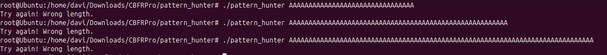

So, the program expects a specific input size, let's analyze it in IDA.

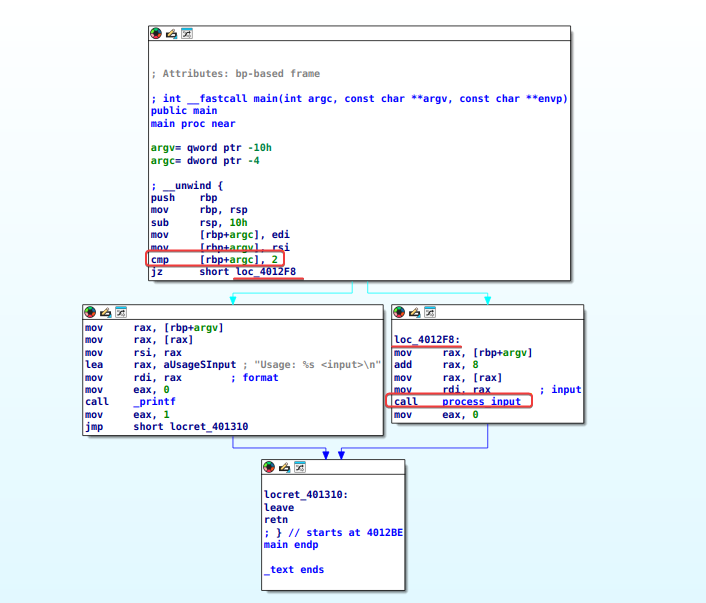

Analyzing the main function, we can see at the beginning the program comparing the number of arguments with 2; if it is not equal to 0, the program's usage mode will be executed. If it is equal to 0, the program jumps to loc_4012F8. Here, the program passes the address to rdi, where it calls the process_input function, already having the string stored in rdi at the time of the function call.

process_input:

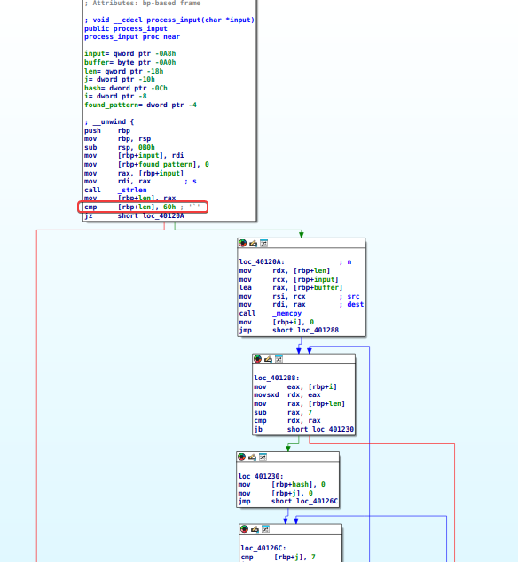

Right at the beginning, we can see that the string's length is compared to 60h = 96 in decimal. If it is equal to 96, the program continues executing at loc_4012A0; otherwise, the program closes.

Next, it is possible to notice a series of comparisons, which probably indicates a loop there, which I decided to analyze dynamically now. I will use the EDB debugger, providing an input size of 96.
```
edb --run ./pattern_hunter AAAAAAAAAAAAAAAAAAAAAAAAAAAAAAAAAAAAAAAAAAAAAAAAAAAAAAAAAAAAAAAAAAAAAAAAAAAAAAAAAAAAAAAAAAAAAAAA
```

Initially, I set a breakpoint in our main at 0x4012BE, executed line by line, and entered the process_input function (F7).

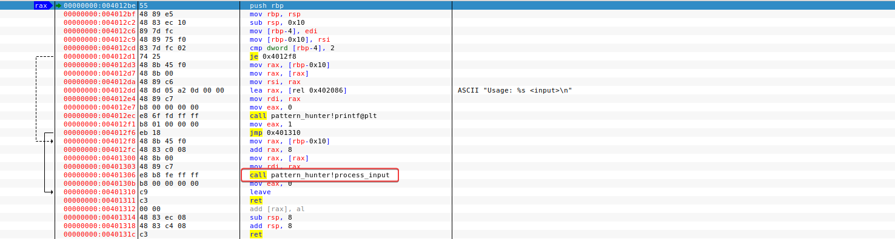

At the beginning in process_input we can see that a comparison of the size of our input is made; in this case, our input is equal to 96, so Z = 1, and we jump to 0x40120A.

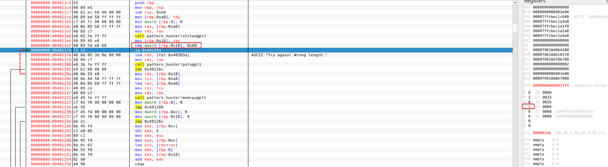

Next, copy the input to a memory region, in this case, to RDI.

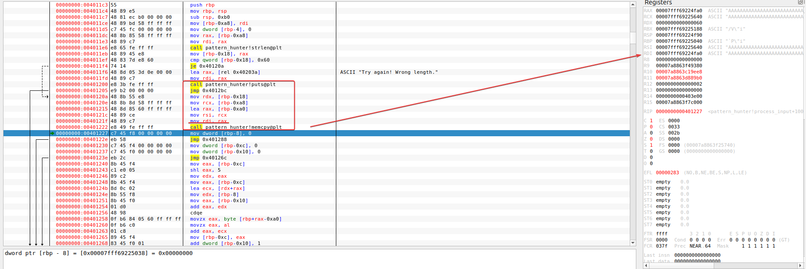

After that, he starts the loop, where he probably tries to find a specific input which at the end he compares with a hash. I will add a breakpoint after this comparison.

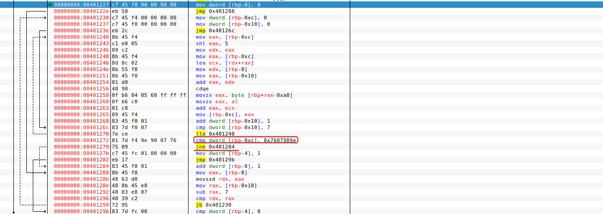

At our breakpoint instruction, it will analyze the result, clearly it will not have the input it expected and will jump to 0x401284. I will skip this and add a new breakpoint at 0x401299, where we will find a jb instruction, in which the above program compares rdx and rax; in this case, it will loop while rdx is greater than rax.

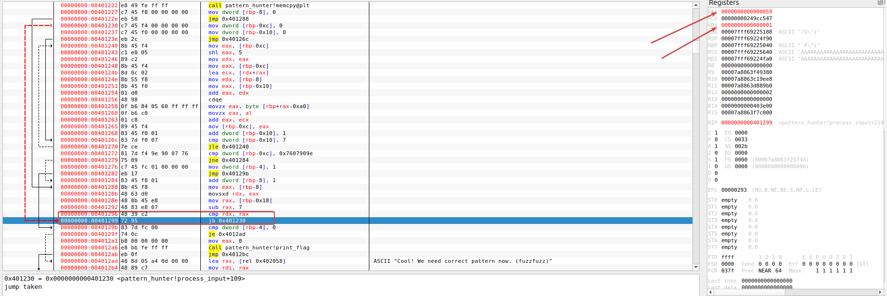

To get out of this loop, I will add a breakpoint at the next instruction.

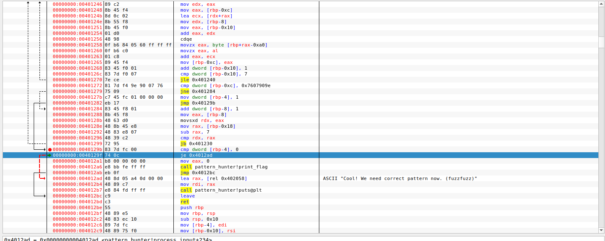

Just below, we can see the function we are looking for in the program. To enter the function and be able to print the flag, we will right-click and select 'Set RIP to this instruction.' Next, we run the print_flag function and view the terminal:

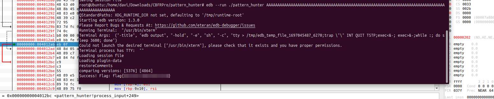

---

## 3.1 libimg
```
Usage: ./libimg <img_file>
Hint: This IMG parser might get FUZZ-y with interesting inputs ;)
```

In view of the program usage demonstration, I downloaded a random image from the internet, ran the program providing the image, but nothing happened. So, let's move on to IDA.

In the main function, it checks the number of arguments provided when the program is executed; if it is not 0 or equal, it executes the usage messages, otherwise, it will move the file name to RDI and call the function sub_401260.

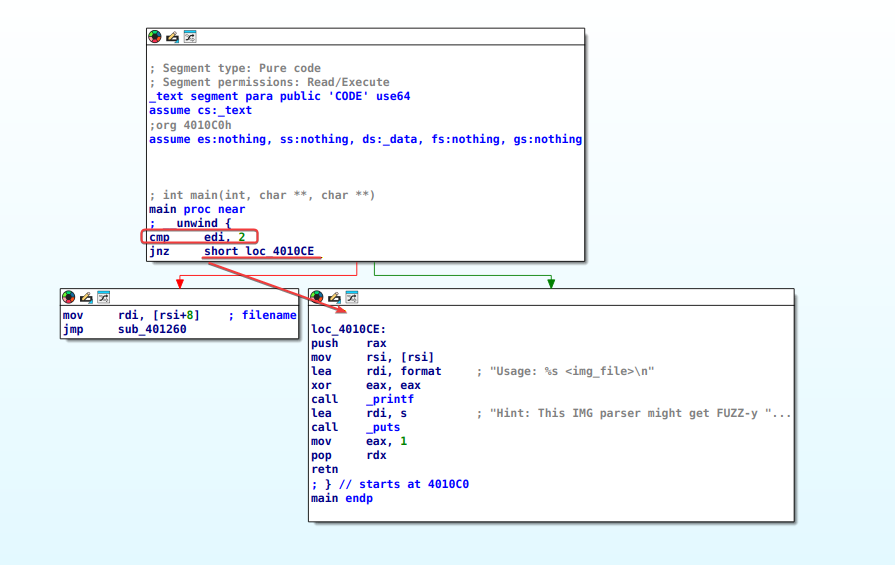

In sub_401260, the program opens the image with fopen, then with fread it reads the first 8 bytes of the image, compares the first two bytes with 4D49h = IM, then compares the next byte with 47h = G. So, we know that the program checks if the first 3 bytes of the image are 'IMG'.

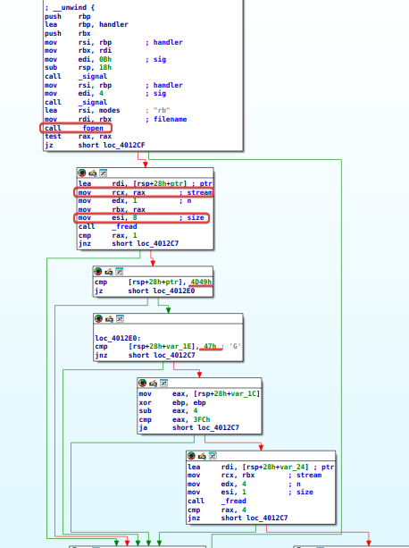

I will create a file and add IMG to the first bytes, then I will open it in the debugger.

```
touch image.img
echo "IMG" > image.img
```

Analyzing line by line, we can see that the program also checks the number of bytes in the image, that is, if the image does not have 8 or more bytes, the program will close.

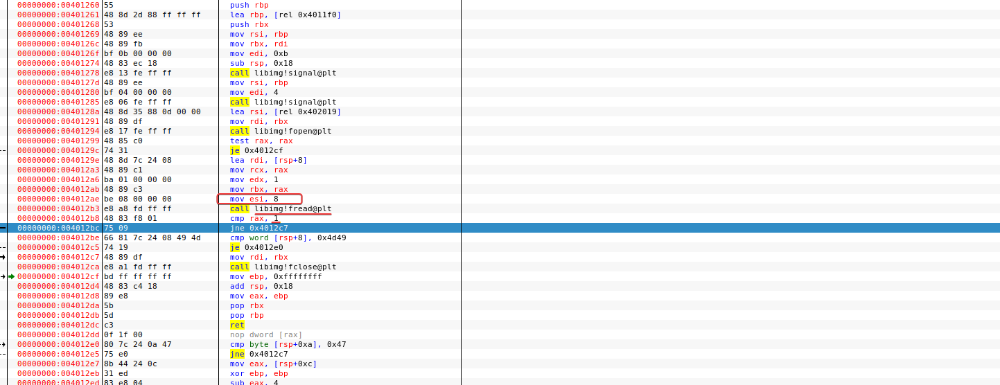

I will add more bytes to our image.

```
echo "IMG123456" > image.img
```

Navigating back to the instruction, we can see that now we will see that it returned 1..

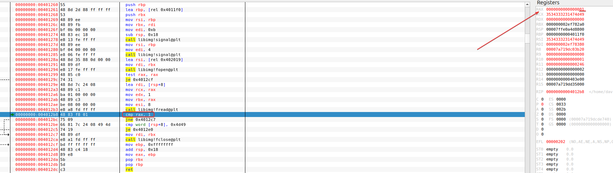

In the next instructions, it will check if the first bytes are IMG, in our case they are, so I will go to the next new instruction.

Then, it moves 2,3,4,5 to RAX, zeros edp, subtracts 4 from RAX, and compares it with 3fc = 1020.

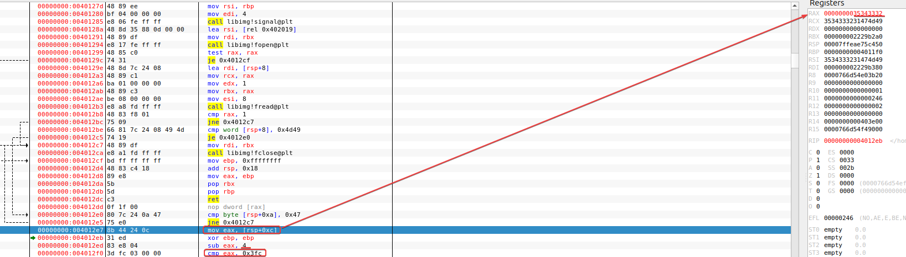

So, the subtraction made must be less than or equal to 1020; if not, the program jumps to loc_4012C7 (where it closes the program).

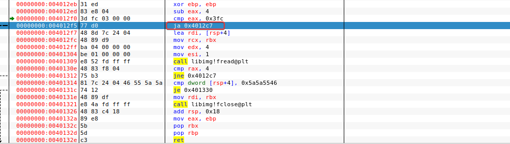

I’m going to open the img file in HxD to be able to modify the bytes.

Alright, now we know that 0F - 4 will be less than 1020.

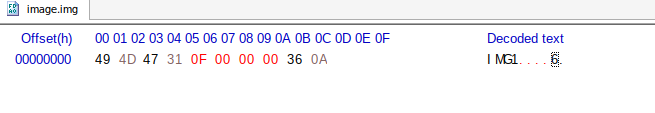

Okay, moving on to the next instructions, the program will read the next 4 bytes of the image. We know that above in HxD, we only have 2 more bytes in the image. Below, it's possible to see the value 2 in RAX. After that, the program closes.

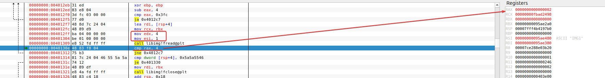

I added more bytes to the image:

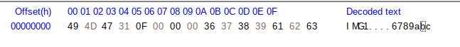

Ok, let's move on to the next comparison. It compares the 4 bytes with 5a5a5546 = FUZZ.

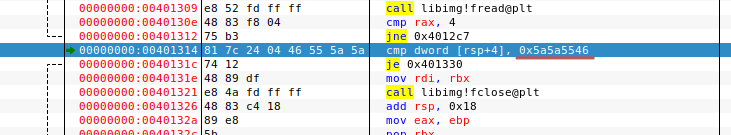

So, we will update it in HxD.

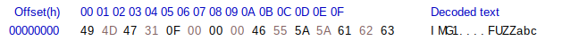

Alright, we’ve reached the end of the program. In the end, it forces an error, but we can continue with SHIFT+F9, and we have the flag.

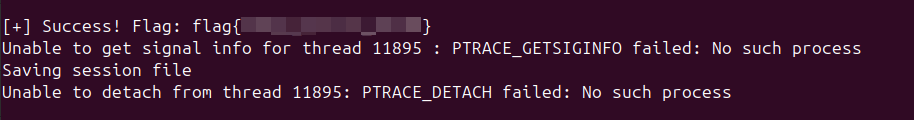

---

## SecureCanary

## SecureConfig

## SecureWebServer
