## 1.1 Introduction

This report presents a technical analysis of malware samples obtained from a public information security research repository. The analyzed samples show characteristics consistent with targeted campaigns, in which social engineering techniques are used as the initial vector of compromise. 

The analysis indicates that the infection process occurs through emails containing compressed attachments that combine legitimate lure documents with malicious payloads, exploiting common Windows environment formats. The observed samples exhibit multi-stage execution chains, using different technologies for code execution, interaction with the operating system, and external communication. 

The purpose of this report is to independently document the behaviors and techniques observed during the static and dynamic analysis of the samples, without attributing them to specific groups, campaigns, or contexts, being limited to the technical evidence identified.

## 2.1 Email Phishing

When analyzing the email as a possible attack vector, the use of an apparently compromised institutional email account for delivering a malicious RAR file was observed. The message was crafted to appear as a legitimate forward, aiming to trick the recipient into opening the attachment.

The RAR file contained a malicious ISO responsible for dropping additional artifacts onto the system. Next, the PDF document used as a lure during this stage of the infection is analyzed.

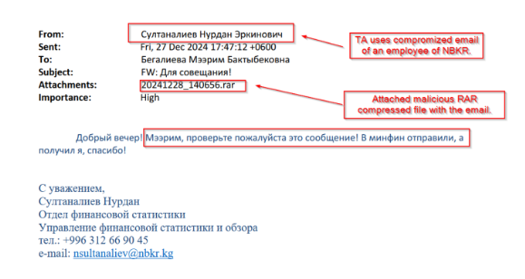
*Image source: Publicly available threat research report. Used for illustrative purposes only.*

### 2.1.1 Lure Document (PDF)

When extracting the ISO file, two main artifacts were identified: a malicious executable developed in C++ and a document used as bait. The bait file consists of an invitation related to an international event, written in a way that imitates legitimate institutional communications.

The content of the document explores a technical and current topic, aligned with discussions on digitalization and supply chains, which helps increase its credibility. This type of approach is commonly used in phishing campaigns to reduce user suspicion and encourage the opening of the file.

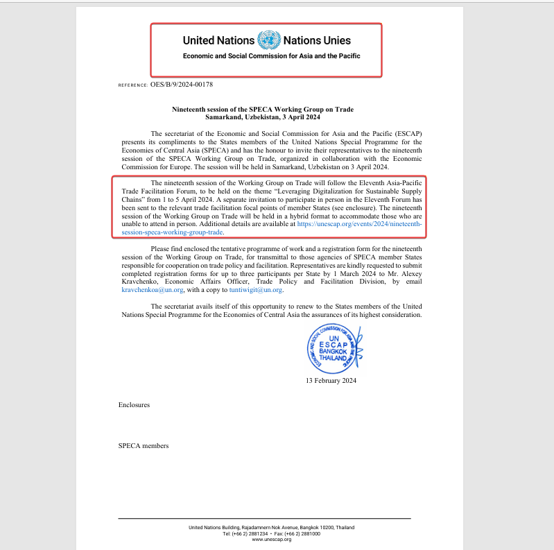

## 3.1 Malicious ISO File 

The RAR file contains a malicious ISO file. When extracting the ISO, two artifacts were identified: a bait PDF document and a malicious C++ binary acting as a loader. The next section focuses on the analysis of the C++ binary.

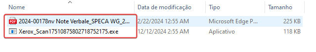

## 4.1 Static Analysis

### 4.1.1 C++ Binary

The extracted executable was analyzed to better understand its structure and execution logic. The initial inspection indicates that the main purpose of the binary is to decode and execute an embedded payload, rather than performing complex operations on its own.

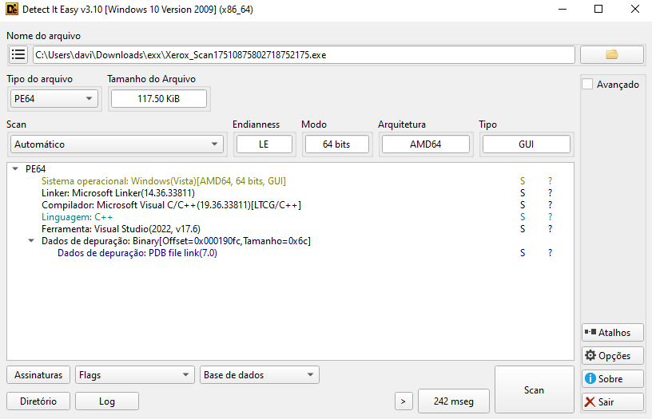

### 4.1.2 IDA Analysis

Disassembling the binary reveals a significant amount of embedded data encoded in Base64. This encoded content is subsequently decoded at runtime and passed to a PowerShell execution context.

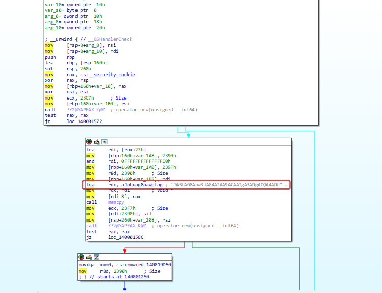

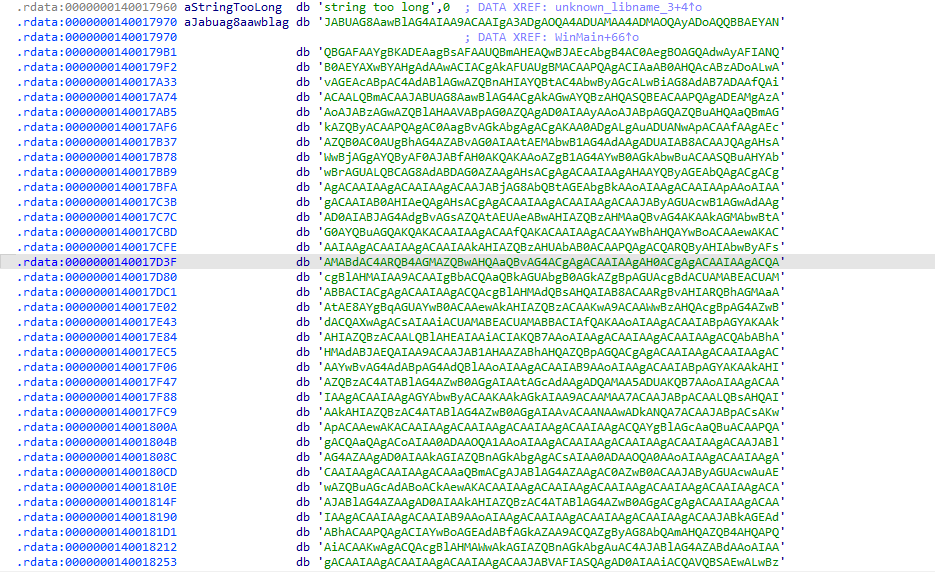

A more detailed inspection confirms that the decoded content is executed through a PowerShell command, indicating that the C++ binary primarily functions as a loader for a script-based payload.

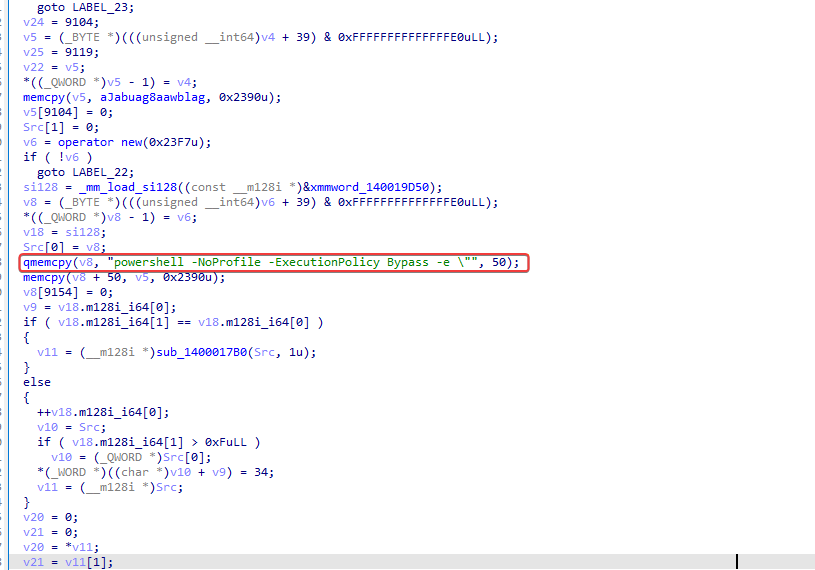

### 4.1.3 PowerShell Script 

With the PowerShell script decoded, we discovered that a Telegram Bot is being used to execute commands and exfiltrate data. The script contains interesting functions such as Invoke-BotCmd and Invoke-BotDownload. We will analyze these functions.

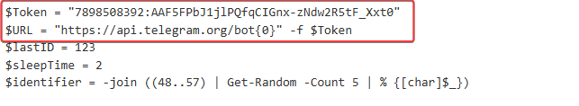

#### 4.1.3.1 Invoke-BotCmd

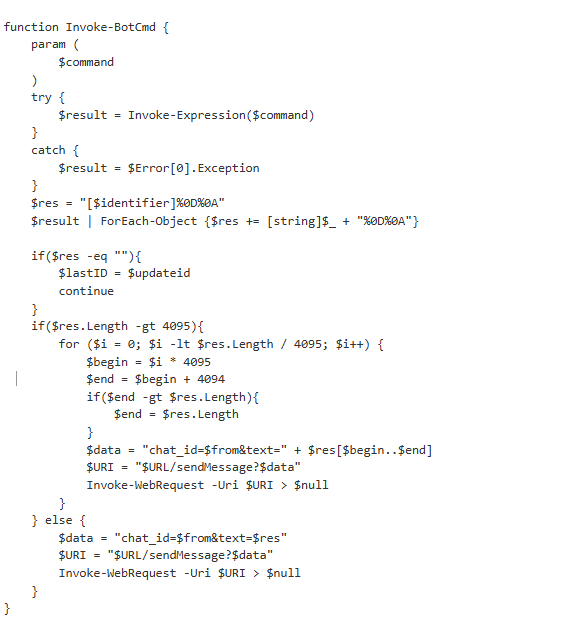

The Invoke-BotCmd function is responsible for executing system commands received remotely and returning their respective results via the Telegram Bot API. The provided command is executed using Invoke-Expression, with standard output and error messages being captured.

The results are enclosed with a unique identifier and sent back to the operator. When the output exceeds the 4,095-character limit imposed by Telegram, the content is split and transmitted in multiple messages; otherwise, it is sent in a single response. This mechanism enables the remote execution of commands and bidirectional communication with the compromised system using Telegram as a C2 channel.

#### 4.1.3.2 Invoke-BotDownload

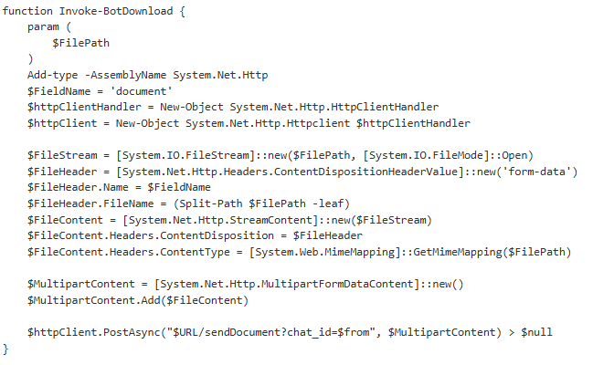

The Invoke-BotDownload function is used to exfiltrate files from the compromised system to a Telegram chat controlled by the threat actor. From a remotely provided path, the file is read locally and encapsulated in a multipart/form-data POST request, containing the metadata and headers required by the Telegram API.

This mechanism allows the direct transfer of data from the victim machine to the command and control channel, enabling information exfiltration through Telegram's infrastructure.

#### 4.1.3.3 Main Bot Loop

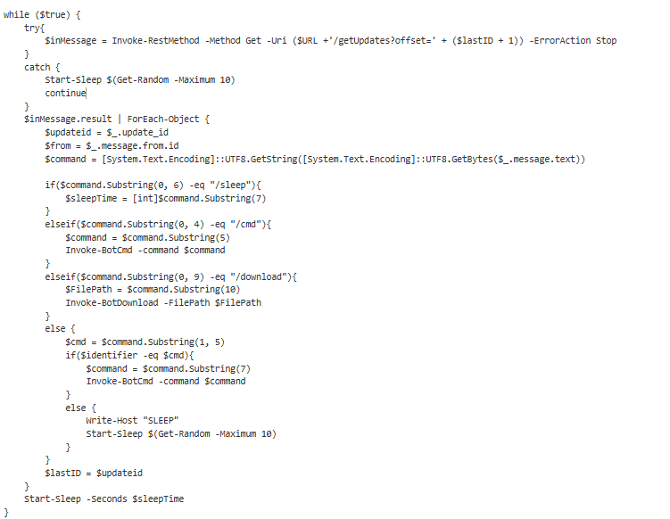

The remainder of the script implements the bot's main operational logic, running in a continuous loop to query and process messages sent by the threat actor. Communication is carried out through the Telegram API's getUpdates endpoint, which allows retrieving new commands.

Actions are defined according to the content of the received messages: the /sleep command dynamically adjusts the bot's execution interval, /cmd enables the remote execution of system commands via Invoke-BotCmd, and /download triggers the exfiltration of files from the victim machine through the Invoke-BotDownload function.

## 5.1 Conclusion

This analysis presented a multi-stage malware infection chain that begins with phishing emails containing compressed attachments. The attack heavily relies on social engineering, using familiar file formats to deliver a malicious ISO along with a bait document with a legitimate appearance, increasing the likelihood of user interaction. 

During the analysis, it was possible to observe how the infection unfolds through a C++ loader and embedded scripts that allow remote command execution and data exfiltration. The use of the Telegram Bot API as a command and control channel provides the attacker with a simple and effective way to interact with the compromised system while remaining hidden within normal network traffic.

Overall, the malware demonstrates a practical and well-structured design, focused on remote control and persistence, rather than complex evasion techniques. This report intentionally avoids attributions and contextual speculations, focusing solely on the technical behavior and artifacts identified throughout the analysis.
