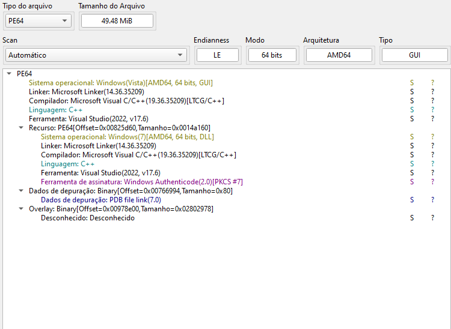
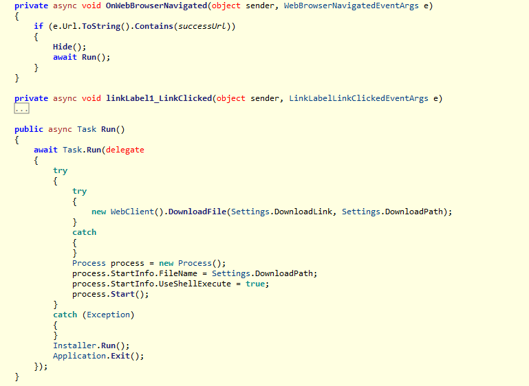
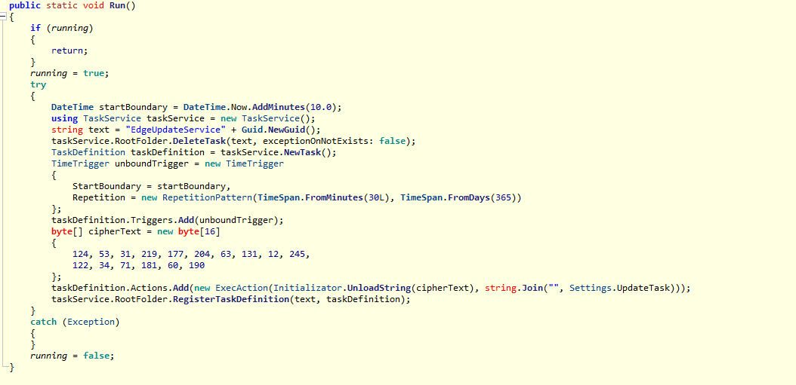
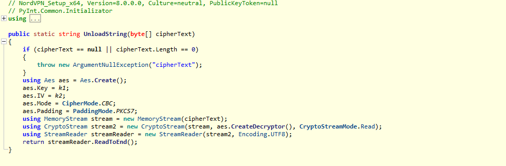
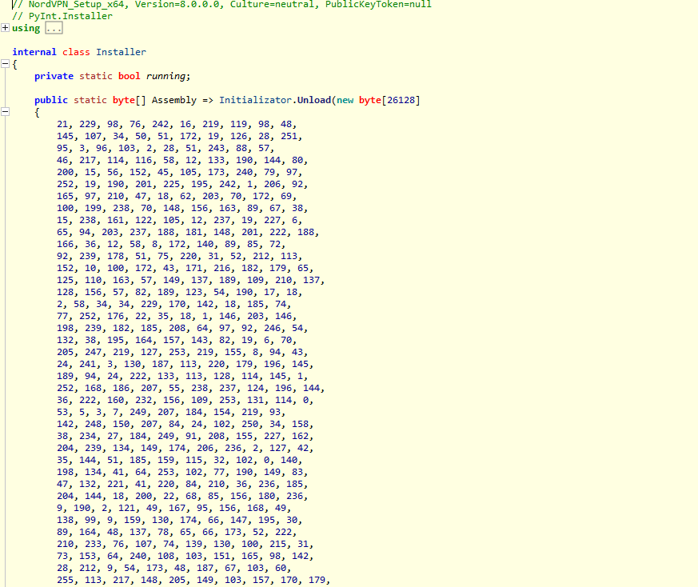

## 1.1 Introduction

Recently, a malicious installer disguised as the legitimate NordVPN setup has been circulating online, targeting unsuspecting users. This example demonstrates typical behaviors of beginner-level malware, including persistence, basic data collection, and communication with a command and control (C2) server. In this analysis, we will dissect the malware's internal operations, explore its installation vector, and examine its main functionalities to understand how it compromises a system.


## 2.1 PE Analysis


The file analysis in Detect It Easy (DIE) shows that the binary is a PE64 for AMD64, compiled in C++ with Microsoft Visual Studio 2022 (v17.6). The use of a GUI subsystem reinforces that it is trying to pass itself off as a legitimate installer.

Important points:
```
 - Format: PE64, AMD64 architecture
 - Compiled in: Microsoft Visual Studio 2022 (v17.6)
 - Language: C++ (no apparent obfuscation)
 - Subsystem: GUI – emphasizes that it tries to appear as a legitimate installer
 - Linker: 14.36 (recent, standard for modern builds)
 - PDB path present: indicates a careless build → typical of beginner malware
 - Authenticode signature detected, but not trusted: strong indication of tampering
 - Large overlay (~2.8MB): common in trojanized installers containing additional payload
 - Duplicated PE resources (GUI + DLL): indicates that more than one component is embedded
```

## 3.1 Initial Execution


Once executed, the program loads a standard user interface through a browser component, mimicking a legitimate installer interface.



The `onWebBrowserNavigated()` method performs the following:

### 3.1.1 URL Validation and UI Handling
- Checks if the displayed URL is valid.
- Immediately hides the browser interface by setting its visibility to `false` to avoid user suspicion.

### 3.1.2 Execution of the `run()` Routine
Once the UI is hidden, the code invokes:

```
 await run();
```
This marks the beginning of the malicious flow.

---

## 4.1 The `run()` Routine



The `run()` method performs two actions:

### 4.1.1 Downloads the Fake Installer
It retrieves a remote file defined in `DownloadLink` and saves it locally as:
```
 https://downloads.nordcdn.com/apps/windows/NordVPN/lastest/NordInstaller.exe
```


### 4.1.2 Executes the Downloaded File
After downloading:

- The file is executed normally
- The malware then calls:
```
 Installer.run();
```

This is where the malicious behavior starts.

---

## 5.1 Malicious Behavior: `installer.run()`

This is the core of the trojan.

The function begins creating an **Edge Update Service task** — a common social engineering trick to hide in plain sight.

---

## 6.1 Creating a Fake “Edge Update Service” Task


### 6.1.1 Task Name With GUID
A random GUID is appended to give the task a legitimate update-service look.

### 6.1.2 Cleanup of Previous Tasks
It deletes any existing scheduled task with the same name:

```
 DeleteTask();
```

No exception is thrown if the task doesn't exist.

### 6.1.3 Creating a New Task Definition
The malware:

- Creates a new scheduled task definition
- Adds a new **Time Trigger**
- Defines when execution should begin

### 6.1.4 Persistence Configuration
The repetition pattern is:

```
Every 30 minutes
For 365 days
```

This ensures long-term presence even if the user restarts the system or deletes the fake installer.

---

## 7.1 Encrypted Task Payload

Inside `installer.run()`, the malware contains encrypted command strings which are decrypted before being written to disk.

The decryption logic is located in:

```
UnloadString();
```



The sample uses a **fixed key and IV**, making the encryption purely cosmetic and easily reversible.

---

## 8.1 Decryption Keys

### 8.1.1 Key (k1)

```csharp
    private static byte[] k1 = (from x in Enumerable.Range(1, 32)
        select (byte)x).ToArray();
```

A simple byte sequence from 1 to 32.

### 8.1.2 IV (k2)

```csharp
private static byte[] k2 = (from x in Enumerable.Range(1, 16)
    select (byte)x).ToArray();
```

A sequence from 1 to 16.

Both keys are static and predictable, indicating low sophistication.

## 9.1 Decrypted Payload

The decrypted command launches:

```
mshta.exe
```

This is significant — mshta is a LOLBIN frequently used for remote code execution, allowing the attacker to execute HTML Application (HTA) malware.

The malware also executes the task immediately to start the payload in real time.

## 10.1 Encrypted Secondary Payload (Assembly Array)


The malware stores an additional encoded .NET assembly inside an internal array:
This array is decoded inside the Unload section using the same key and IV used previously.
This secondary payload may include:
 - Additional spyware logic
 - A downloader
 - Credential harvesting modules
 - Browser profile theft routines
 - Or a fallback persistence mechanism

Static analysis tools like DIE (Detect It Easy) detect it as a .NET assembly:

This confirms the sample contains at least two stages:
 1. The trojanized installer
 2. A decrypted internal .NET payload

This staged architecture is very common in beginner-level malware.
