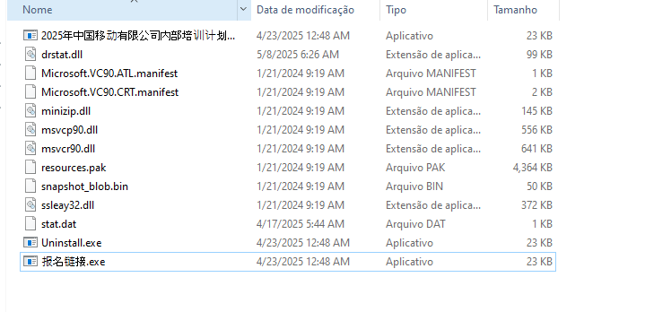
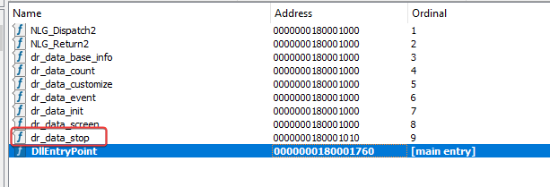
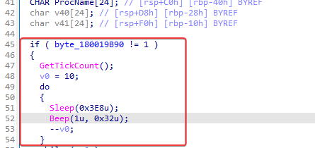
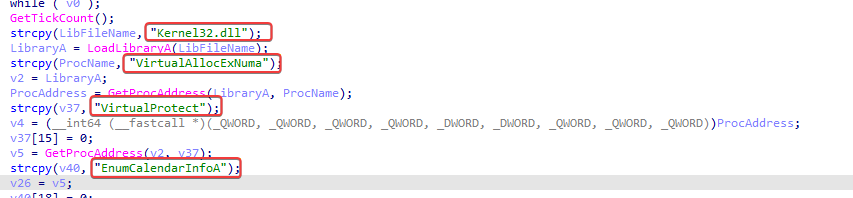
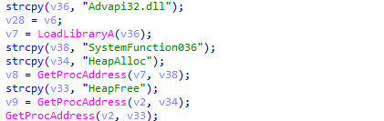
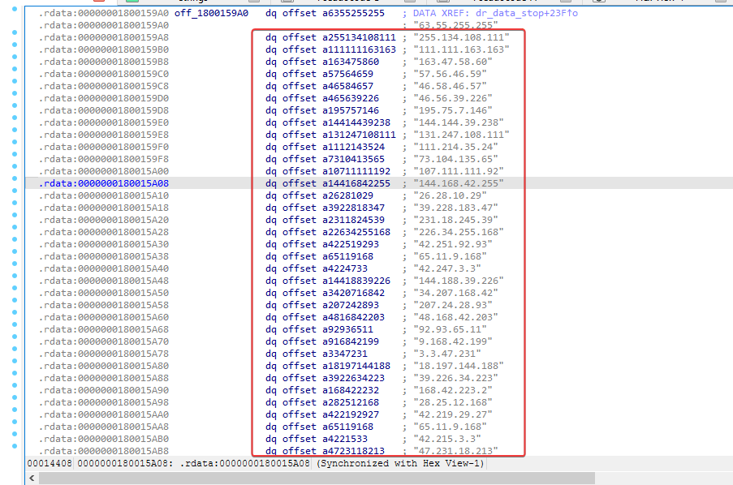

## 1.1 Introduction

Throughout my ongoing studies in *Malware Analysis* and *Reverse Engineering*, I have had the opportunity to analyze different malicious campaigns associated with broader, more structured operations. These analyses, which often cover only the fundamental elements of the *kill chain* and some specific components of the arsenal used by threat actors, have served as a starting point for a deeper understanding of how modern campaigns are planned and executed over time.

This study process, which is still in progress, has led me to examine multiple campaigns and their most recent variations, with special attention to the initial stages of infection. This post is one of the results of that journey, focused on understanding how loaders are employed as key pieces to enable more complex, long-term operations.

## 2.1 Campaigns Guided by Strategic Objectives

Before delving into the technical analysis, it is important to understand that advanced campaigns do not follow the same short-term motivations observed in purely financial operations. Unlike classic *eCrime* scenarios, where rapid impact and monetary gain are the priority, more sophisticated campaigns are conducted with well-defined strategic objectives, often prioritizing persistence, continuous information gathering, and long-term positioning.

In this type of operation, malware is not designed to produce immediate visible effects. On the contrary, it is developed to operate silently, maintaining access to the compromised environment for as long as possible, gathering data and laying the groundwork for future actions. The careful selection of the initial stages of infection directly reflects this concern for discretion and control.

The cybersecurity market often associates the term "cyberwar" with ransomware groups or *Malware-as-a-Service* operations. However, truly strategic campaigns are those carried out with a focus on espionage, infiltration of critical infrastructures, and gaining informational advantages, whose effects manifest gradually and are often invisible.

## 3.1 Context of the Analyzed Campaign

In this post, I analyze a malicious campaign that stands out precisely for this level of operational sophistication. The operation's focus is not on system destruction or direct service disruption, but on the strategic infiltration of critical infrastructure. By compromising such targets, the threat operators gain visibility and control over high-value data flows, enabling large-scale espionage activities.

Campaigns of this type highlight the level of planning involved and underscore the importance of the initial components of the infection. The success of the entire operation directly depends on the reliability and stealth of these early stages, which are responsible for establishing execution, persistence, and control of the pace of malicious activity.

## 4.1 The Role of the VELETRIX Loader in the Infection Chain

It is within this context that the **VELETRIX Loader** emerges. It acts as the entry point of the campaign, being responsible for preparing the compromised environment and enabling the execution of later stages. Although loaders are often underestimated for their apparent simplicity, in practice they play a central role in the *kill chain*, reflecting technical decisions aligned with the strategic objectives of the operation.

Throughout this post, the VELETRIX Loader will be analyzed from a reverse engineering perspective, focusing on its behavior, internal structure, and how its implementation choices contribute to the overall effectiveness of the campaign.

From this point on, the analysis will focus on the technical aspects of the loader and its practical function within the infection chain.

## 5.1 Arquivo ZIP 

Inside the ZIP file, you can see several binaries, but the main target of the spearphishing is the one identified as "2025年中国移动有限公司内部培训计划即将启动,请尽快报名.exe", which translates to "The internal training program of China Mobile Limited for 2025 is about to start, please sign up as soon as possible." Most of them were binaries legitimately signed by Microsoft, while some had code signing certificates from Shenzhen Thunder Networking Technologies Ltd.

### 5.1.1 drstat.dll

Analyzing the implant's exports, none of the exports do anything, except for "dr_data_stop", and the only function has a routine.

After the implant is called by the legitimate binary, this function is executed. Initially, an anti-analysis is performed, which uses a combination of the Windows Sleep and Beep APIs, running GetTickCount at the beginning and end of the cycle, with a loop consisting of a 10-second sleep (Sleep API) and checking the system sound with the Beep call.

Next, after executing Anti-Sandbox, it starts by loading kernel32.dll, since the DLL is being loaded using LoadLibraryA. Once the DLL is loaded, GetProcAddress is used to resolve an interesting set of APIs, which are VirtualAllocExNuma, VirtualProtect, and EnumCalendarInfo.

In the same way, it loads ADVAPI32.dll and, once the DLL is loaded, it resolves it using the same technique, which are SystemFunction036, HeapAlloc, and HeapFree.

Finally, ntdll.dll is loaded and an interesting Windows API is resolved, known as RtlIpv4StringToAddressA.

And here's the interesting part: if you look at the strings in the binary, you'll see a large number of IPv4 addresses. These addresses together are the encrypted shellcode that the binary loads at runtime. This isn't a new obfuscation method, but it is quite unusual. It works because each byte (in hexadecimal) of the shellcode can be represented by an octet of an IPv4 address. The work the adversary had to do was to group four octets (4 bytes) and visually turn them into IPv4 addresses. To convert IPv4 addresses back into bytes, you need to use the RtlIpv4StringToAddressA API, which is exactly the routine the binary runs.
