## 1.1 Introduction

WannaCry, also known as WannaCrypt, was a ransomware that became famous in May 2017 for spreading quickly around the world. The malware is widely linked to the Lazarus Group, a group associated with North Korea.

One of the main culprits for its spread was EternalBlue, an exploit developed by the NSA and later leaked by the Shadow Brokers group. The exploit took advantage of a vulnerability in Windows' SMBv1 protocol (CVE-2017-0144), allowing remote code execution on vulnerable systems.

Unlike a conventional ransomware, WannaCry had worm-like characteristics, using the vulnerability to spread automatically across the network and infect other computers. Once infected, the malware would encrypt the victim's files and demand payment to recover the data.

In this report, we will perform a technical analysis of WannaCry, covering how it works, its propagation mechanisms, behavior during execution, and main features identified through reverse engineering and malware analysis.

## 2.1 Static Analysis

### 2.1.1 Strings

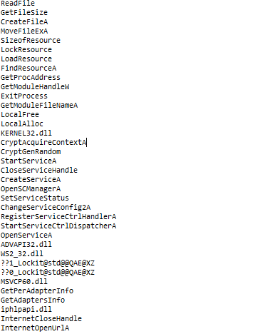

We can see some interesting strings that are used by ransomware for file encryption and create files.

Functions used to establish connections, possibly opens a connection with the C2.

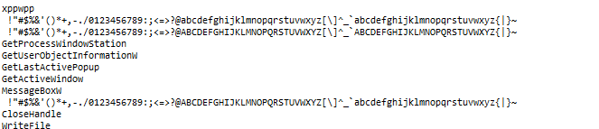

And it creates a sort of string of characters, which is probably at some point used to generate keys related to encryption.

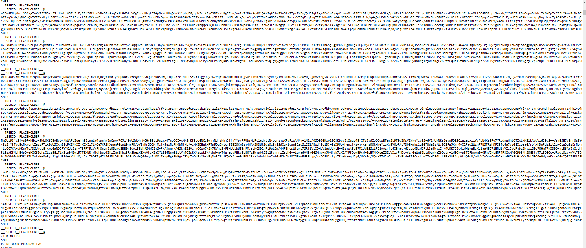

We can see what appears to be some kind of different payloads used by this malware, which probably refer to how this malware infects other machines on the network.

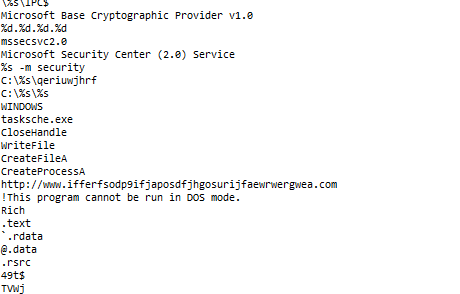

Here we see the kill switch in use, it basically works like this: the malware communicates with this domain before the encryption starts, if the connection fails, the encryption proceeds; if the connection is successful, the malware stops, it doesn't encrypt the file. This kill switch was discovered by the researcher Marcus Hutchins.

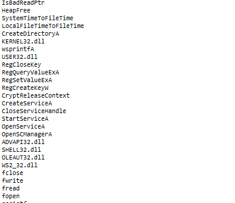

Functions used for Windows registry settings, we can say that this is where the malware creates its possible persistence within the infected system.

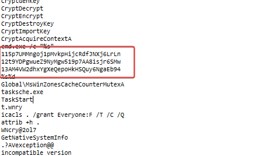

We also see BTC wallet addresses. 

Let's check some of these addresses on the blockchain to see if we find anything interesting.

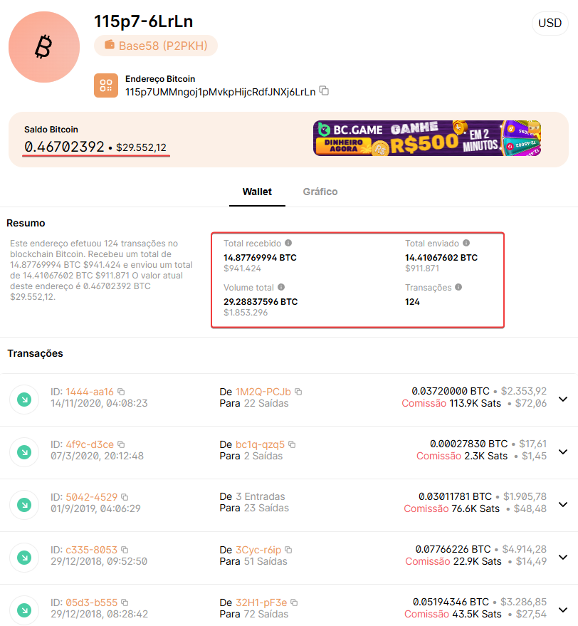

There's still some value in BTC left there, lol.

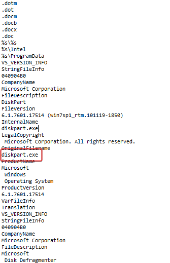

After a long sequence of file extensions, in which it’s probably the malware’s interest to encrypt them or use them in other stages, we found the string 'diskpart.exe', where diskpart is used to manage operating system partitions, probably used to help encrypt partitions of the infected system.

### 2.1.2 Format PE

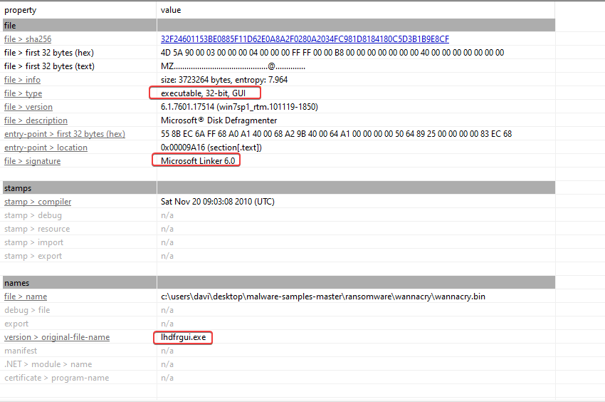

##### 2.1.2.1 Tabela de Importacoes

Some imports we can mention that, for our analysis, will make a difference.

##### 2.1.2.2 WS2_32.dll

    - connect
    - recv
    - send
    - socket
    - WSAStartup

Indicates active use of low-level TCP communication, likely used for beaconing or C2 propagation.

##### 2.1.2.3 ADVAPI32.dll

    - CryptGenRandom
    - CryptAcquireContextA
    - CryptEncrypt

The Windows CryptoAPI is used for file encryption.

##### 2.1.2.4 WININET.dll

    - InternetOpenA
    - InternetOpenUrlA
    - InternetCloseHandle

These APIs are probably involved in the logic of the kill switch.

I also noticed the use of functions for manipulation, creation of Windows system registry keys, where the malware probably installs its persistence.

### 2.1.3 IDA

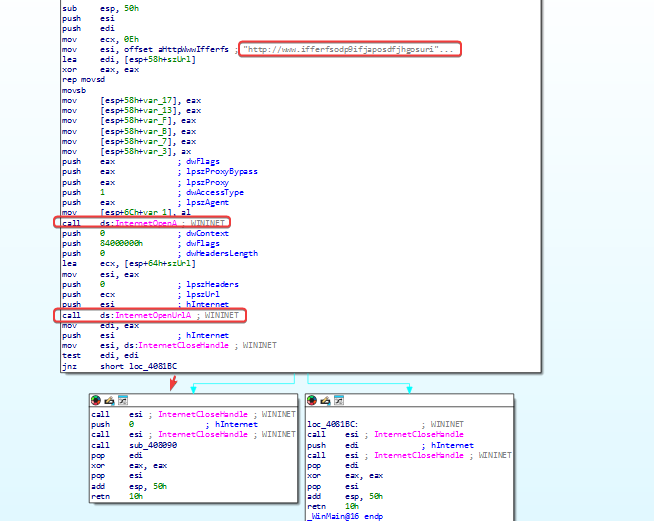

When we analyze this function, we can see that there is a routine for checking the domain associated with the kill switch. It goes like this:

    1: A URL statically stored in the binary is copied to a local variable.
    2: A session is initialized through InternetOpenA and it tries to access the URL using InternetOpenUrlA, storing the return in EDI.

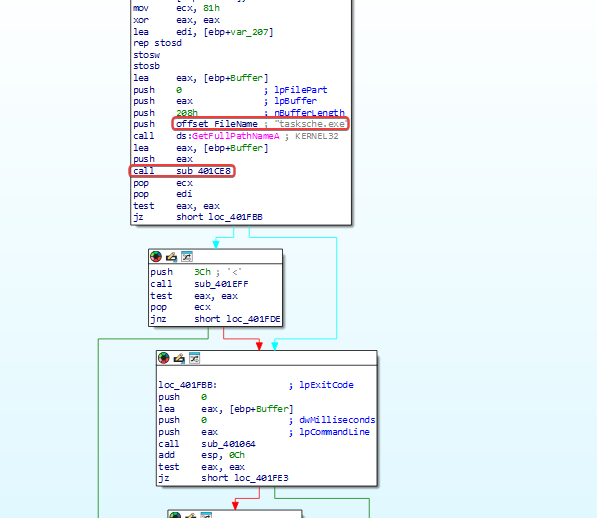

We can see an .exe file that is used, probably used at some stage of the malware infection. We will analyze the function in sub_401CE8 more.

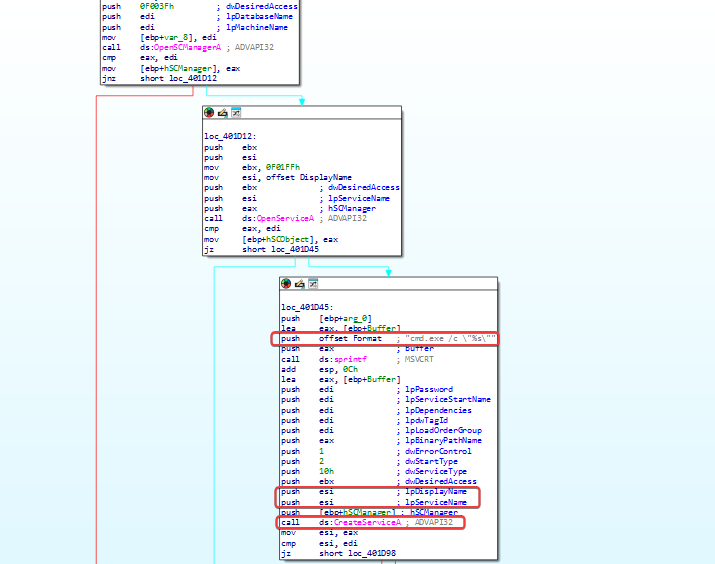

lpDisplayName and lpServiceName are initialized using the ESI. When using any service or API, the necessary parameters must be initialized or passed in. In most regular programs, service parameters are hard-coded. However, as we can see above, both lpDisplayName and lpServiceName are initialized using ESI (the ESI register, a pointer-type register). So, the name isn’t hard-coded, but passed through a pointer. We can only figure out the service name by doing dynamic analysis (running the malware). Even in OpenService, the service name is still relatively hidden.

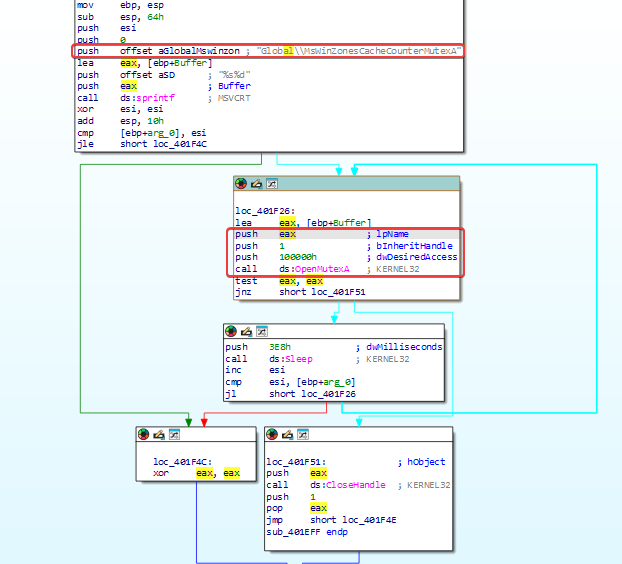

The code initially builds the name of the object in a buffer using 'sprintf' and then makes a call to the 'OpenMutexA' API to check for the existence of a mutex with the identifier 'Global\MsWinZonesCacheCounterMutexA'.

The value returned by the function is checked using the 'test eax, eax' instruction. If a valid handle is returned, indicating that the mutex is present, the code directs execution to a routine that calls CloseHandle on the object. If the mutex isn't found, the flow goes into a routine that executes Sleep(1000), which results in about 1 second, and then repeats the check.

Agora abaixo vamos analisar a funcao 'WinMain'.

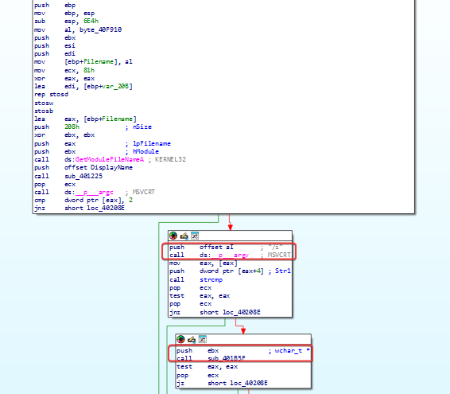

Initially, it starts by reserving 0x664 bytes for local variables, and IDA even identified some of them. It uses 'GetModuleFileNameA', which is a function that retrieves the fully qualified path for the file containing the specified module, with the goal of getting the name of the file associated with the running executable.

In the routines below, the malware checks the command-line arguments; in this case, it checks for the '/i' argument.

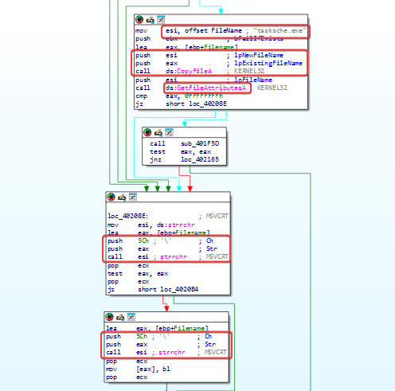

Here, the malware aims to create a copy of the executable using the name 'tasksche.exe' and uses 'GetFileAttributesA' to check if the file/path is accessible/existent before continuing.

Then, the function strrchr is used with '', which searches for the last backslash in the path to separate the directory from the file name. After that, the same function is used to extract the directory from the full path.

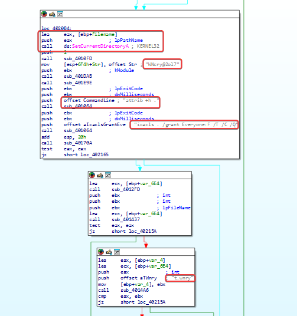

We've reached an interesting point: using the 'SetCurrentDirectoryA' API changes the process's working directory, so the malware starts executing commands and operations related to that directory.

Right off the bat, with 'WinCry@2017' we can't tell what the purpose of this string is, let's quickly look at sub_401E9E because I saw something interesting worth noting:

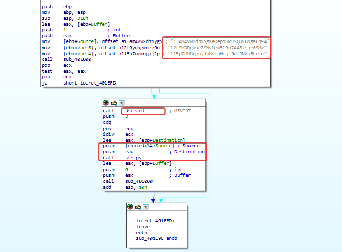 

Looking at the code, it contains 3 embedded Bitcoin addresses. The function uses 'rand' and does 'rand' % 3 to randomly pick one of the three, the chosen address is copied to the buffer with 'strcpy' and the value is passed to sub_401000.

In short, WannaCry hides the working directory and changes its permissions, giving full control to the Everyone group. After validating these operations, the malware goes ahead with processing its auxiliary files.

## 3.1 Dynamic Analysis

As we saw above, the name of the service that the malware is creating is passed in the ESI register. To see the name that the malware is using when creating the service, let's analyze the call to the CreateServiceA function:

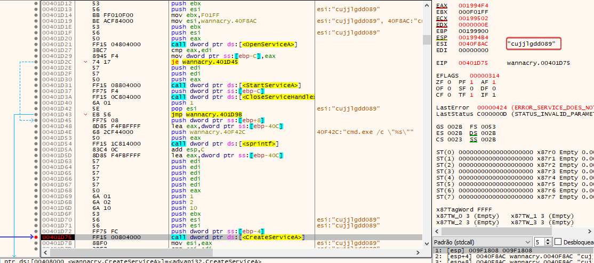

We can conclude that "attrib +h" is a command line command that hides the files inside the current directory which is SoftwareWanaCryptwd.

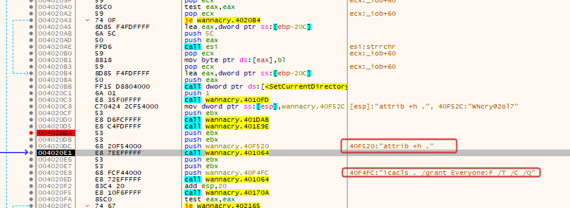

Let's analyze the function FUN_401DAB that we had seen being called right after we spot the string 'WNcry@2017':

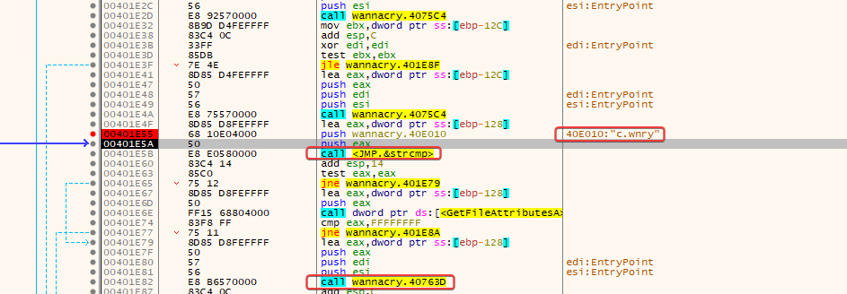

The malware lists the package files and compares the names with c.wnry. When it finds this file, it uses GetFileAttributesA to check if it already exists on the system before proceeding with extraction/processing.

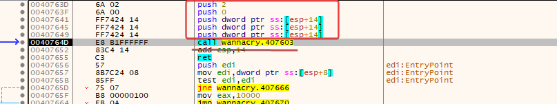

The function FUN_0040763D receives parameters related to resource processing and makes a call to FUN_00407603. The return value is then checked to determine whether the flow continues. The actual file writing must be confirmed inside FUN_00407603.

During the analysis, it was found that WannaCry keeps additional components embedded in the .rsrc section of the executable. The function FUN_00401DAB uses the APIs FindResourceA, LoadResource, LockResource, and SizeofResource to locate and access the resource. Afterwards, the processing routines initialize the content using the password WNcry@2ol7 and enumerate the stored files. During this process, the malware checks for the presence of files like c.wnry using GetFileAttributesA before proceeding with data processing. The analysis shows the use of an embedded resource package as a mechanism to store and provide additional components during execution.

    c.wnry
        - gx7ekbenv2riucmf[.]onion
        - 57g7spgrzlojinas[.]onion 
        - xxlvbrloxvriy2c5[.]onion 
        - 76jdd2ir2embvy47[.]onion 
        - cwwnhwhlz52maqm7[.]onion

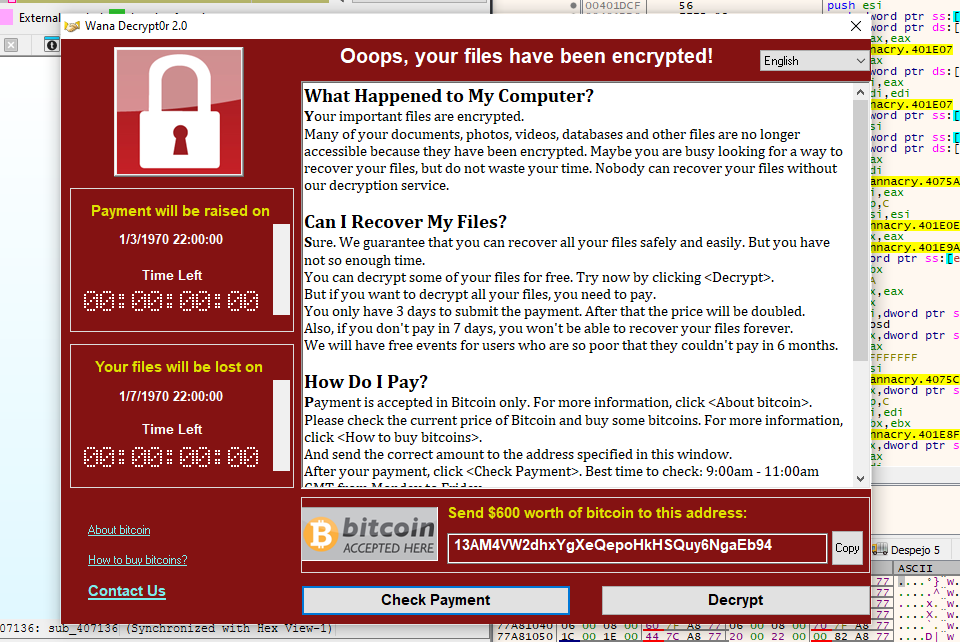

## 4.1 Conclusion

Through static and dynamic analysis, we identified several important WannaCry behaviors, including the kill switch, mutex usage, service creation, file manipulation, permission changes, Bitcoin addresses, and embedded resources.

The analysis of WinMain showed how the malware prepares its execution environment, creates tasksche.exe, modifies the working directory and permissions, and processes its embedded components.

We also identified a ZIP-based resource embedded in the .rsrc section, protected by the hardcoded password WNcry@2ol7, containing additional malware components.

Overall, the analysis shows how WannaCry brings together execution, persistence, resource extraction, network communication, and ransomware functionality into a single malware operation.
