In this post, I continue my studies of the book "Practical Malware Analysis" and begin working on Lab 1. The goal is to apply practical static and dynamic analysis techniques to understand the behavior of real samples, reinforcing fundamental concepts used in malware analysis environments. This content is part of my study routine and documentation of the learning steps.

## 1.1 LAB 01-01
```
Lab01-01.exe and Lab01-01.dll
```

### 1.1.2 Question 1
```
Send the files to http://www.VirusTotal.com/ and check out the reports. Do any of the files match any existing antivirus signature?
```

Yes, both are detected as malware. Threat Categories: Trojan, downloader, worm, PUA.

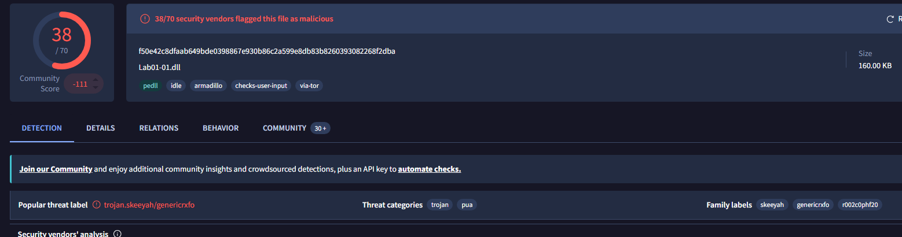

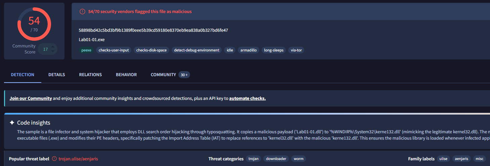

---

### 1.1.2 Question 2
```
When were these files compiled?
```

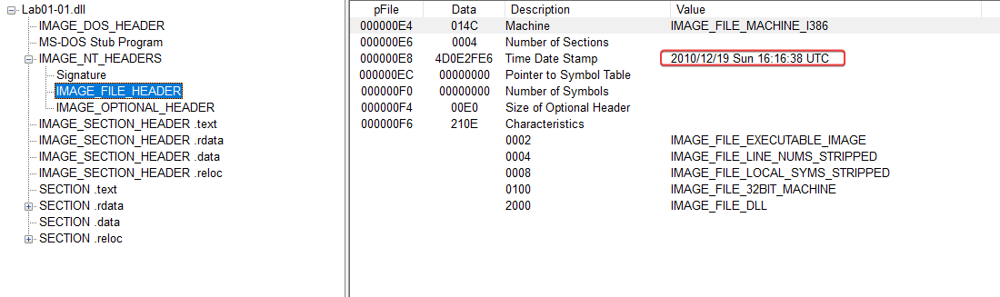

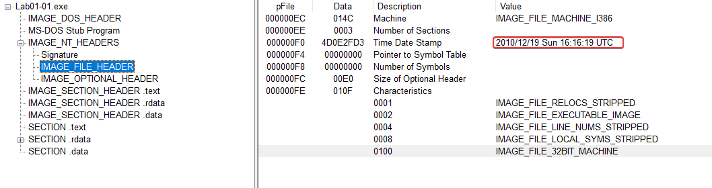

---

### 1.1.3 Question 3
```
Are there signs that any of these files are compressed or obfuscated? If so, what are those indicators?
```

There are no signs that it is packed or obfuscated, virtual size and raw size are quite close, low entropy, a good amount of strings in the binaries.

---

### 1.1.4 Question 4
```
 Do any imports indicate what this malware does? If so, which imports? Really?
```

Analyzing Lab01-01.dll it is possible to see interesting imports in kernel32.dll like:
    - Sleep
    - CreateProcessA

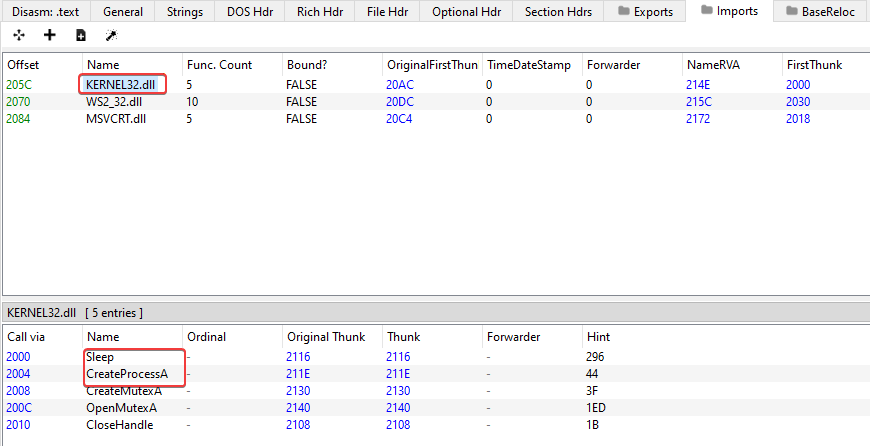

It’s possible that the malware creates a process and suspends its execution for a certain amount of time to achieve its goal.

And imports from WS2_32.dll:

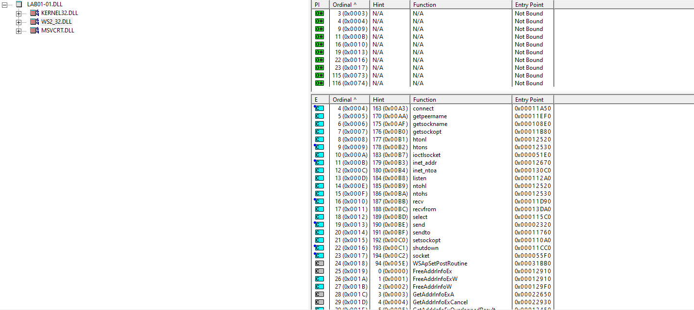

There are imports that might lead us to believe that network connections are being created, possibly to establish communication with the C2.

Analyzing Lab01-01.exe's imports, we can say that it would search for files within the system and the files would be copied.

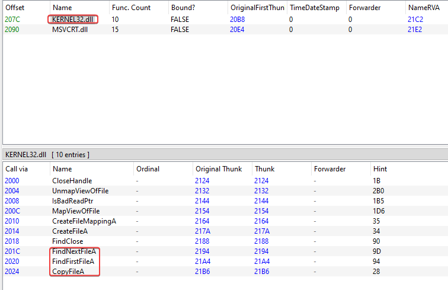

---

### 1.1.5 Question 5
```
Are there other host-based files or indicators you could look for on infected systems?
```

In Lab01-01.exe, by analyzing the strings and linking this to its imports, we can believe that it creates/copies a somewhat unusual file.

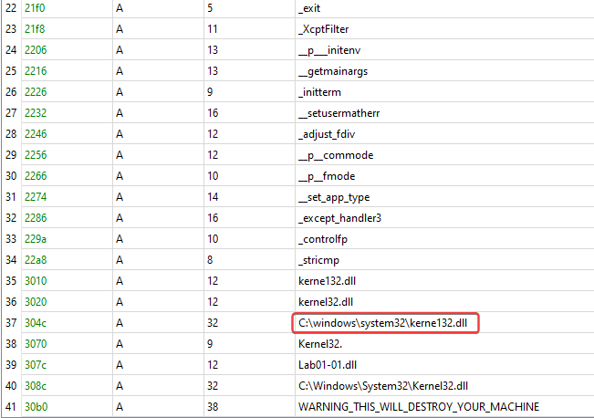

kerne123.dll

---

### 1.1.6 Question 6
```
What network-based indicators could be used to find this malware on infected machines?
```

In Lab01-01.dll where we have indications of possible creations of connections with the C2, in the strings we identified:

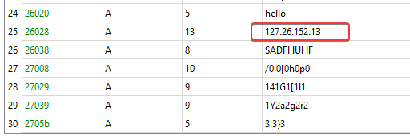

127.26.152.13

---

### 1.1.7 Question 7
```
Which do you think is the purpose of these files?
```

We can assume that the executable is used to run the DLL, which acts as a backdoor or remote access Trojan (RAT).

---

## 2.1 LAB 01-02
```
Lab02.02.exe
```

### 2.1.1 Question 1
```
Upload the file Lab01-02.exe to http://www.VirusTotal.com/. Does it match any existing antivirus definitions?
```

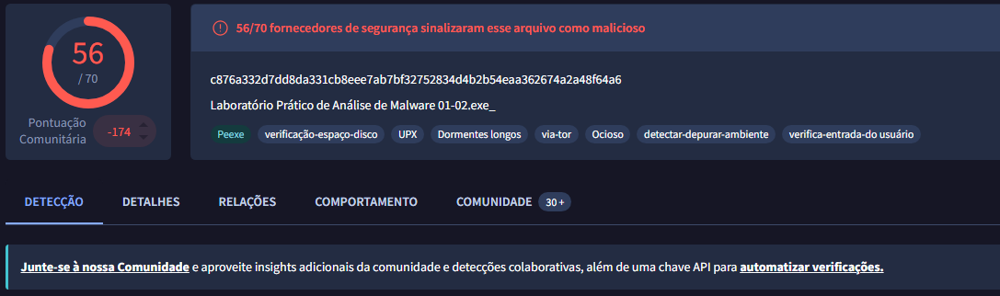

Trojan

---

### 2.1.2 Question 2
```
Is there any indication that this file is compressed or obfuscated? If so, what are those indications? If the file is compressed, decompress it if possible.
```

Yes, compressed using UPX.

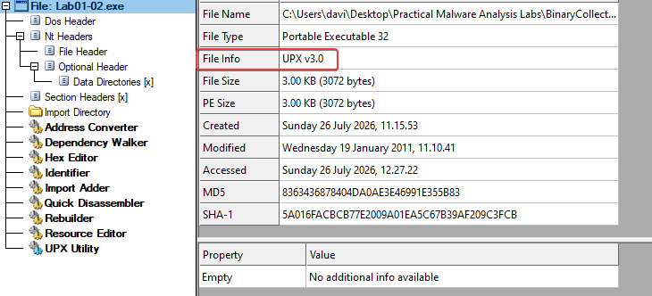

---

### 2.1.3 Question 3
```
Do any imports indicate the functionality of this program? If so, what are these imports and what do they reveal?
```

In kernel32.dll there are imports for creating mutexes, creating threads, opening mutexes, this malware clearly creates mutexes to make sure it only runs one instance at a time.

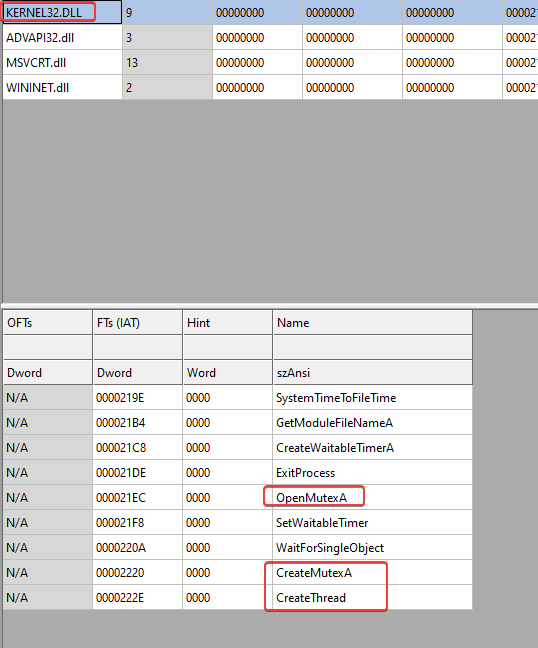

In imports from advapi32.dll, there are signs of registry key creation, we can assume that the malware creates registry keys to maintain its persistence and automatic startup on the system.

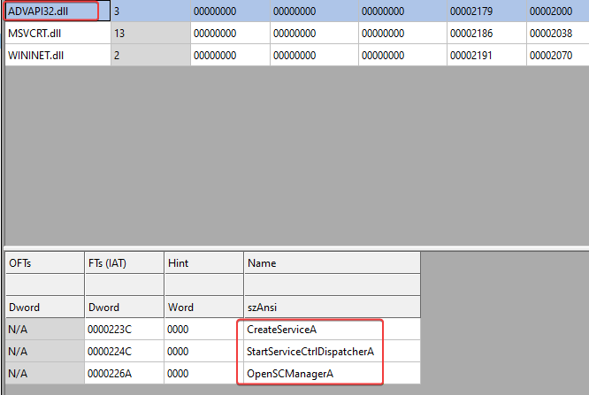

And imports from wininet.dll, and where we see that the malware makes its connection to the C2 server, possibly to start a next step, download payloads, etc.

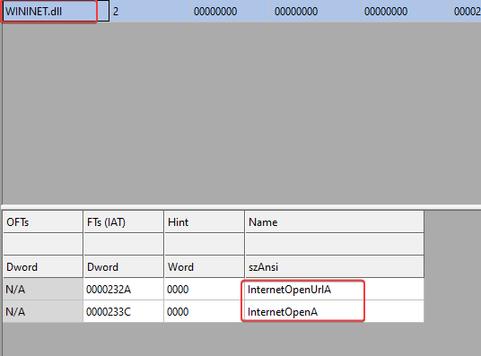

---

### 2.1.4 Question 4
```
What host- or network-based indicators could be used to identify this malware on infected machines?
```

Analyzing the strings in the binary, it's possible to identify the possible name of the service that the malware creates, which is 'MalService'. There's also an interesting string, 'HGL345', possibly the name of the mutex, and the URL that is possibly the C2: www[.]malwareanalysisbook[.]com.

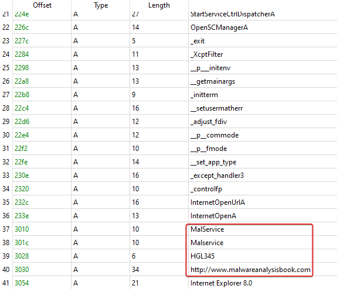

---

## 3.1 LAB 01-03
```
Lab01-03.exe
```

### 3.1.1 Question 1
```
Upload the file Lab01-03.exe to http://www.VirusTotal.com/. Does it match any existing antivirus definitions?
```

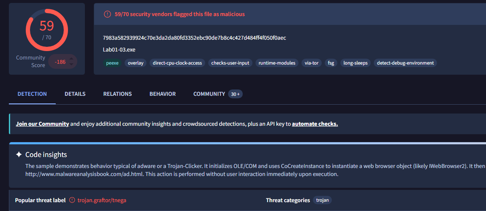

Trojan

---

### 3.1.2 Question 2
```
Is there any indication that this file is compressed or obfuscated? If so, what are those indications? If the file is compressed, decompress it if possible.
```

Packed using FSG.

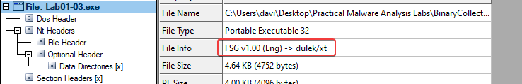

---

### 3.1.3 Question 3
```
Do any imports indicate the functionality of this program? If so, what are these imports and what do they reveal?
```

It hasn't been possible to unpack the file so far with the techniques learned, the file is full of FSG.

---

### 3.1.4 Question 4
```
What host- or network-based indicators could be used to identify this malware on infected machines?
```

It hasn’t been possible to unpack the file so far with the techniques learned, the file is full of FSG.

---

## 4.1 LAB 01-04
```
Lab01-04.exe
```

### 4.1.1 Question 1
```
Upload the file Lab01-04.exe to http://www.VirusTotal.com/. Does it match any existing antivirus definitions?
```

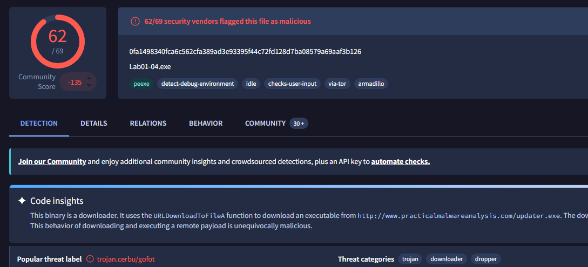

Trojan, downloader, dropper.

---

### 4.1.2 Question 2
```
Is there any indication that this file is compressed or obfuscated? If so, what are those indications? If the file is compressed, decompress it if possible.
```

Possibly the binary isn't compressed or obfuscated, low entropy, virtual size and raw size are close in value, there's no indication of names of possible packers.

---

### 4.1.3 Question 3
```
When was this program compiled?
```

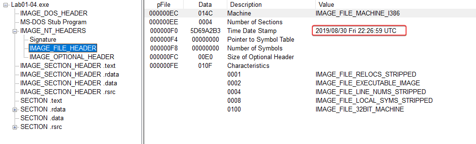

---

### 4.1.4 Question 4
```
Do any imports indicate the functionality of this program? If so, what are these imports and what do they reveal?
```

In the kernel32.dll imports, we can see that it loads resources into the file's resource section and writes files to the disk. By using the GetWindowsDirectory function, we can say that it will write files to the system directory and execute them using the WinExec function.

The advapi32.dll imports indicate token manipulation, which is being assigned to this malware process, possibly for privilege escalation.

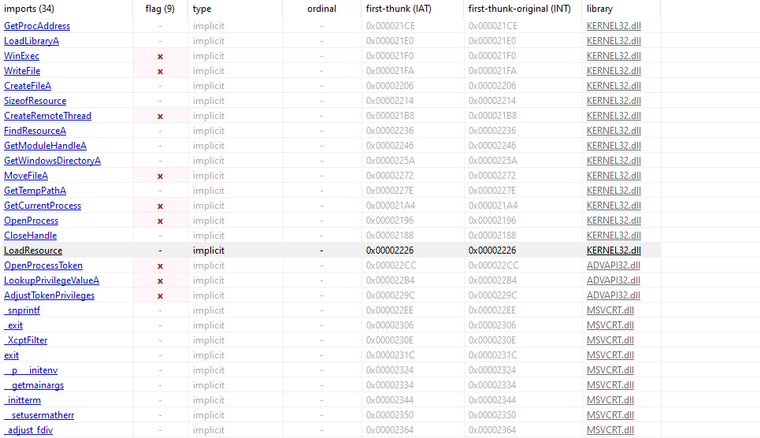

---

### 4.1.5 Question 5
```
What host- or network-based indicators could be used to identify this malware on infected machines?
```

We can identify possible files used by the malware in the binary strings:
    - winup.exe
    - wupdmgrd.exe
And a host that the malware possibly communicates with:
    - www[.]practicalmalwareanalysis[.]com

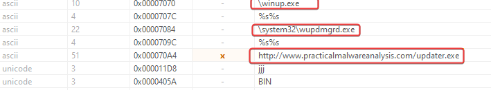

---

### 4.1.6 Question 6
```
This file has a resource in the resources section. Use Resource Hacker to examine this resource and then use it to extract the resource. What can you learn from the resource?
```

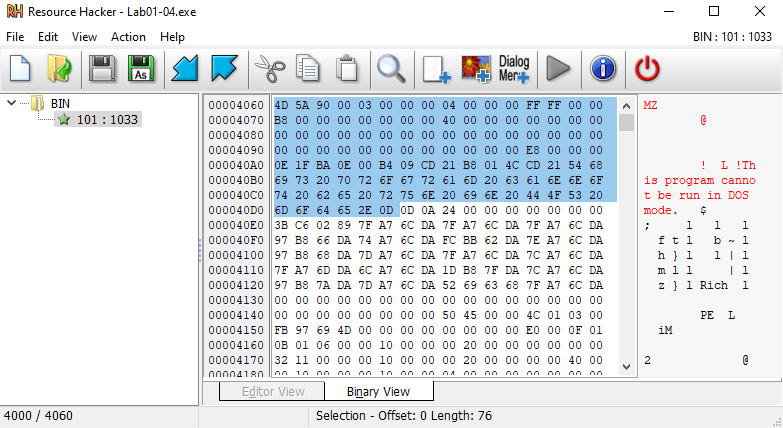

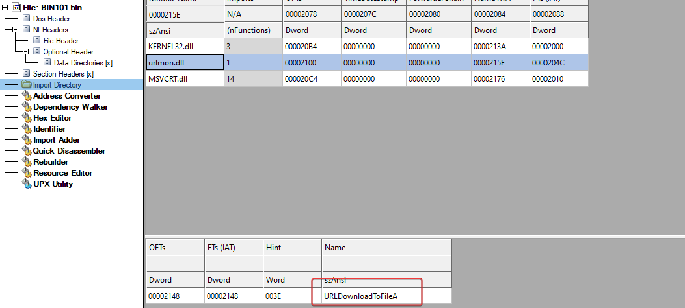