In this post, I continue my studies of the book "Practical Malware Analysis" and begin working on Lab 11. The goal is to apply practical static and dynamic analysis techniques to understand the behavior of real samples, reinforcing fundamental concepts used in malware analysis environments. This content is part of my study routine and documentation of the learning steps.

---

## LAB 11-01
```
Lab11-01.exe
```

### Question 1
```
What does the malware install on the disk?
```

When examining the binary using PEview, we can see that it contains imports related to reading its resource sections, writing a file to disk, and it also has an unusual import marked as binary.

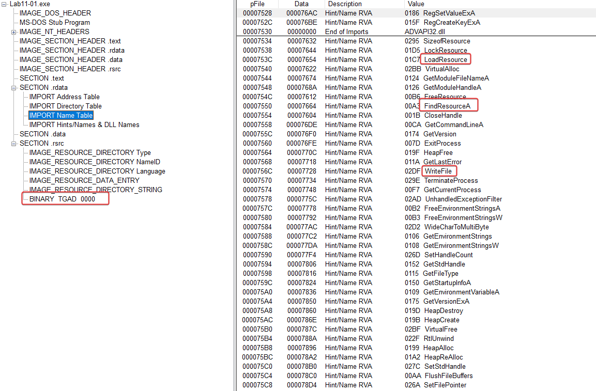

In the binary strings, there are some references to GINA (Graphical Identification and Authentication), a system that allowed third parties to customize the login process, implemented in msgina.dll, loaded in Winlogon during login. We can already assume that the malware will drop a malicious .dll on the disk aimed at stealing the user's credentials.

```
GinaDLL
SOFTWARE\Microsoft\Windows NT\CurrentVersion\Winlogon
msgina32.dll
\msgina32.dll
MSGina.dll
```

Using Procmon, we can see that it drops msgina32.dll to the disk before setting up a registry key to specify that the custom GINA DLL will be used during login.

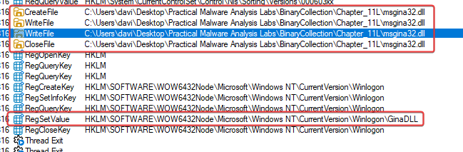

---

### Question 2
```
How does malware manage to stay persistent?
```

As shown above, persistence is achieved by registering msgina32.dll, which is taken from its resource section, as a custom GINA DLL in the Windows Registry at the location below:

- HKLM\SOFTWARE\Microsoft\Windows NT\CurrentVersion\Winlogon\GinaDLL

We know that it is loaded in Winlogon, and it may have credentials passed through it that can be captured.

Most exports just pass the real call to **msgina.dll**, except **WlxLoggedOutSAS**, which also logs credentials (username, domain, password, old password) into a file disguised as a driver (.sys), before passing the real call along.

---

### Question 3
```
How does malware steal the user's credentials?
```

Analyzing the obtained dll, 'msgina32.dll', looking at its imports we can see in the exports references to the GINA functions.

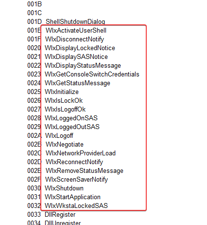

Looking at the strings in this DLL, we can see that it contains some interesting strings that seem to be related to formatting, as well as references to msutil32.sys that we haven't seen used yet.

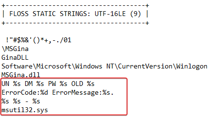

What we can use as a pivot is the msutil32.sys file used as a disguised driver that is used to collect the user's credentials before passing them on to the real call.

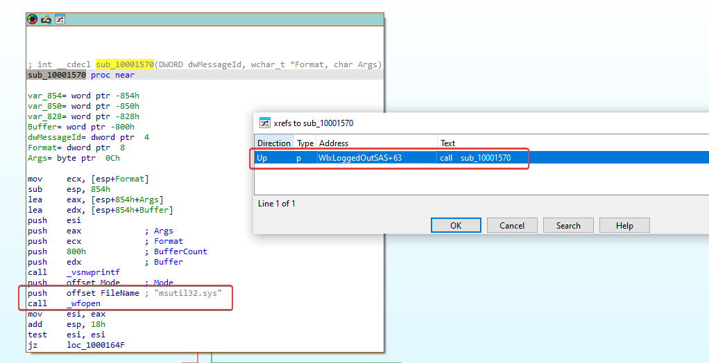

We can immediately see that this calls _wfopen, which indicates that there is a file named msutil32.sys that will be opened. Checking the reference to this function gives us the impression that the formatted string below will be written to the msutil32.sys file.

- ONU %s DM %s PW %s OLD %s

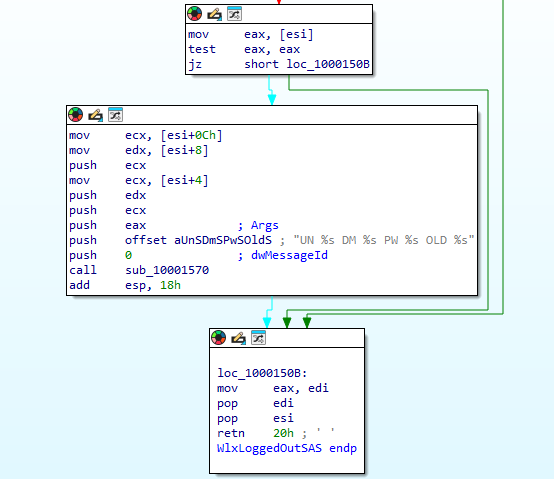

---

### Question 4
```
What does the malware do with stolen credentials?
```

Looking at sub_10001570, it seems like this is getting the date, time, and another value that's being put into msutil32.sys along with a new character line.

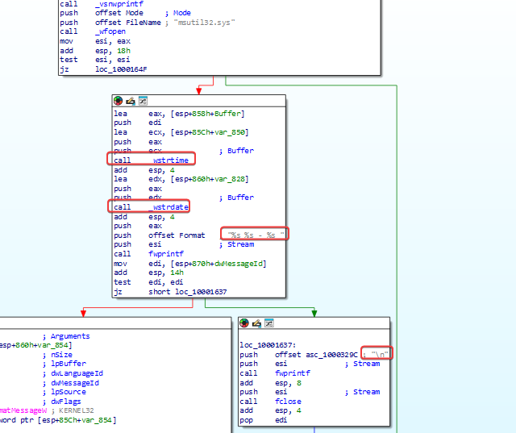

Based on what we see from this function, the final value being written to this file is the content passed by the calling function: UN %s DM %s PW %s OLD %s.

Putting all this together, we can make the informed decision that the malware will create a file called msutil32.sys that will contain the date, time, domain, username, and password of a specific user every time a call is made to the exported WlxLoggedOutSAS function of msgina32.dll. Since this will be executed by winlogon.exe, we can expect it to be inside the C:WindowsSystem32 directory.

---

### Question 5
```
How can you use this malware to get user credentials in your test environment?
```

At the time of the resolution, I couldn't access Windows XP or any earlier version, because GINA DLLs are ignored in later versions.

---

## LAB 11-02
```
Lab11-02.dll e Lab11-02.ini
```

---

### Question 1
```
What are the exports of this malware?
```

In the binary exports, we can see that there is an export called 'installer', which is possibly an installer.

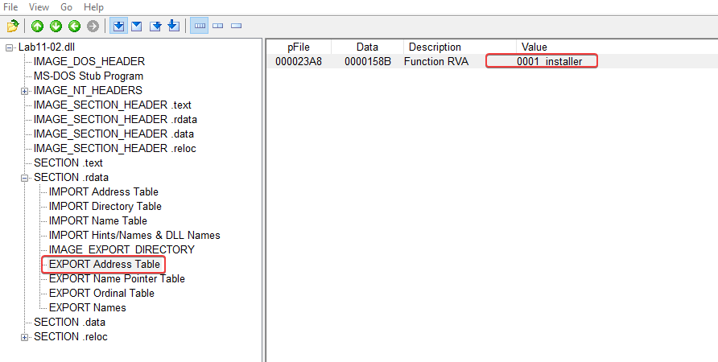

---

### Question 2
```
What happens after trying to install this malware using rundll32.dll?
```

We can run it as follows:

```powershell
rundll32.exe Lab11-02.dll, installer
```

After we run it, we can filter inside Procmon for processes named 'rundll32.exe' and see what happens.

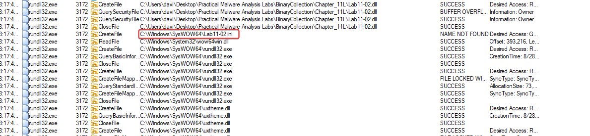
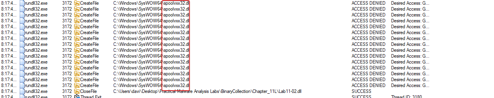

CreateFile call for:

  - C:\Windows\SysWOW64\Lab11-02.ini

Since we know that CreateFile can be used both to create and to read a file, we can take a closer look at the properties of this event. Doing that, we see that it's just trying to open the file with read privileges, rather than writing to it.

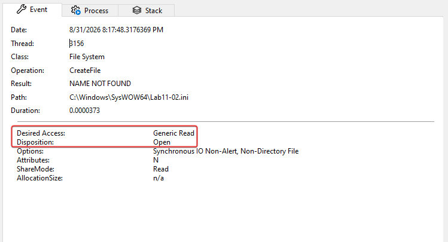

Different from this, we have the other one called CreateFile:

  - C:\Windows\SysWOW64\spoolvxx32.dll

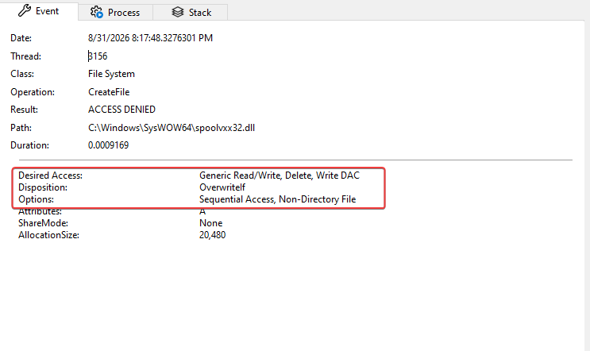

Additionally, the malware tries to add an entry to include the above DLL in 'AppInit_DLLs' within the registry. If we look at this and the security implementations added to Windows 7, we can understand that this is used to load the specified DLL into all user-mode processes on the system; however, since this was designed for Windows XP, no modification to 'RequireSignedAppInit_DLLs' is needed to allow unsigned modules to be loaded this way. 

---

### Question 3
```
Where should the Lab11-02.ini file be located for the malware to be installed properly?
```

C:\Windows\System32\Lab11-02.ini

---

### Question 4
```
How is this malware installed to ensure its persistence?
```

The malware installs itself as an AppInit_DLL for persistence, which means it will be loaded into any user-mode process (anything that loads a user interface, for example, using User32.dll) on a system, making it hard to fully remove if all user processes are running the malware.

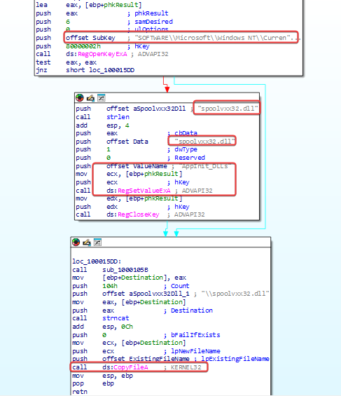

---
