In this post, I continue my studies of the book "Practical Malware Analysis" and begin working on Lab 12. The goal is to apply practical static and dynamic analysis techniques to understand the behavior of real samples, reinforcing fundamental concepts used in malware analysis environments. This content is part of my study routine and documentation of the learning steps.

## LAB 12-01.exe
```
Lab12_01.exe and Lab12_01.dll
```

### Question 1
```
What happens when you run the malware executable file?
```

Before executing the malware, decide to analyze its imports.

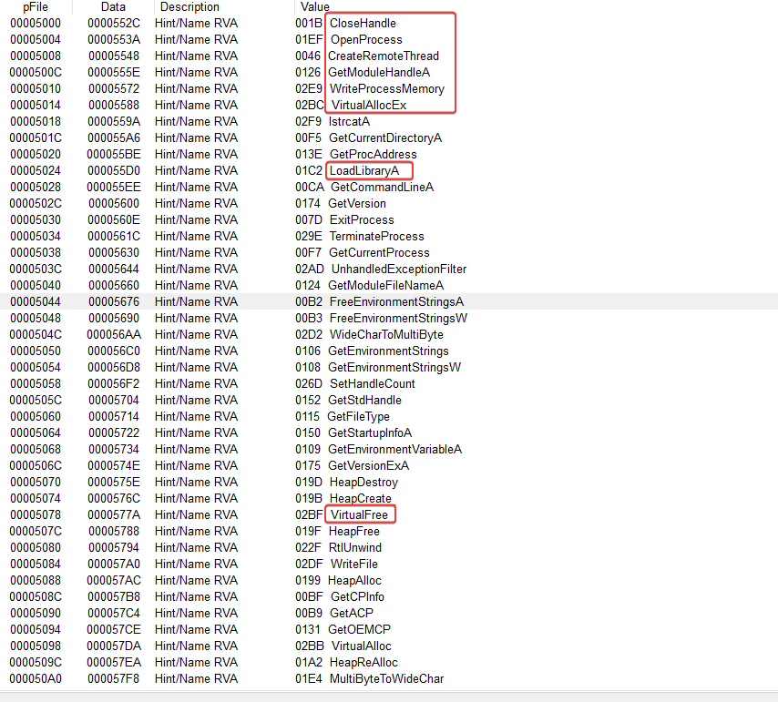

With the imports above, we can say that the binary performs some kind of device process injection using some API calls.

- WriteProcessMemory
- CreateRemoteThread
- VirtualAllocEx
- LoadLibraryA
- VirtualFree

In the imports of USER32.dll, it uses the API call MessageBoxA. When we run the binary, we can see a pop-up.


### Question 2
```
Which process is being injected?
```

For better identification, I will analyze it in IDA.

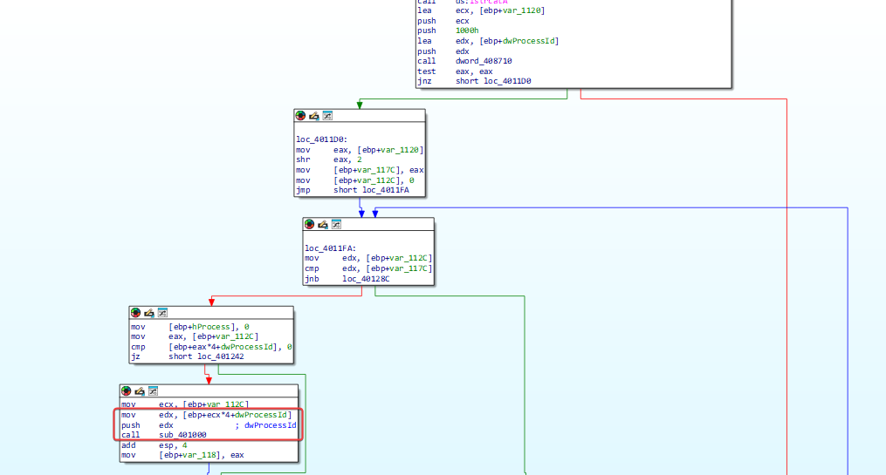

There are some checks and operations before calling sub_401000 with a relevant processId. Let's see what sub_401000 does.

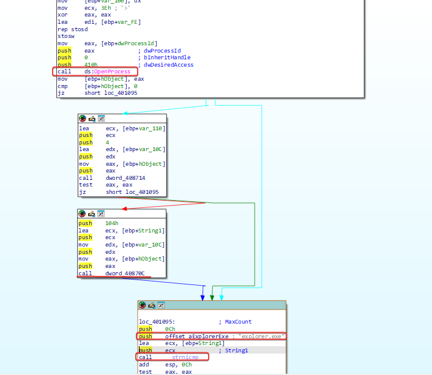

It is possible to notice that there is a process check being done based on the processID, and it is comparing the output of 'GetModuleBaseNameA'. More specifically, it translates the processID to the process name from dword_40870C, and compares it with the string 'explore.exe'.

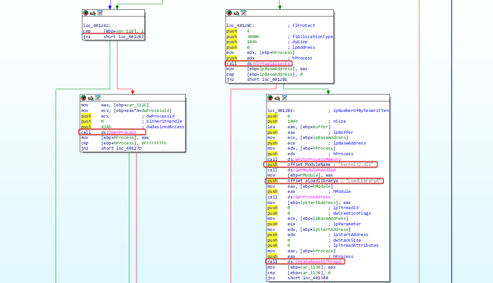

If the comparison is successful, the process function will return 1, then it will open a target for the process and start allocating memory that will be used by LoadLibrary to load the DLL.

### Question 3
```
How to make the malware stop the pop-ups?
```

The easiest way is to stop the explorer.exe process using the PowerShell command:

```
Stop-Process -ProcessName explorer
```

### Question 4
```
How does this malware operate?
```

As we have already seen the process to be injected, let's analyze the DLL code in IDA.

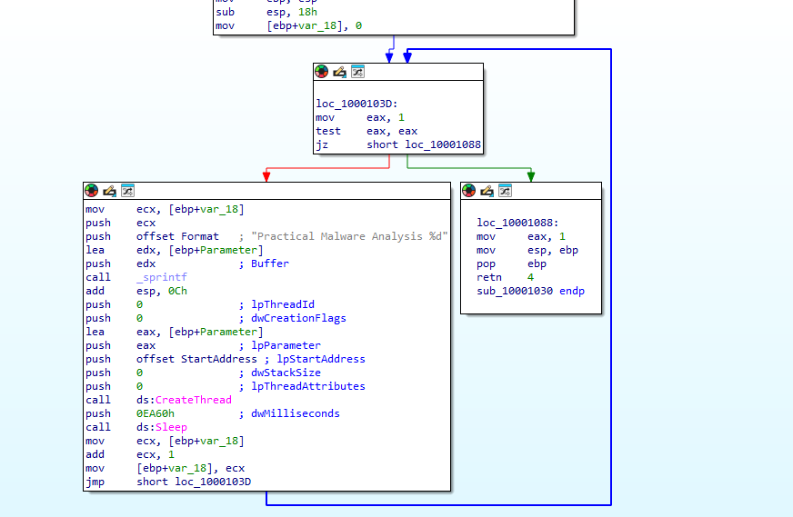

The analysis is simple. The code runs a loop in which the variable var_18 is incremented with each repetition. Before each execution, there is a pause of 60,000 milliseconds (60 seconds).

As a result, every 60 seconds a new thread is created within the explorer.exe process, which displays a message box. The message contains the text "Practical Malware Analysis %d", where %d is replaced by the value of var_18, indicating how many minutes have passed since the injection into explorer.exe.

## LAB 12-02.exe

### Question 1
```
What is the purpose of this program?
```

Based on the program's imports, we noticed that it is performing memory manipulation in a process.

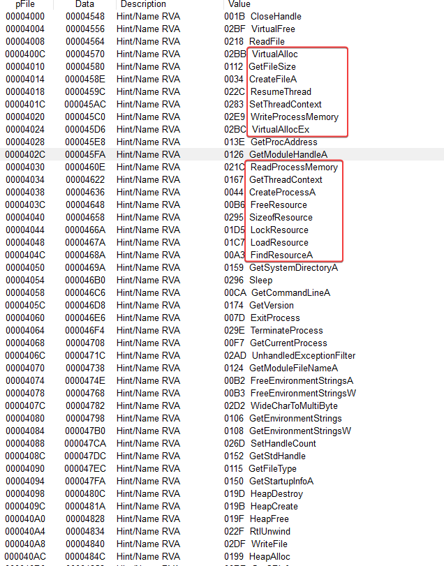

With this, we can start thinking that this could be used to execute embedded code in the resources. It is possible to notice an unusual resource 'name_0'.

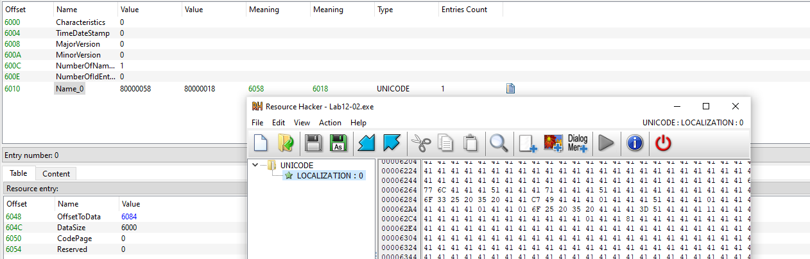

I ran this binary on VirusTotal to look for any clues, and we can see that it is being classified as a keylogger.

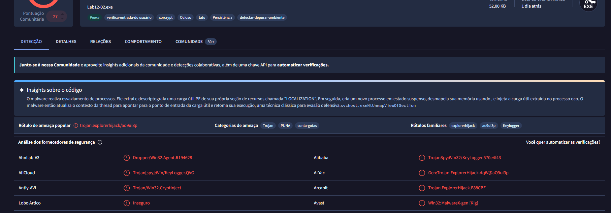

The malware performs process hollowing. It extracts and decrypts a PE payload from its own resource section called "LOCATION." Then, it creates a new suspended process, **svchost.exe**, unmaps its memory using **NtUnmapViewOfSection**, and injects the extracted payload into the hollow process. The malware then updates the thread context to point to the payload's entry point and resumes its execution, a classic technique for defense evasion.

---

### Question 2
```
How does the startup program hide its execution?
```

Using the **Process Hollowing** injection technique, which forces a legitimate system binary to run malicious code. The malware first starts a clean system process (in this case, svchost.exe) - in a suspended state, by calling the `CreateProcessA` API with the CREATE_SUSPENDED flag (0x4).

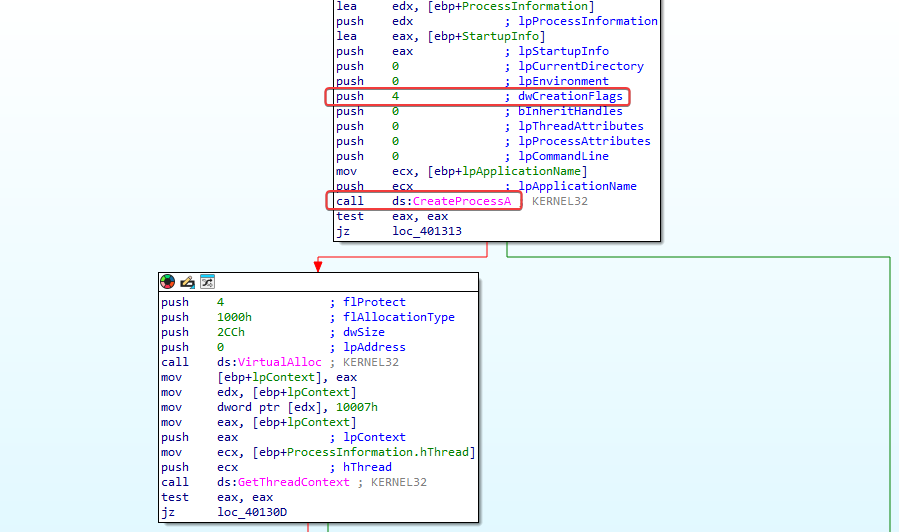

Once the process is created but remains frozen, the malware checks its structure and reads its memory using `ReadProcessMemory` to find the base address of the executable. Then, it dynamically resolves the function `NtUnmapViewOfSection` from `ntdll.dll`, which is used to unmap the legitimate code from the target process's memory space.

After emptying the process, the malware creates a new memory region using `VirtualAllocEx` and copies its own malicious payload into the **Process Hollowing** (hollow shell) using `WriteProcessMemory`.

As far as I'm concerned, the malware gets and modifies the thread context using `GetThreadContext` and updates the remote process entry point with `SetThreadContext`. Then, it lets the process run by calling `ResumeThread`, causing the malicious code to execute inside a legitimate process, like `svchost.exe`.


---

### Question 3
```
Where is the malicious content stored?
```

As mentioned in the answer to question 1, we know that it extracts and decrypts a PE payload from its own resource section called "LOCALIZATION."

---

### Question 4
```
How is the payload protected?
```

In `sub_401000` there's a decryption routine where we can see evidence that it uses the third argument passed as the key for XOR decoding.

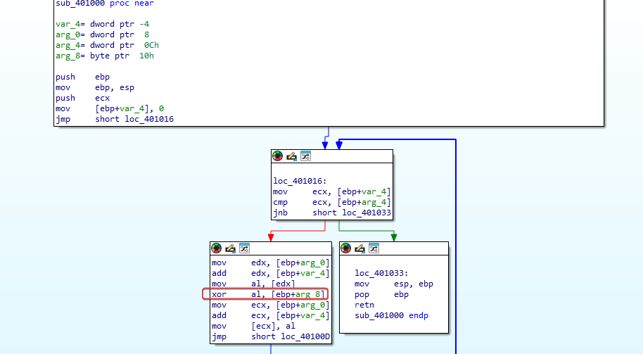

We can see that we have references to the call of this decryption function.

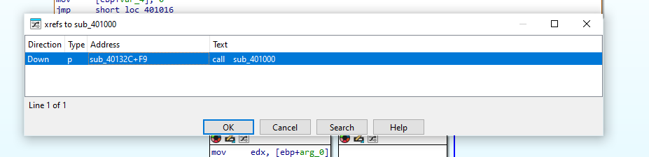

41h (A) is being pushed onto the stack first, so it will be the third argument to be popped from the stack, and in this case, it indicates our key for decoding.

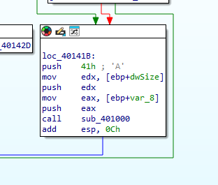

---

### Question 5
```
How are the strings protected?
```

The strings inside the 'LOCALIZATION' program's resource section are XOR-encoded using the hex key '0x41'.

When opening the resource tab payload, we get the encrypted content.

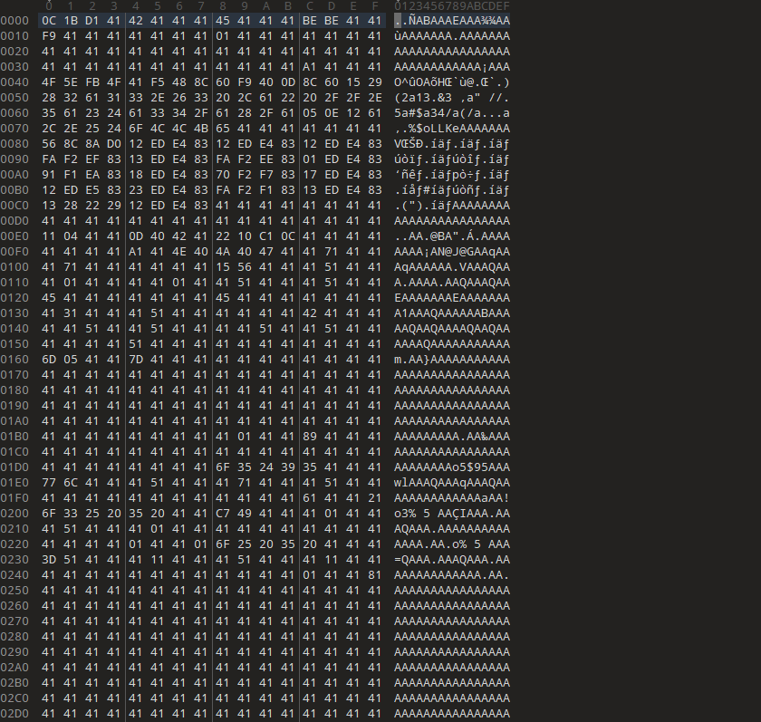

I used 010 Editor to decrypt it and got a PE file.

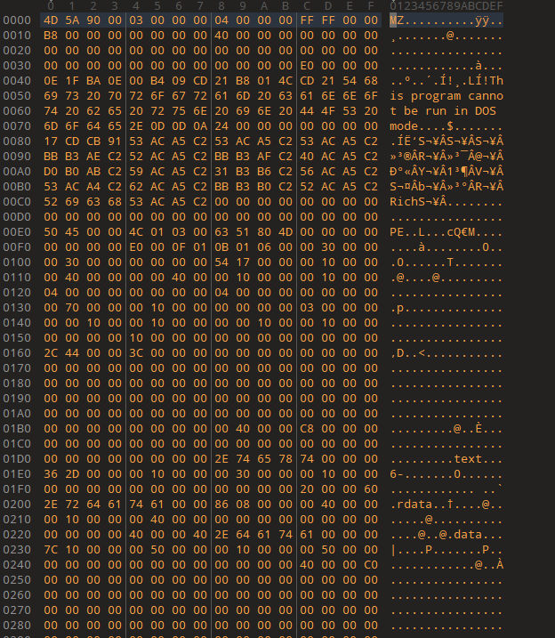

Alright, here we have the Keylogger.


## LAB 12-03.exe ou Keylogger.exe obtivo da Questao 5.

---

### Question 1
```
What's the purpose of this payload?
```

We already know it's a keylogger.

---

### Question 2
```
How does the malicious payload get injected?
```

When looking at the main method of this binary, we can see that it installs a hook procedure defined by the application.

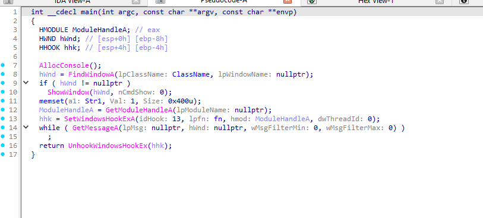

In this case, the idHook argument of '0D' in hexadecimal translates to 13, and this sets the type of hook to be installed. Looking at Microsoft's documentation, we found out that this relates to a 'WH_KEYBOARD_LL' hook.

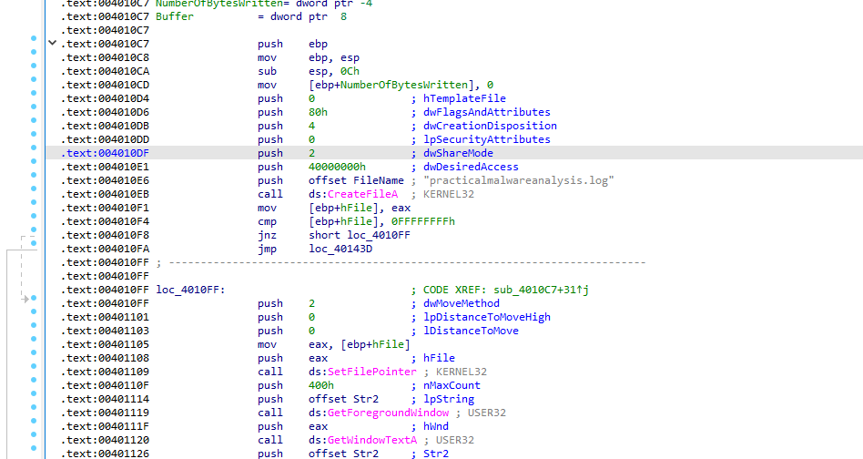

The execution routing is set up through the parameters of **`SetWindowsHookExA`**, where the malware provides the handle of its hooking function, **`lpfn`**, along with the base handle of the module, **`hMod`**, dynamically retrieved using **`GetModuleHandleA`**. This allows Windows to direct keyboard event notifications to the malware’s malicious callback function.

After the event is processed, the **`CallNextHookEx`** function is used to pass the input to the next hook in the chain, letting normal event processing continue while the malware captures the keystrokes.

---

### Question 3
```
What kind of leftover in the file system does this program create?
```

As shown in the analysis above, this program creates a keylog file called 'practicalmalwareanalysis.log' to store stolen keystrokes.

## LAB 13-04.exe

---

### Question 1
```
What does the code at 0x401000 do?
```

The function at the address is an enumeration and search routine used for process checking. It goes through all the system's active processes to find a specific target by comparing process names. Initially, it uses EnumProcesses to get a list of active process IDs (PIDs).

Next, the routine goes through these PIDs and uses OpenProcess to get a handle for each process. With that handle, it calls GetModuleBaseNameA to get the name of the process's main module and then compares that name with the target process set by the malware using _stricmp, doing a string comparison that ignores case differences.

when a match is found, the routine ends the search loop and returns the target process's PID to the caller.

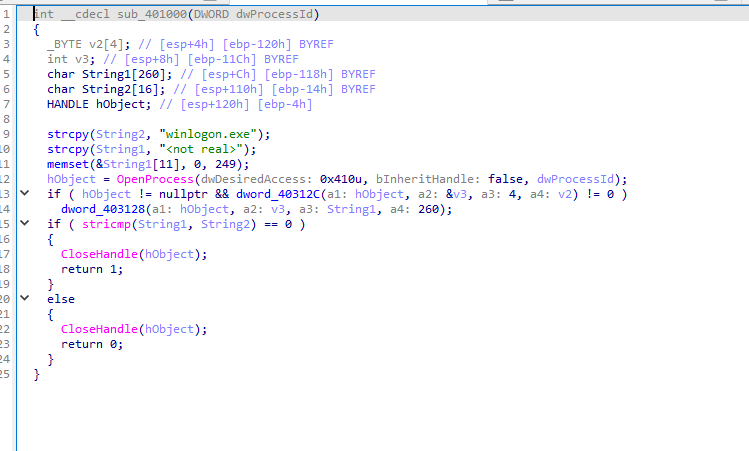

---

### Question 2
```
Which process had the code injected?
```

When our subroutine at 0x401000 successfully finds winlogon.exe, it will call another one at 'sub_401174'. Looking at this, we see a familiar call that confirms that it is winlogon.exe being injected.

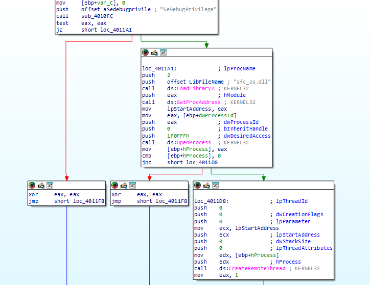

---

### Question 3
```
Which DLL is loaded using LoadLibraryA?
```

As we can see in the image above from the previous question, `sfc_os.dll`.

---

### Question 4
```
What’s the fourth argument passed to the CreateRemoteThread call?
```

The fourth argument passed to the **`CreateRemoteThread`** API call corresponds to the **`lpStartAddress`** parameter, which defines the entry point where the new thread will start executing in the remote process.  

In this case, the pointer doesn’t point directly to the start of **`LoadLibraryA`**. Instead, the malware gets the base address of **`sfc_os.dll`** and locates an undocumented export, specifically **ordinal 2**, which is often associated with the **`SfcTerminateWatcherThread`** function.  

The memory address of this exported function is then used as **`lpStartAddress`** in the **`CreateRemoteThread`** call, causing the new thread in the remote process—in this case, **`winlogon.exe`**—to start executing directly in this internal routine of the DLL.

---

### Question 5
```
What malware is installed by the main executable?
```

The main executable drops a secondary malicious file called **`wupdmgr.exe`** into the Windows system directory, typically at **`C:WindowsSystem32wupdmgr.exe`**. The launcher extracts this binary directly from its internal PE resource section.

As seen in the disassembly flow, the malware uses **`GetSystemDirectoryA`** to dynamically get the system directory path and, from there, builds the full path of the target file. It then writes the extracted binary directly to disk, overwriting or impersonating the legitimate **`wupdmgr.exe`**, a component associated with the Windows Update Manager.

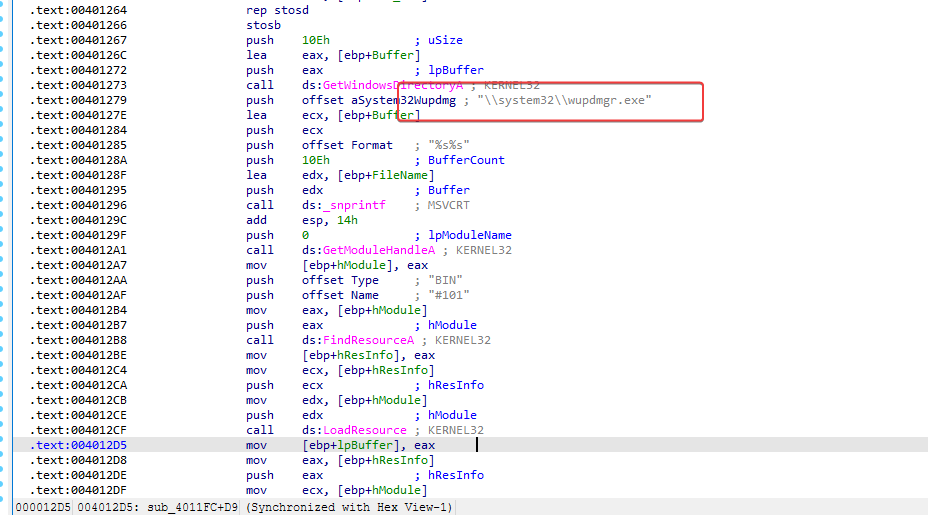

---

