The labs in this chapter focus on identifying malware network components. To some extent, these labs complement Chapter 13, since when developing network signatures, you will often need to deal with encoded content.

## Lab14-01

Analyze the malware found in the file Lab14-01.exe. This program is not harmful to your system.

### Question 1
```
Which network libraries does the malware use and what are its characteristics? Advantages?
```

When we look at the imports of this malware, it’s possible to identify that it is importing the 'URLDownloadToCacheFileA' API from the urlmon.dll library.

URLDownloadToCacheFileA is used to download data to the internet cache and returns the file name from the cache location to retrieve the bits.

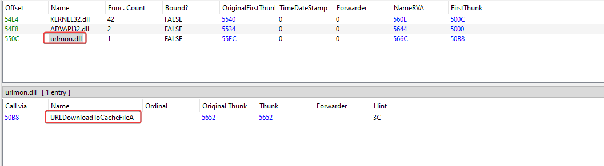

When running the binary, we can see that the following request is made:

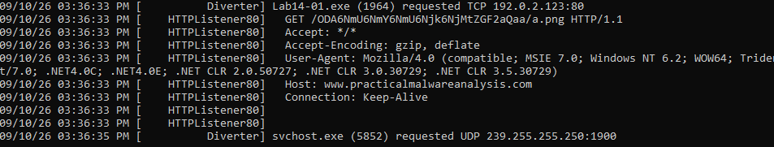

After seeing the request made, I immediately looked at the User-Agent field, which doesn't refer to the one used in my system. The malware probably has custom requests like this inside its code.

This is one of the advantages of using COM interfaces, since the request API automatically removes the appropriate User-Agent from the operating system.

---

### Question 2
```
Which origin elements are used to build the network beacon, and what conditions would make the beacon change?
```

In the previous question, when running the binary, in the request it was possible to see the beacon 'ODA6NmU6NmY6NmU6Njk6NjMtZGF2aQaa'. Decoding from base64 gave: 80:6e:6f:6e:69:63-davi, which is widely used for controlling infected users.

Analyzing the main of this malware, we can see the function calls that build this beacon,

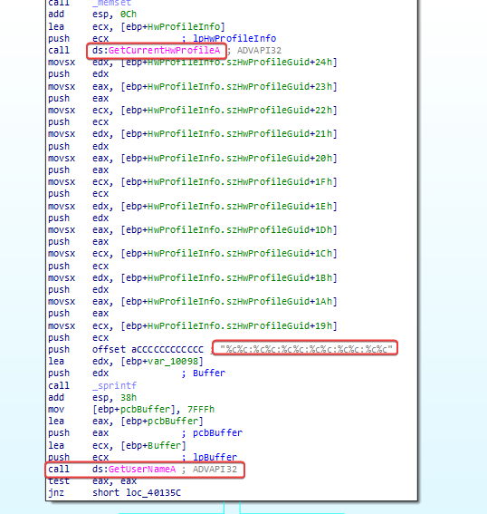

We immediately see that a call to GetCurrentHwProfileA is executed before a call to GetUserNameA, which helps confirm what we've found so far.

1. MAC Address: Extracted using the GetCurrentHwProfileA API to grab the system Hardware Profile GUID (from which the MAC Address bytes are parsed)
2. Username: The currently logged-on user.

What probably happens is that when executed on different machines, the MAC address changes, and the username probably does too, so the base64 code applied to the beacon will be different.

---

### Question 3
```
Why might the information embedded in the network beacon be of interest to the attacker?
```

Control of infected users: as soon as the malware infects a user, the beacon is sent to the C2 server, so the attacker has information about infected users.

---

### Question 4
```
Does the malware use standard Base64 encoding? If not, what's peculiar about this encoding?
```

Using KANAL to analyze possible traces of the encryption used, it gave me some addresses that I'll check in IDA.

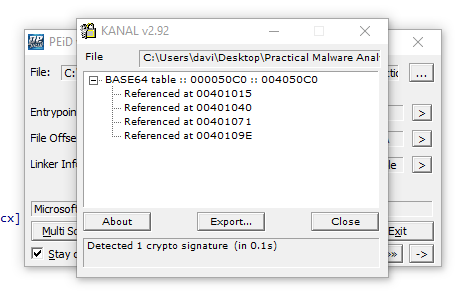

Browsing through 'sub_401000', which seems to be our encoding routine. What's interesting is that it has a modified 'padding' character used as '61h' (a), which means any padding needed in the Base64 encoded data will show up as the letter 'a' instead of the usual '='.

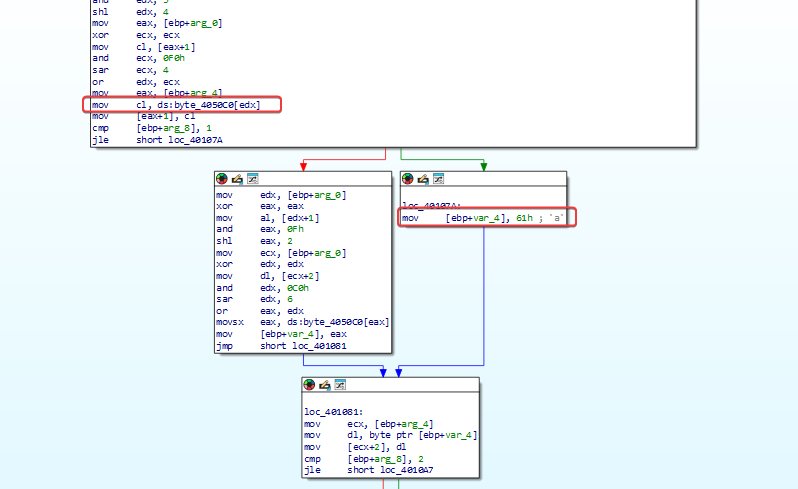

---

### Question 5
```
What's the overall goal of this malware?
```

Resuming the execution of the malware, after it gets the machine's MAC Address and username, in the flow below, it makes a call to 'sub-4011A3'.

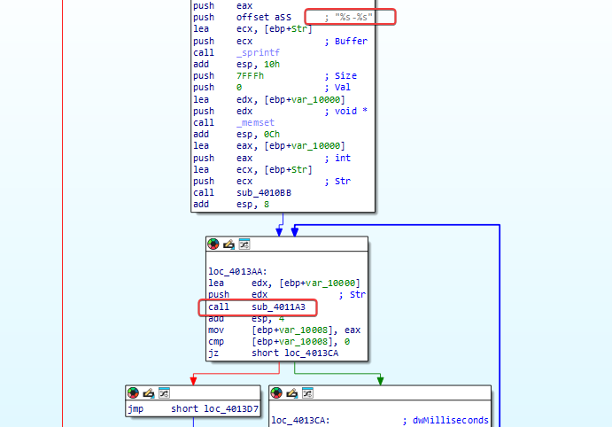

That's how the request to the URL is made using the 'URLDownloadToCacheFileA' function, then it runs the file using the 'CreateProcessA' function.

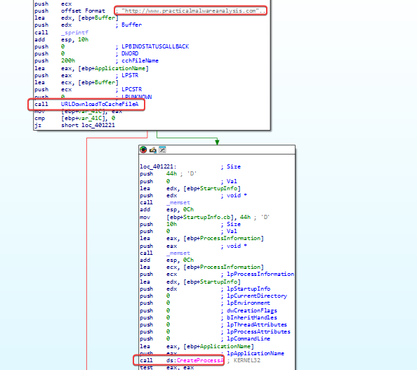

We can conclude that the malware is possibly a Dropper or Downloader, used to start other stages of infection, downloading other malware, etc.

---

### Question 6
```
Which elements of malware communication can be effectively detected using a network signature?
```

The default file that is downloaded by the malware.

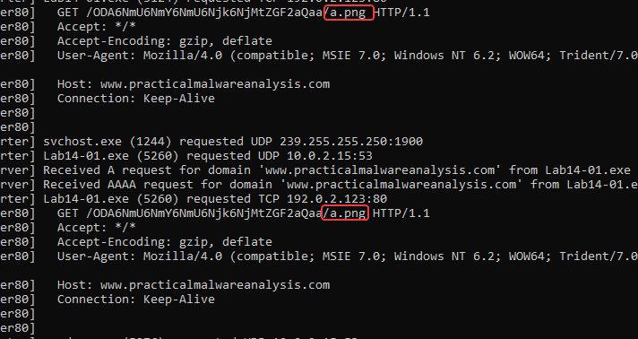

'www[.]practicalmalwareanalysis[.]com' domain  
User-Agent used by the malware is the same in any executions. (assuming that analysts are careful in this part)

---

### Question 7
```
What mistakes can analysts make when trying to develop a signature for this malware?
```

An error could be directing the User-Agent, username, MAC, or another field that is dynamically set based on the system where the malware is running.

---

### Question 8
```
Which set of signatures would detect this malware (and future variants)?
```

Identify Base64 encoded data sent when fetching the png resource of a character, and another to identify any Base64 encoded data that has a pattern involving colons and, finally, a '-' character.

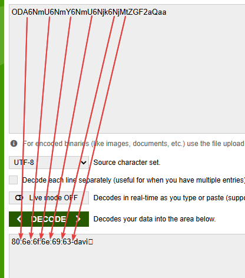

## Lab14-02

Analyze the malware found in the file Lab14-02.exe. This malware was set up to send a signal to a fixed loopback address to avoid damage to your system, but imagine it’s an external fixed address.

### Question 1
```
What are the pros and cons of programming malware to use direct IP addresses?
```

The main advantage is that the malware doesn't need to make a DNS query to find out the address of the C2 server. This cuts out a step in communication and can make some forms of DNS-based monitoring harder. Also, the IP address is set directly in the code, making the behavior simple and predictable for the malware developer.

The main downside of this approach is that the IP address can become invalid or be blocked. If the server changes its address, the malware will no longer be able to communicate with the C2. On top of that, a hardcoded IP can be easily spotted by analysts during static or dynamic analysis and be added to blocklists.

---

### Question 2
```
Which network libraries does this malware use? What are the advantages and disadvantages of using these libraries?
```

The malware imports the 'wininet.dll' library and uses the following functions:

```
  InternetCloseHandle
  InternetOpenUrlA
  InternetOpenA
  InternetReadFile
```

One advantage of these API calls is that they are more granular and, therefore, have access to work with cache and cookies. Also, they don't rely on a COM object, which, if corrupted, can cause problems.

One disadvantage of these API calls is that they require many elements, like a User Agent, to be entered manually. 

---

### Question 3
```
What is the origin of the URL that the malware uses to send signals (beaconing)? What advantages does this source offer?
```

As soon as the malware is executed, we can see that it makes a request to the system's local loopback IP 127.0.0.1 (in this case, we pretend this is a C2 IP).

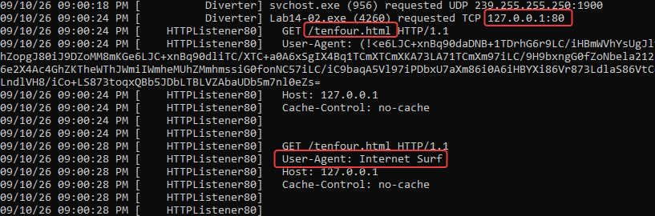

A URL (for example, the IP address and the URI) is encoded directly in the malware's .data section, instead of being generated or downloaded dynamically /tenfour.html/

Advantages: simplicity and reliability. By keeping the target hard-coded, the malware requires fewer steps to start its initial beacon. There's no need for domain generation algorithms (DGA) for reverse engineering, nor dependence on external configuration files that could fail to download.

---

### Question 4
```
Which aspect of the HTTP protocol does the malware use to achieve its goals?
```

Based on the requests, there seems to be some strange data contained within the 'User-Agent' field. Looking at the INetSim/FakeNet log, the initial beacon uses a hardcoded anomalous agent (User-Agent: Internet Surf). Subsequent requests smuggle large blocks of encoded data out of the network within this same header.

Advantage: this allows the malware to maintain a standard request profile while still exfiltrating data, potentially bypassing simplistic IDS rules that only look for suspicious payloads in the request body.

---

### Question 5
```
What kind of information is communicated in the malware's initial message? Beacon?
```

Decoding the base64 beacon:

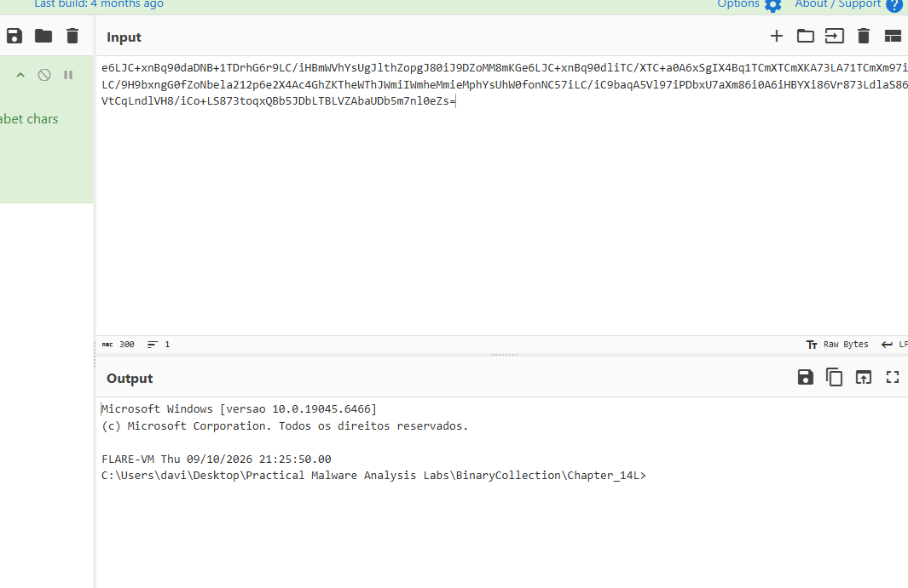

---

### Question 6
```
What are some disadvantages in the communication design of this malware? Cationic channels?
```

Lack of encryption: Besides the custom encoding, the traffic is sent over plain HTTP. Any network traffic analysis tool (like Suricata or Zeek) can easily intercept, decode, and monitor the entire interactive session.

Static IOCs: The hardcoding is super noisy. It's a trivial IOC to hunt for and block within a SIEM.

---

### Question 7
```
Is the malware's encoding scheme standard?
```

It's Base64, but it uses a custom dictionary/alphabet. Extracting its thread clearly shows this. Since it deviates from the standard index, standard base64 decoding tools will return nonsense unless they're explicitly set up with that custom alphabet. It's a classic obfuscation technique designed to make quick scanning frustrating.

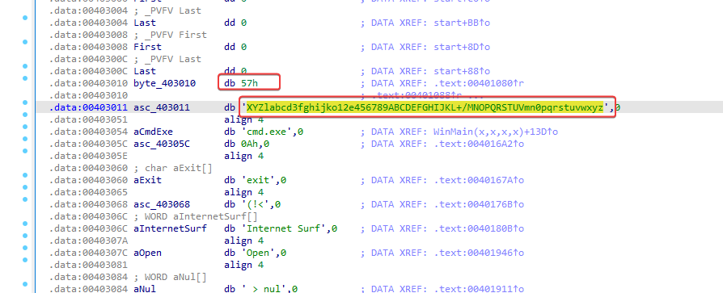

---

### Question 8
```
How is the communication ended?
```

When the attacker issues an exit command (or if the connection drops), the malware runs a cleanup routine:

  1. TerminateThread: Kills the specific threads responsible for reading and writing to the anonymous pipes.
  2. TerminateProcess: Forcefully kills the child process it had previously spawned, cmd.exe.
  3. DisconnectNamedPipe & CloseHandle: Gracefully tears down the Interprocess Communication (IPC) channels and releases system handles to avoid memory leaks or locked files.
  4. It can then either go back to waiting for a new connection or terminate completely, depending on the main control flow.

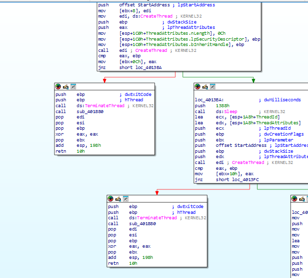

---

### Question 9
```
What is the purpose of this malware and what role could it play in the attacker's arsenal?
```

The purpose of this malware is to set up a reverse TCP command shell that passes data through a user-agent to try to avoid network analysis techniques. Since the malware tries to delete itself, it's likely that this is only used during initial access to the system, before more malware or persistence is set up, and it's just a disposable means to an end.

---
