## Lab 15-01

Analyze the sample found in the file Lab15-01.exe. This is a command-line 
program that takes an argument and prints “Good Job!” if the argument 
matches a secret code.

### Question 1
```
What anti-disassembly technique is used in this binary?
```

When opening the binary in IDA, it's easy to spot that it uses some anti-disassembly technique because all the data is marked as text and there are calls to non-existent functions.

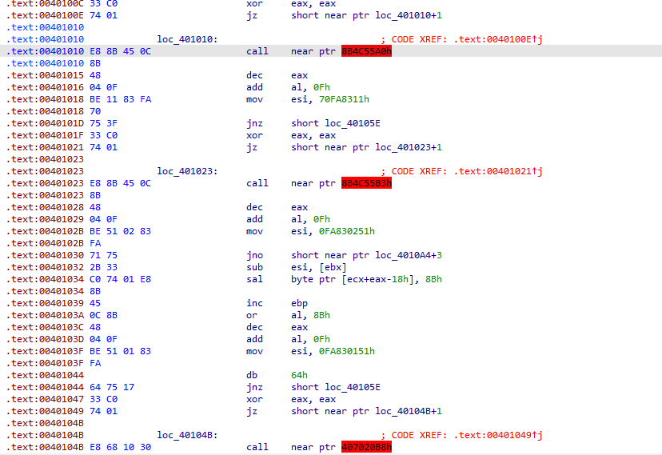

It uses the instruction **`xor eax, eax`**, which clears the `EAX` register and, consequently, sets the **ZF (Zero Flag)** to `1`. Then it executes **`jz`** (*jump if zero*). Since ZF will always be set, the jump will be taken during execution, deliberately skipping a single byte.

This technique can confuse **linear disassembly**, causing the disassembler to misinterpret the following bytes and making static code analysis harder.

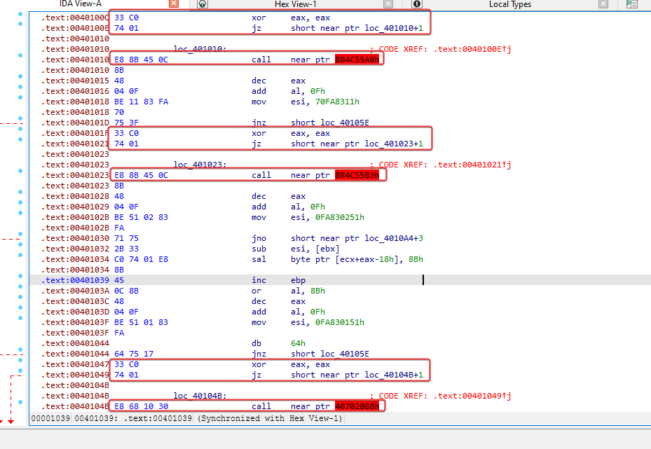

---

### Question 2
```
What rogue opcode is the disassembly tricked into disassembling?
```

The malicious opcode in the disassembly is 0xE8, which makes the disassembler believe that the following data consists of 5 bytes for the call instruction, thus hiding the remaining bytes that precede it from our view.

---

### Question 3
```
How many times is this technique used?
```

It's possible to identify them by looking for the rogue bytes that were inserted or the recurring patterns/traps at addresses 0x401010, 0x401023, 0x401037, 0x40104B, and 0x401062, usually associated with sequences like db 0E8h, xor eax, eax, and jz.

After identifying them, to rebuild the code back to how it should be, we can turn the instruction at '00401010' into data using 'D'.

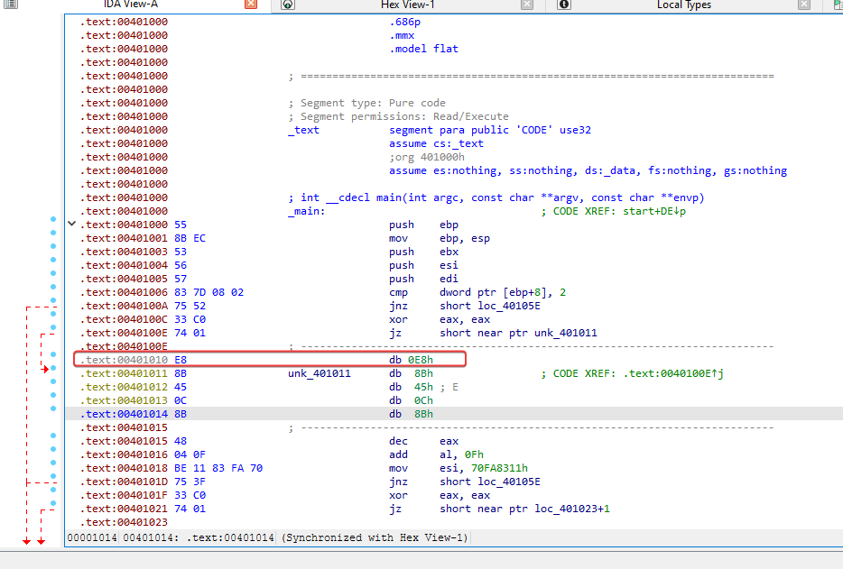

By doing this, it's possible to notice that many operation codes were converted into data, so we started converting anything beyond the rogue 0xE8 back into code using 'C'.

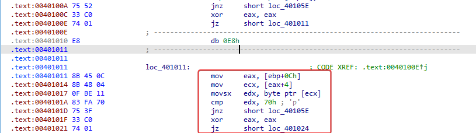

By doing this same process for each uncontrolled instance of 0xE8, we can get visibility into what was previously hard to understand, and then the program starts to look more like a properly disassembled program.

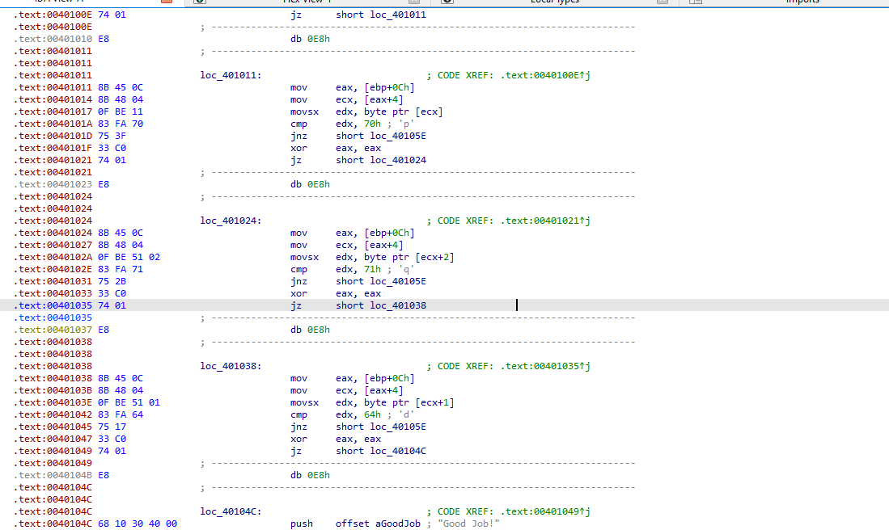

This specific desynchronization technique is used 5 times within the analyzed code sequence.

---

### Question 4
```
What command-line argument will cause the program to print 
“Good Job!”?
```

The binary it checks the arguments passed using execution, makes comparisons of the strings using 'cmp', checking 0x70 (p), 0x71 (q), 0x64 (d) = pqd.

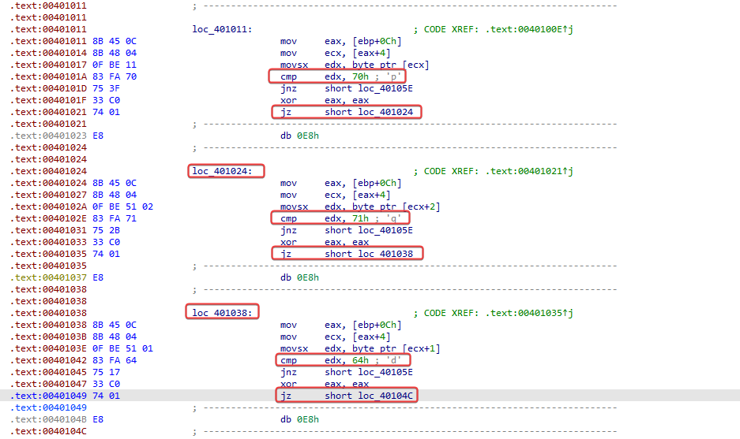

If provided correctly, it runs the 'printf' at loc_40104C that prints 'Good Job!'.

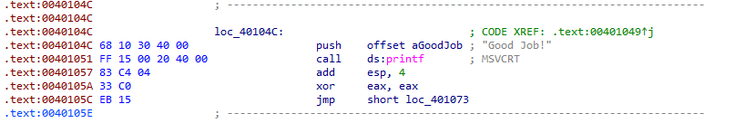

## Lab 15-02

Analyze the malware found in the file Lab15-02.exe. Correct all anti-disassembly countermeasures before analyzing the binary in order to answer the questions.

---

### Question 1
```
What URL is initially requested by the program?
```

First, let's find the anti-disassembly operation so we can run the program in the correct flow. Then we read the code looking for known anti-disassembly techniques that have an 'E9' or 'E8' operation and that seem to be calling an invalid function. This initially reveals an entry at 0040115E.

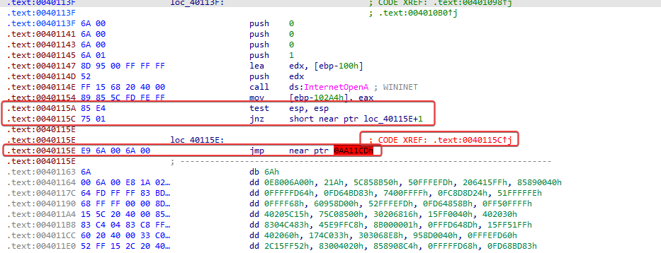

This tests if ESP = ESP and, if it is the case, it will have a non-zero flag set. If a non-zero flag is set, it will jump, but our disassembler relied on the false condition of this statement.

After fixing the execution flow, we actually have code that’s properly disassembled.

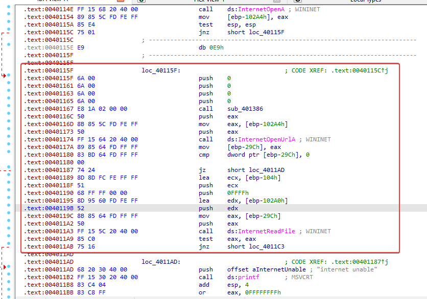

A bit further down we also have something interesting at 00401215.

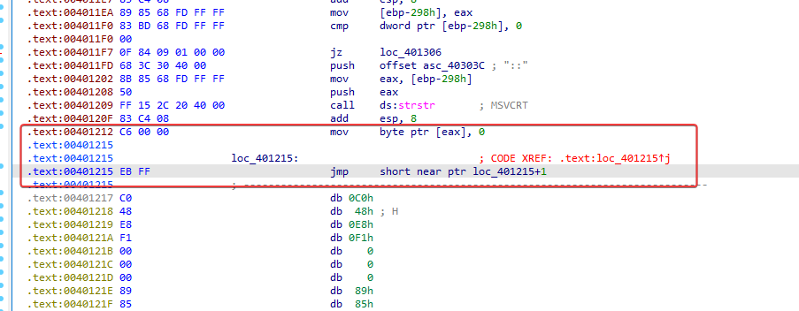

We have a sequence of four bytes, the first two bytes "EB" and "FF" form a two-byte jump instruction with a target location (0x00401216), which is the second byte of the jump instruction, that is, "FF", but the bytes "FF" and "C0" combine to form the inc EAX instruction, and after that comes the DEC EAX instruction, which ultimately becomes a NOP instruction.  

Turning this into code, we see another technique used at 0040126D.

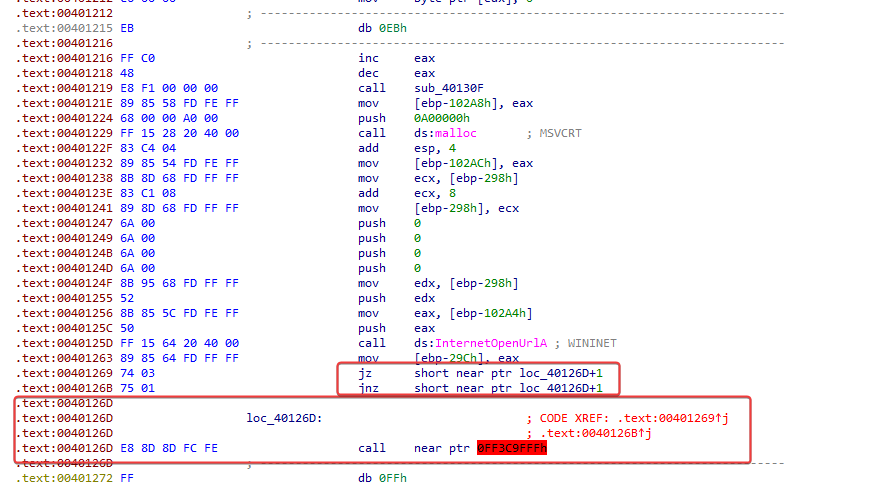

In this case, we see that the previous comparisons 'jz' and 'jnz' are jumping to the same target, and since they are two different conditions one after the other, we can see that another anti-disassembly technique was used. Converting this into data, after the surrounding elements in code, there's more anti-disassembly technique at 004012E6.

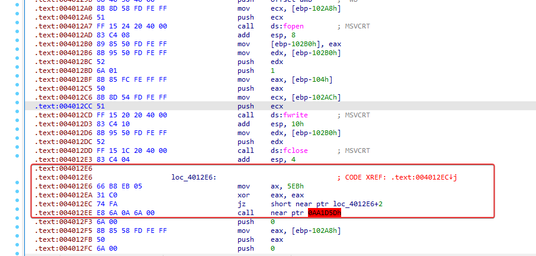

What we have here is a case of impossible disassembly, where the dishonest operational code at 4012EC is used both in the legitimate execution of the program and to make an unnecessary call. By converting areas around it to data and code, like before, and logically following the assembly to make sure it makes sense, we end up with something more like what's below.

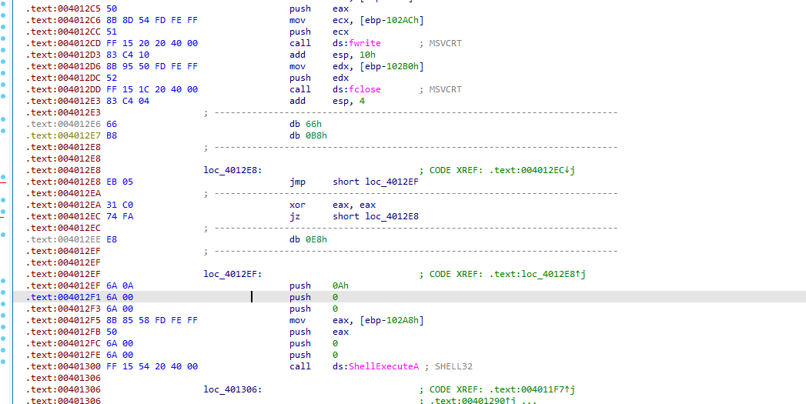

Now, there are no more jumps to invalid locations, which seems to be disassembled correctly.

Moving on to the function 'sub_401386', we can already see the URL used by the malware. Parts of the string are built dynamically on the stack, which is a common string obfuscation technique used to hide indicators of compromise.

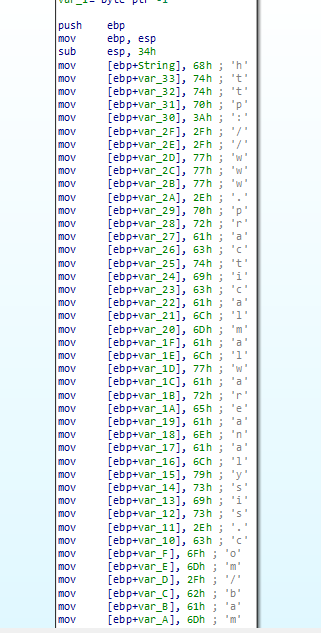

http[:]//www[.]practicalmalwareanalysis[.]com/bamboo[.]html

---

### Question 3
```
What does the program look for in the page it initially requests?
```

The malware scans the downloaded HTML looking for the string 'Bamboo::', using the C function 'strstr' to find this opening tag.

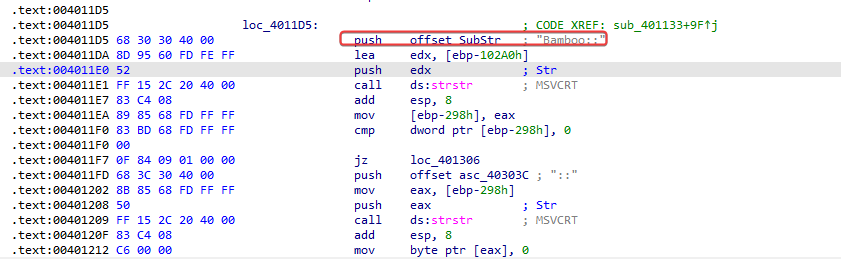

---

### Question 4
```
What does the program do with the information it extracts from 
the page?
```

The malware creates a file called **`Account Summary.xls.exe`**, probably used to store the payload downloaded from the URL extracted between the **`Bamboo::`** tags.

To make basic static analysis harder, the malware doesn't keep the file name as a continuous string. Instead, it builds **`Account Summary.xls.exe`** dynamically, putting its characters on the stack one by one.

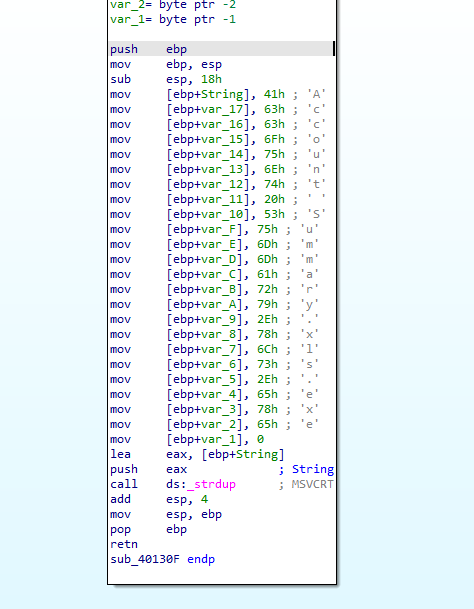

Finally, the malware runs the **`Account Summary.xls.exe`** payload using the **`ShellExecuteA`** function.

## Lab15-03

Analyze the malware found in the file Lab15-03.exe. At first glance, this binary appears to be a legitimate tool, but it actually contains more functionality than advertised. 

### Question 1
```
How is the malicious code initially called?
```

Initially, I ran the malware to see its behavior. After being executed in the terminal, it shows that it apparently is performing a process listing, and makes a GET request to 'http[:]//www[.]practicalmalwareanalysis[.]com/tt[.]html'.

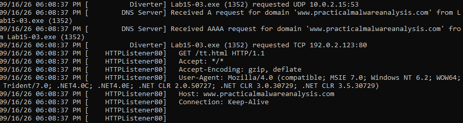

I opened the binary in IDA and already analyzed the code looking for possible signs of anti-disassembly and quickly found at 0x004010148C, code that wasn't disassembled and uses some already known anti-disassembly techniques.

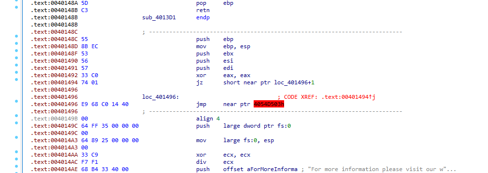

When converting the rogue byte into data and then back into code, we see a suspicious element that looks like it's dividing by zero.

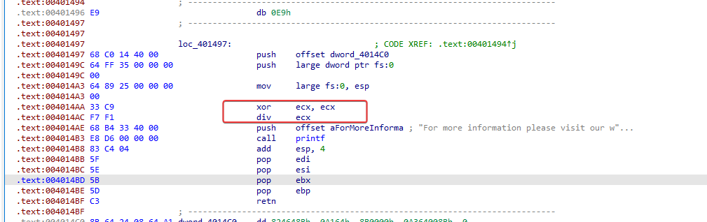

---

### Question 2
```
What does the malicious code do?
```

Following the disassembly flow, in 'loc_401497' it's possible to see a reference to 0x004014C0, but without any call instructions.

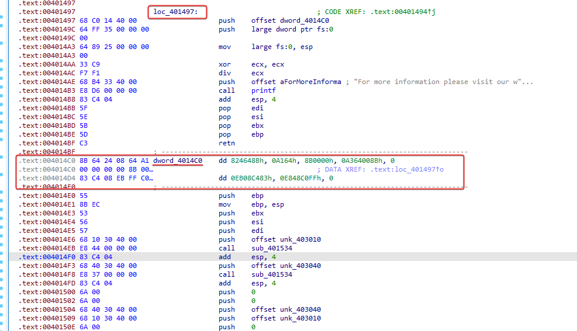

After converting the content to code, we then have another anti-disassembly attempt at 'loc_4014D7'.

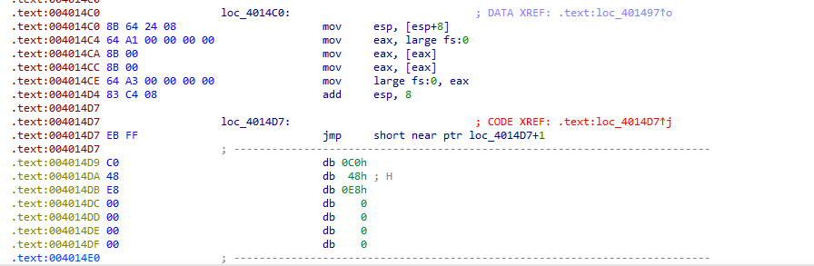

Isolating the byte 'EB' and converting it into code, we can see a call to the 'URLDownloadToFileA' API and below more anti-disassembly.

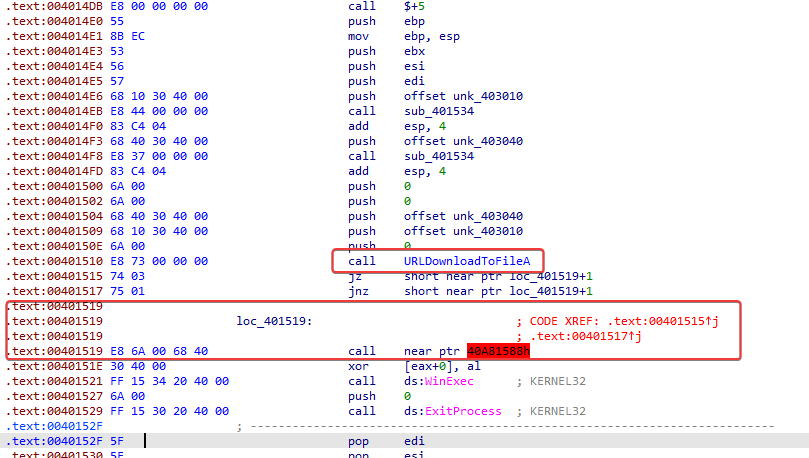

By isolating the rogue byte again and converting the surrounding text into code, we can see that a proper function now seems to be present.

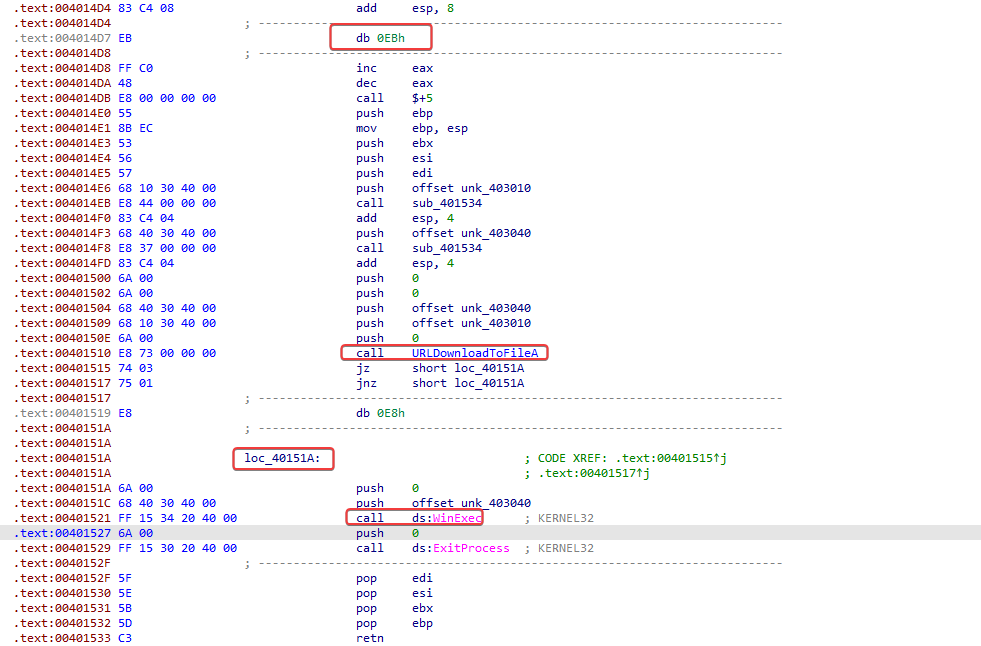

Now, we can keep in mind that the malware will download a file from a URL and run it using 'WinExec'.

---

### Question 3
```
What URL does the malware use?
```

As we saw dynamically in question 1, 'http[:]//www[.]practicalmalwareanalysis[.]com/tt[.]html'

---

### Question 4
```
What filename does the malware use?
```

The malware saves the downloaded payload as `spoolsrv.exe`. This is determined by analyzing the obfuscated byte array located at unk_4030408Ch, which contains the hexadecimal sequence: 8Fh, 90h, 90h, 93h, 8Ch, 8Dh, 89h, 0D1h, 9Ah, 87h, 9Ah. When passed through the malware's decoding function, each byte is decoded with 0xFF.


