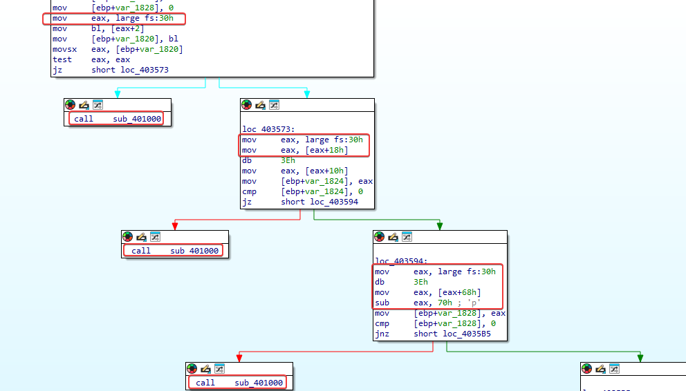
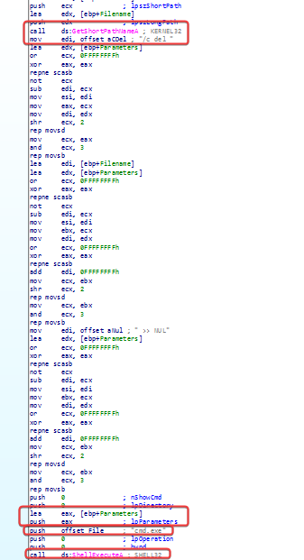
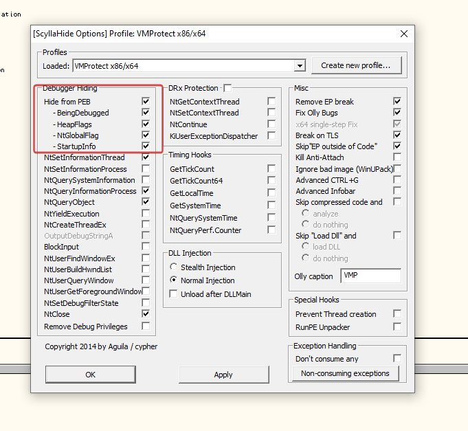
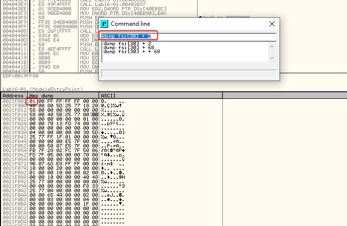
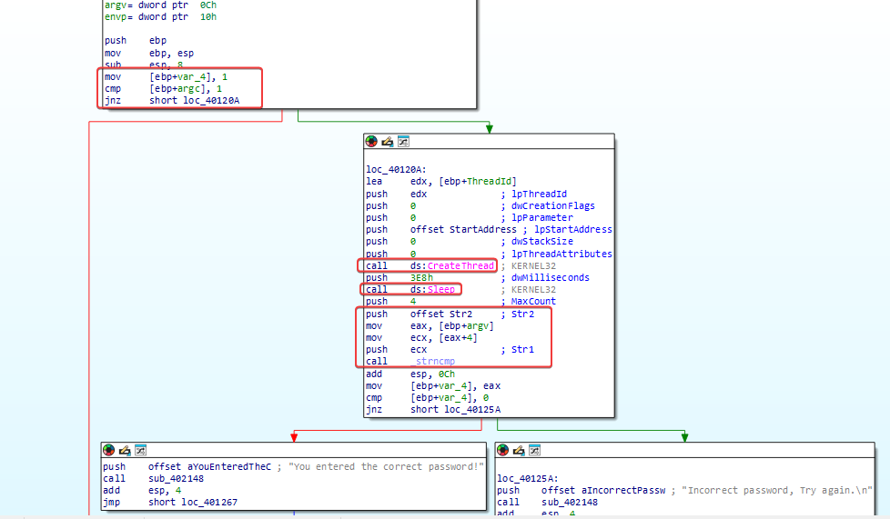
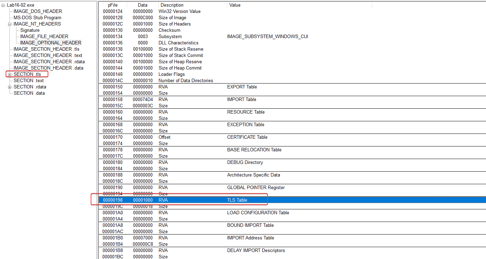
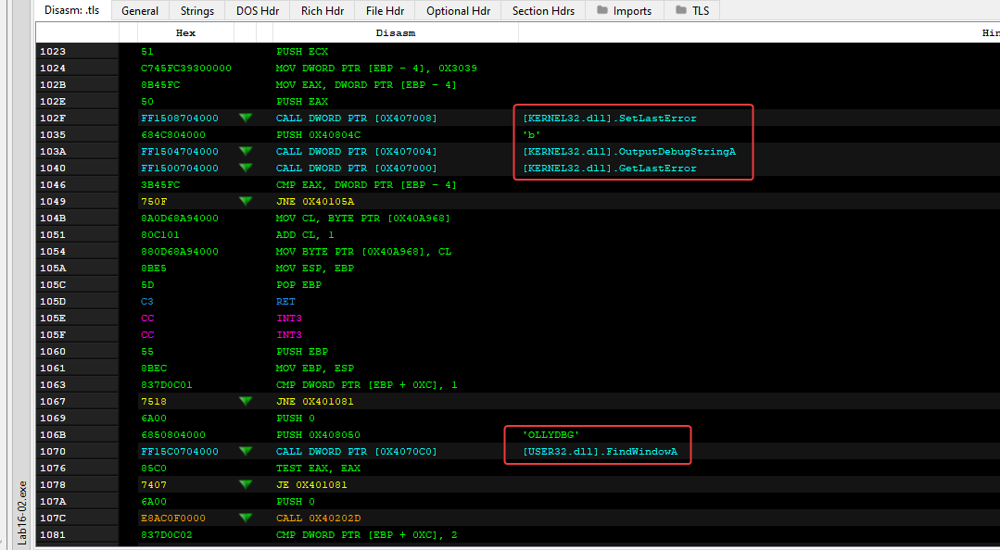
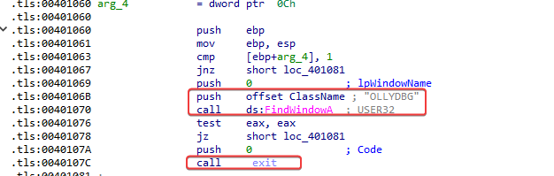

## Lab 16-01

Analyze the malware found in Lab16-01.exe using a debugger. This is the 
same malware as Lab09-01.exe, with added anti-debugging techniques.

### Question 1
```
Which anti-debugging techniques does this malware employ?
```

Before directly opening the malware in a debugger, the best way to look for anti-debugger traces is by analyzing the malware statically, examining its disassembled code. It's possible to identify references to 'fs:30h' in the code, where the PEB will possibly be analyzed.



In the first check, the location in the PEB is passed in `eax`, then the offset `2` is passed in `bl`, which corresponds in the PEB to the location of the BeingDebugged flag. After that, `test eax, eax`, if it's `0`, no debugger is attached and it jumps to 'loc_403573`.

At `loc_403573`, this is where the ProcessHeap flag located at 0x18 in the PEB structure is checked—an undocumented location inside the Reserved4 array—and it’s set as the location of a process’s first heap allocated by the loader. `mov eax, large fs:30h` -> passes the address of the PEB structure, `mov eax, [eax+18h]` -> offset to ProcessHeap. `mov eax, [eax+10h]` -> the 0x10 offset in the heap header corresponds to the ForceFlags field in Windows XP.

At `loc_403594`, the NTGlobalFlag is checked, where the 0x68 offset contains information the system uses to determine how heap structures are created. If the value there is 0x70, it means the program is running under a debugger.

> In all anti-debugging checks, if a debugger is detected as attached, a call is made to 'sub_401000'.

Inside `sub_401000`, the function that is called if the malware manages to detect the presence of a debugger during its execution, it basically deletes the malware.



---

### Question 2
```
What happens when each anti-debugging technique succeeds?
```

As we saw above, the function `sub_401000`, if the malware manages to detect the presence of a debugger, it deletes the malware.

---

### Question 3
```
How can you get around these anti-debugging techniques?
```

Using the ScyllaHide plugin in OllyDbg to debug the program, we were able to debug normally.



---

### Question 4
```
Which OllyDbg plug-in will protect you from the anti-debugging tech
niques used by this malware
```

To manually change the PEB structure, we go inside OllyDbg using the command line plugin and look for `dump fs:[30] + 2`, where the offset `2` refers to the `BeingDebugged` flag.



At the represented memory address, we can change the representation of the byte `1` to `0`.

By searching in the command line for `dump fs:[30 + 0x18] + 10` we can also change the bytes related to ProcessHeap.

---

### Question 5
```
Which OllyDbg plug-in will protect you from the anti-debugging tech
niques used by this malware
```

Using OllyDbg we can use the ScyllaHide plugin, where you can bypass many anti-debugger functions used in malware.

---

## LAB 16-02

Analyze the malware found in Lab16-02.exe using a debugger. The goal of this lab is to figure out the correct password. The malware does not drop a malicious payload. 

### Question 1
```
What happens when you run Lab16-02.exe from the command line?
```

He asks for a 4-character password to be provided.

```powershell
.\Lab16-02.exe
usage: Lab16-02.exe <4 character password>
```

---

### Question 2
```
What happens when you run Lab16-02.exe and guess the command-line 
parameter?
```

By providing any password, without even knowing it yet, it shows:

```powershell
Incorrect password, Try again.
```

---

### Question 3
```
What is the command-line password?
```

By looking at the `_main` function, we can see where the program starts by checking if the user provided 1 argument when running it. If so, besides the malware having calls to the `CreateThread` and `Sleep` APIs, further down it does a string comparison with `strncmp` to check the password provided by the user.



When analyzing the strings used in the `strncmp` function, we can see `p@ss`/ `p}`, I tried providing them, but it returned that they are incorrect.

---

### Question 4
```
Load Lab16-02.exe into IDA Pro. Where in the main function is strncmp 
found? 
```

The function `strncmp` is located at 0x0040123A.

---

### Question 5
```
What happens when you load this malware into OllyDbg using the 
default settings?
```

When opening it in OllyDbg, the process is immediately terminated.

---

### Question 6
```
What is unique about the PE structure of Lab16-02.exe?
```

When examining the malware in PEview, I immediately noticed the `.tls` section (Thread Local Storage), meant to run before the program's main method to stop the malware's execution if it's under a debugger's control.



We can also see evidence that it probably contains multiple anti-debugging techniques, like using 'OutputDebugStringA' and searching for any window called 'OLLYDBG'.



---

### Question 7
```
Where is the callback located? (Hint: Use CTRL-E in IDA Pro.)
```

callback is located at 0x00401060.

---

### Question 8
```
Which anti-debugging technique is the program using to terminate 
immediately in the debugger and how can you avoid this check?
```

The malware checks the window it is running in using the `FindWindowA` API, searching for the window name `OLLYDBG`. If it identifies the OllyDbg window, it shuts down the execution.



We can skip this function simply by using another debugger, changing the string passed to the `FindWindowsA` API function, manipulating flags to act as if OllyDbg wasn't detected, setting a `jnz` jump instead of `jz`.

---

