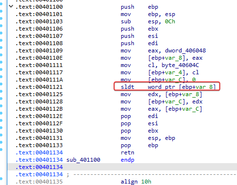
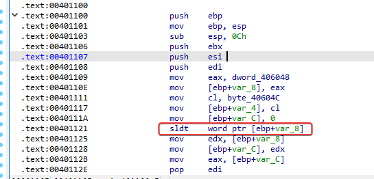
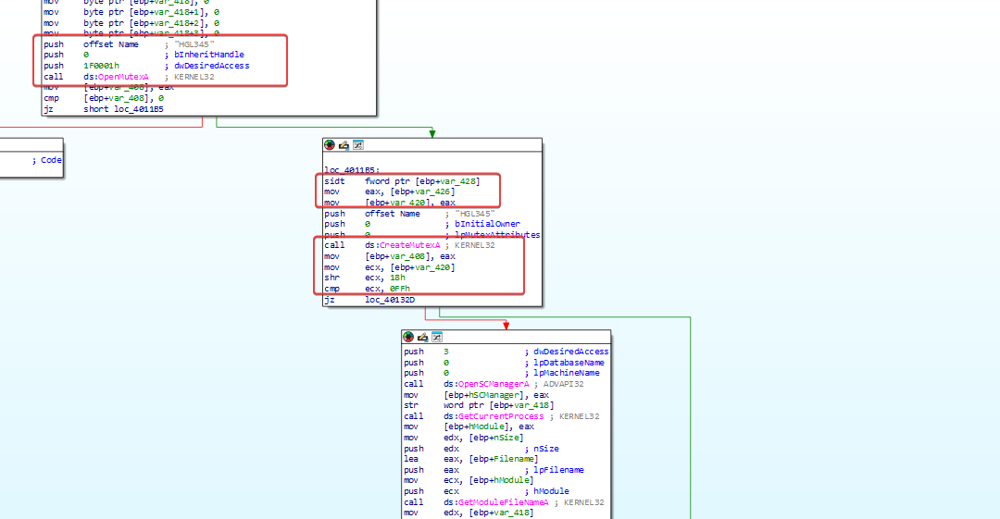
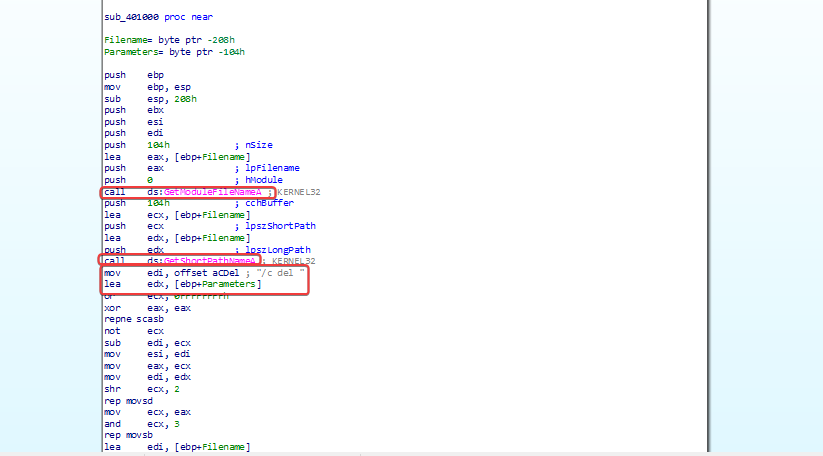
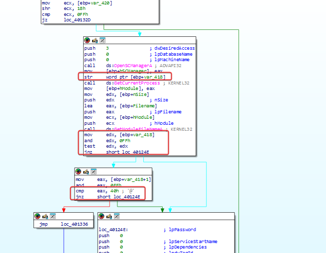
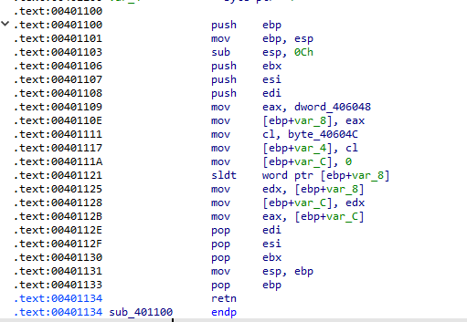
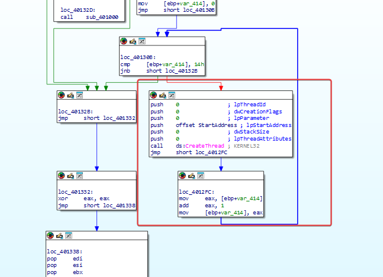
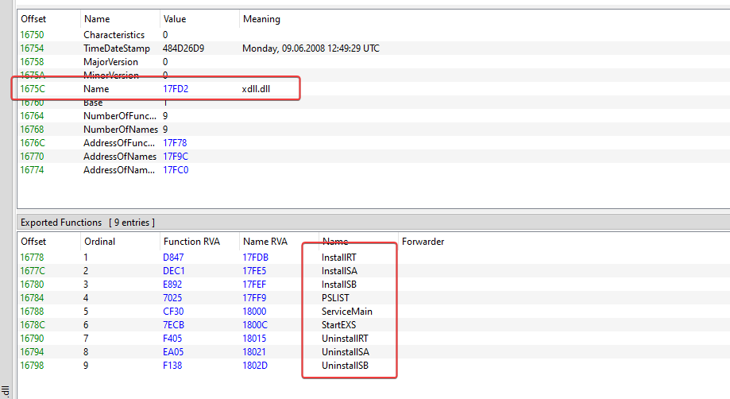
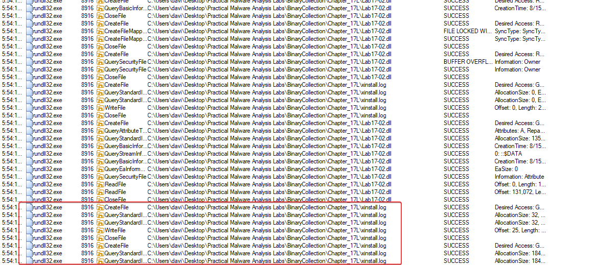

## Introdução

O Capítulo 17 do livro trata de **técnicas anti-VM**: formas que o malware usa pra detectar se está rodando dentro de uma máquina virtual e, ao detectar, mudar de comportamento (geralmente se auto-deletando ou encerrando) pra dificultar a análise. Os dois labs abaixo trazem exemplos reais dessas técnicas em ação.

---

## Lab 17-01

Analisar o malware `Lab17-01.exe` dentro de uma VM. É a mesma amostra do `Lab07-01.exe`, agora com técnicas anti-VMware adicionadas.

> **Nota do livro**: as técnicas anti-VM encontradas neste lab podem não funcionar no seu ambiente — depende de qual hipervisor você está usando (VMware, VirtualBox etc.), já que a maioria dessas checagens é feita especificamente contra assinaturas do VMware.

### Questão 1 — Quais técnicas anti-VM o malware usa?

O malware usa **3 instruções x86 "vulneráveis"** — instruções que não são privilegiadas e, por isso, podem ser executadas direto do user mode pra consultar estruturas internas do processador que se comportam de forma diferente dentro de uma VM. São elas:

| Endereço | Instrução | Técnica |
|---|---|---|
| `0x00401121` | `sldt` | No Pill |
| `0x004011B5` | `sidt` | Red Pill |
| `0x00401204` | `str` | Checagem via Task Register |





---

### Questão 2 — Rodando o script `findAntiVM.py` do Capítulo 17

*(Questão que depende da versão comercial do IDA Pro — sem acesso a ela no momento, deixo em aberto pra revisar depois.)*

---

### Questão 3 — O que acontece quando cada técnica anti-VM tem sucesso?

#### `sidt` — Técnica Red Pill

A instrução `SIDT` só é executada em `0x4011B5` **se não existir** um mutex chamado `HGL345` no sistema — ou seja, essa checagem é a primeira etapa de uma cadeia de verificações.

**Como funciona, passo a passo:**
1. `SIDT` captura a **IDT** (Interrupt Descriptor Table) inteira — uma estrutura de **6 bytes**.
2. O malware pega os **2 bytes menos significativos** dela, usando um deslocamento (offset) de `0x2`.
3. Pra chegar até o offset `0x5` — onde mora o byte que denuncia o VMware (o valor `0xFF`) — o código desloca **18 bits** (0x12) pra direita. Como cada byte tem 8 bits, isso equivale a andar **mais 3 bytes** a partir de onde já estava, resultando exatamente no offset `0x5`.
4. Esse byte final é comparado com `0xFF` — se bater, a VM foi detectada.

> 💡 Essa é a técnica **Red Pill**, vista na teoria do capítulo: o valor no 5º byte da IDT costuma ser `0xFF` quando a VM realoca essa tabela, algo que não acontece em hardware físico.



Se essa verificação **tiver sucesso** (ou seja, detectar a VM), o código chama `sub_401000` — a rotina responsável por fazer o malware **se auto-deletar**.



#### `str` — Checagem via Task Register

A instrução `STR` só roda em `0x401204` **se a verificação anterior (`sidt`) já tiver sido aprovada** — ou seja, é a segunda etapa da cadeia.

**Como funciona:**
1. `STR` recupera o **Task State Segment (TSS)** e guarda o resultado em `var_418`.
2. O código checa se o **primeiro byte** retornado é `0`.
3. Se for, faz uma **segunda checagem**, comparando o **segundo byte** com `0x40`.



Quando essa checagem também tem sucesso, o fluxo chega em `loc_401336`, que **inevitavelmente** chama `sub_401000` de novo — reforçando a auto-deleção.

#### `sldt` — Técnica No Pill

A instrução `SLDT` só roda em `0x401121` se as checagens anteriores já tiverem passado. Ela fica guardada num offset diferente dos outros, porque essa checagem específica acontece dentro de uma sub-rotina separada, `sub_401100` — chamada em `0x4012D1`, **depois** que o malware já criou o serviço malicioso.

**Analisando `sub_401100`:**
1. O valor `0x0DDCCBBAA` é atribuído a `EAX` e guardado em `[ebp+var_8]` — esse valor é usado só como inicialização e nunca mais aparece de novo.
2. A operação `SLDT` roda, e o resultado cai nessa mesma posição de memória.
3. Esse resultado é então movido pra `[ebp+var_C]`, depois de volta pra `EAX`, que é o valor **retornado** por essa sub-rotina.


Voltando pra quem **chama** `sub_401100`: o retorno é comparado contra o valor `0x0DDCC0000`.
- Se **não bater**, ocorre um salto que faz o malware **terminar** a execução.
- Se **bater** (indicando VM), o código entra num **loop infinito** criando repetidamente uma nova thread com o mesmo `StartAddress` — o mesmo comportamento de **negação de serviço** (esgotamento de recursos) já visto rodando o `Lab07-01.exe` sem essas proteções.





---

### Questão 4 — Quais dessas técnicas funcionam contra a sua VM?

Os valores comparados pelo malware são, em grande parte, assinaturas específicas do **VMware** — como estou rodando a análise em **VirtualBox**, boa parte dessas checagens não se aplica diretamente ao meu ambiente (os valores de referência que o malware espera encontrar são de outro hipervisor).

---

### Questão 5 — Por que cada técnica funciona ou falha?

*(A revisar com mais detalhe — depende de comparar, instrução por instrução, os valores reais retornados pelo VirtualBox contra os valores que o malware espera do VMware.)*

---

### Questão 6 — Como desativar essas técnicas e fazer o malware rodar normalmente?

A forma mais simples é **"NOPar"** as instruções associadas às checagens (`sidt`, `str`, `sldt`), garantindo que só os jumps necessários pro fluxo normal sejam tomados — ou, alternativamente, modificar as flags de salto diretamente num debugger, forçando o caminho que **não** leva à detecção.

---

## Lab 17-02

Analisar o malware `Lab17-02.dll` dentro de uma VM. Depois de responder a primeira questão, o exercício pede pra rodar os exports de instalação via `rundll32.exe` e monitorar com uma ferramenta como o Process Monitor:

```rundll32.exe Lab17-02.dll,InstallRT (or InstallSA/InstallSB)```


### Questão 1 — Quais são os exports dessa DLL?

Não consegui acesso ao VMware pra este lab — vou tentar responder o máximo possível das outras questões com base no comportamento observado.

É possível ver, além dos exports abaixo, que o malware importa um número grande de funções de bibliotecas diferentes.



---

### Questão 2 — O que acontece após a tentativa de instalação via `rundll32.exe`?

Rodando no PowerShell:

```powershell
rundll32.exe Lab17-02.dll,InstallRT
```

Aparentemente **nada acontece** na tela — então parti pra analisar com o Process Monitor.



Um arquivo de log é criado, e dentro dele é possível ver que o malware tenta fazer uma **injeção de processo** no `iexplore.exe` — mas a tentativa **falha**, porque esse processo não é encontrado no sistema (não tenho o Internet Explorer instalado no ambiente de teste).

---

### Questão 3 — Quais arquivos são criados e o que eles contêm?

É criado um arquivo **`.bat`** contendo código de auto-deleção, além de um arquivo chamado **`xinstall.log`**, contendo a string: Found Virtual Machine, Install Cancel.