In these labs, we’ll use what we’ve covered in Chapter 19 to analyze samples inspired by real shellcode. Because a debugger cannot easily load and run shellcode directly, we’ll use a utility called shellcode_launcher.exe to dynamically analyze shellcode binaries. You’ll find instructions on how to use this utility in Chapter 19 and in the detailed analyses in Appendix C.

---

## Lab19-1

Analyze the file Lab19-01.bin using shellcode_launcher.exe. 

### Question 1
```
How is the shellcode encoded?
```

Analyzing the debugged code, we can see a `jmp` instruction where it jumps to a large number of `INC ECX` operations.

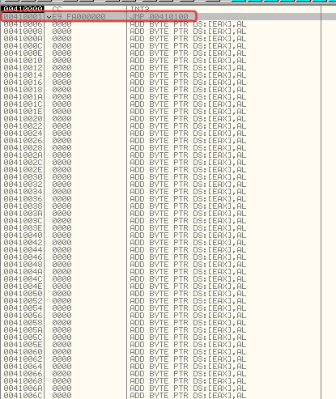

These are basically just filler, keeping in mind that 0x41 operations work like NOP slides and don't do anything interesting. Afterwards, we reach an XOR instruction.

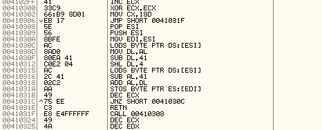

Here, we can assume it's some kind of decoding routine, given that it loads bytes, loops, and shifts bits. Reaching this operation, we can see that ESI now contains what appears to be an encoded string, which will then be overwritten by the decoding routine to become the payload.

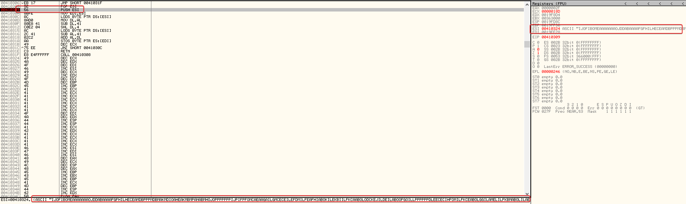

The decoding routine works like this:

- `lodsb` loads a byte from the encoded payload.

- 0x41 (A) is subtracted from the lower 4 bits of that byte.

- The result is shifted 4 bits to the left and stored in DL.

- A second byte is loaded, and 0x41 is again subtracted from the lower 4 bits, with the result stored in AL.

- AL and DL are added together to form the decoded byte.

- `stosb` writes the resulting byte to the memory pointed to by EDI.

So, the shellcode uses 0x41 as the encoding base: each original byte is reconstructed from the lower 4 bits of two encoded bytes.

When running the debugger, you can actually see the decoding happening and the resulting code overwriting the instructions that previously acted as a NOP slide.

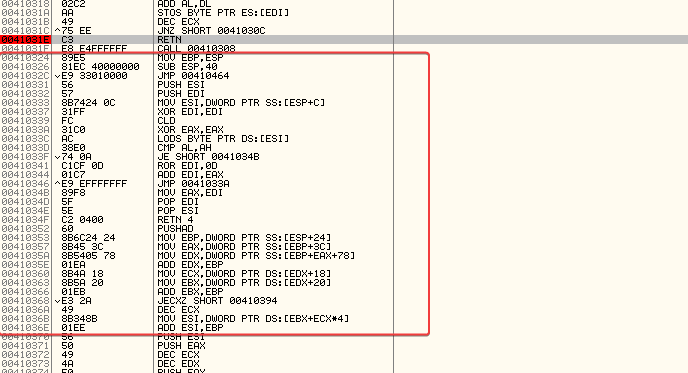

After setting a breakpoint on `retn`, we have the decrypted shellcode. After copying it from the dump, I pasted it into HxD, and that's it, now we have the decrypted shellcode.

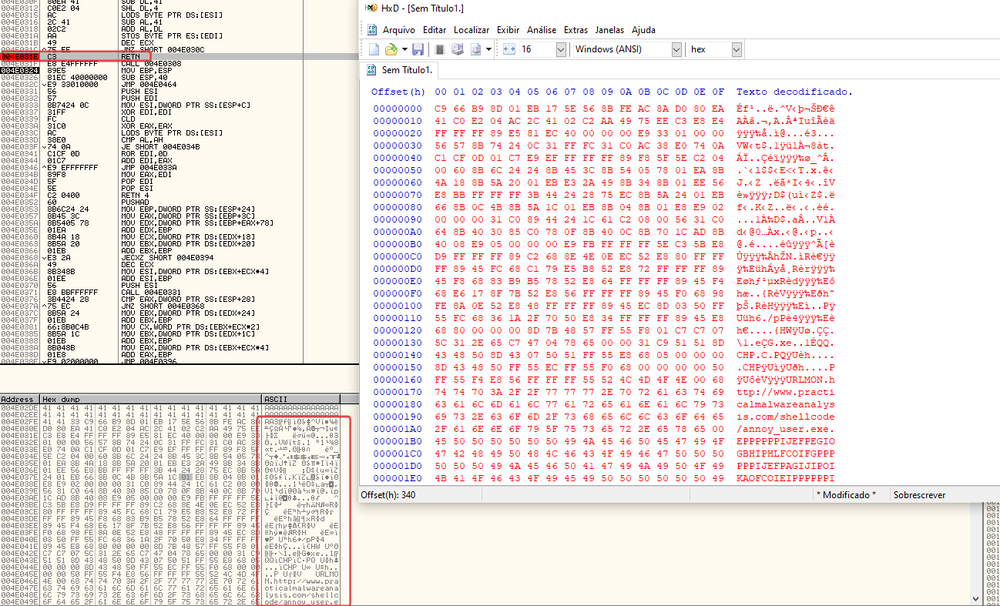

---

### Question 2
```
Which functions does the shellcode manually import?
```

The shellcode dynamically resolves and imports the following 6 Windows API functions:

- kernel32.dll: LoadLibraryA, GetSystemDirectoryA, WinExec, GetCurrentProcess, TerminateProcess
- urlmon.dll: URLDownloadToFileA

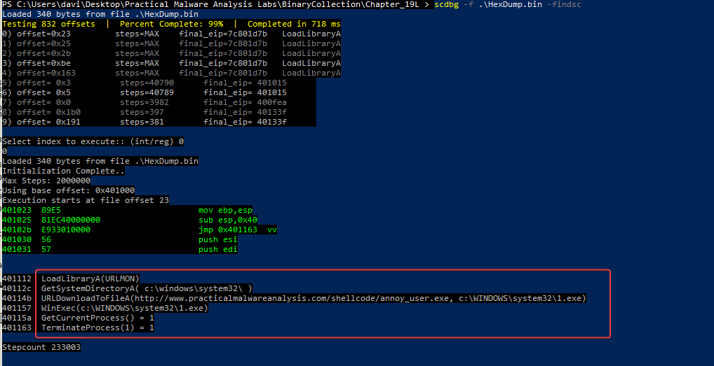

---

### Question 3
```
What network host does the shellcode communicate with?
```

As you can see in the previous question.

- http://www.practicalmalwareanalysis.com/shellcode/annoy_user.exe

---

### Question 4
```
What filesystem residue does the shellcode leave?
```

Based on our analysis using scdbg in question 2, we know that it downloads a binary to c:WINDOWSsystem321.exe. This happens after retrieving the system directory, and it indicates that leftover file system traces would be found in:

- %SystemRoot%\system32\1.exe

---

### Question 5
```
What does the shellcode do?
```

Execution flow:

1. **Self-decoding**
- The code stored in alphanumeric format is decoded in memory to get executable x86 code.

2. **Dynamic API resolution**
- Walks through process structures, like the PEB, to locate loaded modules.
- Looks up export tables to dynamically resolve needed functions.

3. **Getting the system directory**
- Checks the Windows system directory, usually `C:WindowsSystem32`.

4. **Downloading and writing the payload**
- Gets an executable from an external URL.
- Writes the file to the local system.

5. **Running the payload**
- Starts the downloaded executable in the background.

6. **Closing the host process**
- Gets a reference to its own process.
- Requests its termination after completing the previous steps.


> **Self-decoding → API resolution → locating `System32` → downloading/writing → execution → termination**

---

## Lab19-2

The file Lab19-02.exe contains a piece of shellcode that will be injected into another process and run. Analyze this file.

### Question 1
```
What process is injected with the shellcode?
```

Analyzing the malware's main function, in the first block we see a `call` to sub_4010B0, passing a `push` offset 'SeDebugPrivilege'.

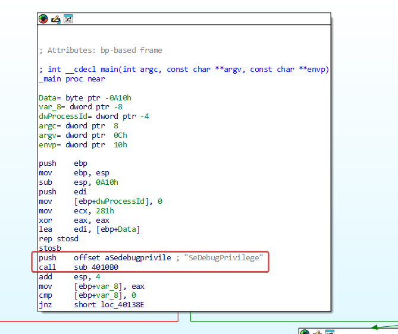

Looking at sub_4010B0, it indeed adjusts the running process so that it has 'SeDebugPrivilege', which allows any process to be debugged by the executable.

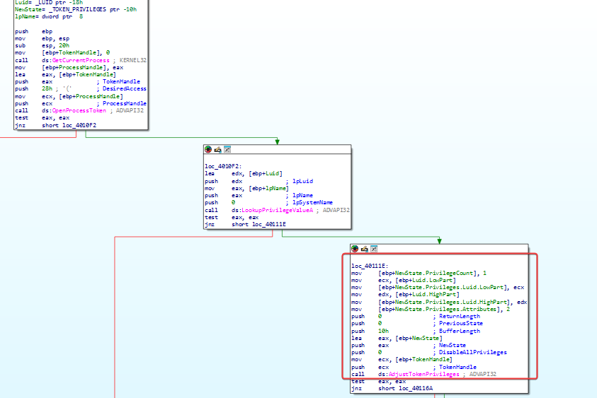

Then, moving to the next block, it makes a call to sub_401000.

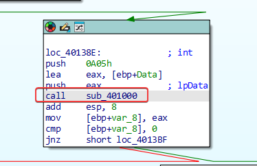

Here it queries the registry at 'HKEY_LOCAL_MACHINESOFTWAREClasseshttpshellopencommand' to find the default browser used on the system.

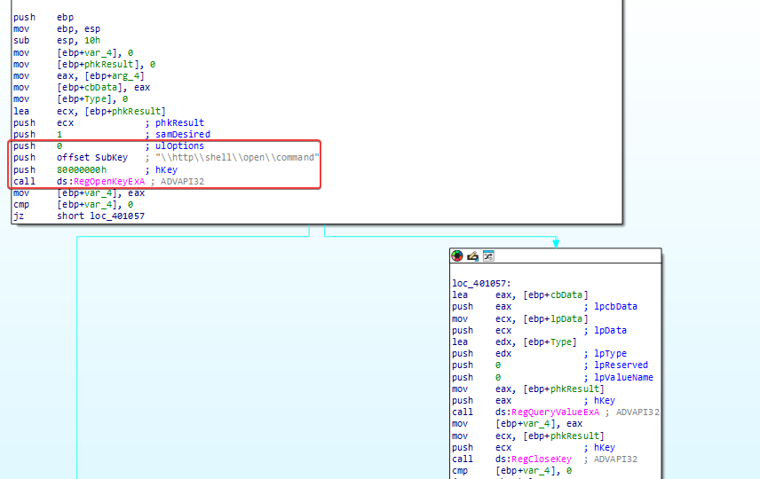

Next, moving to the following block, we have a call to sub_401180.

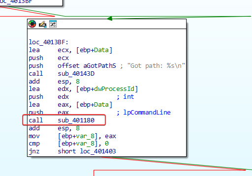

This runs the process with the ShowWindow parameter set to 0, keeping it hidden from the user.

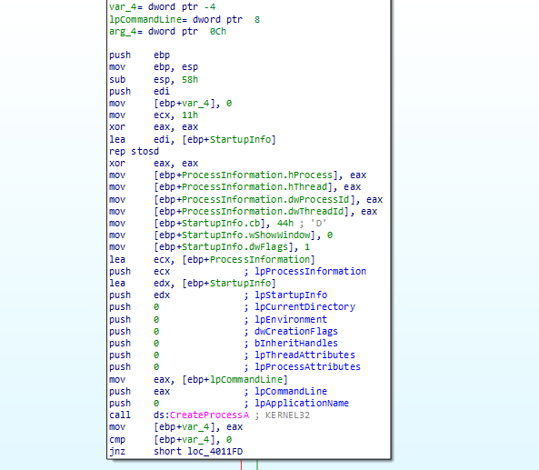

Based on this, the shellcode is injected into msedge.exe (Microsoft Edge).

---

### Question 2
```
Where is the shellcode located?
```

If we keep analyzing the main function of this program, we can see that 'unk_407030' is stored in a buffer right before 'sub_401230' is called.

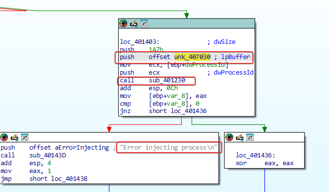

In 'sub_401230', we can see that there are 4 API calls, `OpenProcess`>`VirtualAllocEx`>`WriteProcessMemory`>`CreateRemoteThread`, a standard in process injection, which is the subroutine used to be injected into Internet Explorer.

Specifically, it is located at memory offset 0x407030 (labeled as unk_407030).

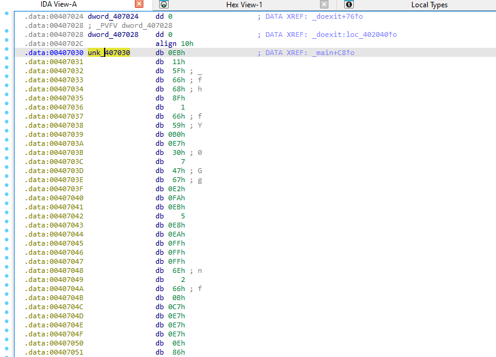

---

### Question 3
```
How is the shellcode encoded?
```

The shellcode isn’t encoded. It consists of machine instructions that are executable in raw, unencoded form, starting with standard opcodes, like the short jump EB 11.

---

### Question 4
```
Which functions does the shellcode manually import?
```

To get the injected shellcode, using the debugger, I arrived exactly at the point where the function sub_401230 is called (as seen in question 1, this is the function where the shellcode is injected into the target process), and as seen, the shellcode is passed in a buffer. Seeing this in OllyDbg:

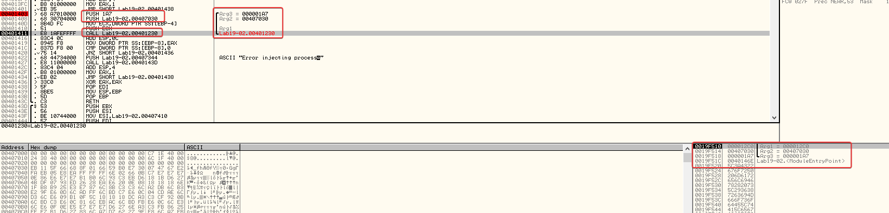

There you go, the shellcode is located at 0x407030, occupying a size of 423 bytes.

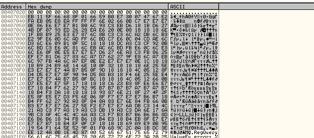

Running it through scdbg, as we did before, we can see that it shows the assembly of the decoding stub as well as what the shellcode is basically trying to do.

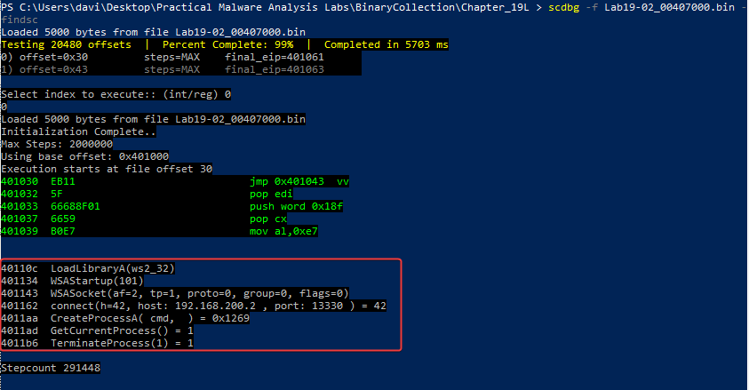

Here we can already visualize the API functions imported by this malware, as well as some parameters passed to these functions, like `connect(h=42, host: 192.168.200.2, port: 13330)`, etc.

- LoadLibraryA
- WSAStartup
- WSASocket
- connect
- GetCurrentProcess
- TerminateProcess

---

### Question 5
```
What network hosts does the shellcode communicate with?
```

As seen in the previous question, with the IP `192.168.200.2`.

---

### Question 6
```
What does the shellcode do?
```

Malware flow:

1. **Initialization**
- The shellcode is loaded and starts execution.

2. **Network setup**
- Initializes communication through sockets.
- Sets the remote host to `192.168.200.2`.
- Sets the remote port to `13330`.

3. **Remote connection**
- Establishes a connection to the remote host.
- Waits for the connection to complete successfully.

4. **Shell creation**
- Invokes `CreateProcessA`.
- Starts `cmd`.
- Binds the standard input and output to the established socket.

5. **Communication**
- The `cmd` receives commands via the connection.
- The output of the commands is sent through the same socket.

6. **Termination**
- After finishing its execution, the shellcode calls `TerminateProcess`.
- The host process is terminated.

---

## Lab19-3

Analyze the file Lab19-03.pdf. If you get stuck and can’t find the shellcode, just skip that part of the lab and analyze file Lab19-03_sc.bin using shellcode_launcher.exe.

### Question 1
```
What exploit is used in this PDF?
```

According to the analysis carried out with PDFStreamDumper, the PDF file exploits the CVE-2008-2992 vulnerability, characterized by a buffer overflow in the JavaScript util.printf function of Adobe Reader.

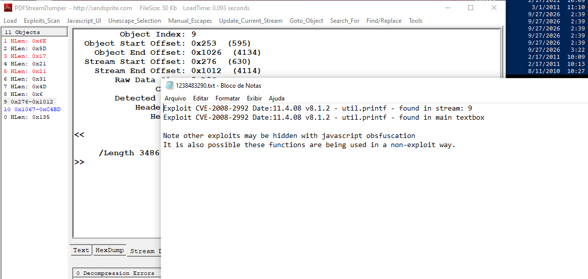

---

### Question 2
```
How is the shellcode encoded?
```

As observed in the analysis, the shellcode is stored in the PDF as a JavaScript string, using a Unicode/percent-based representation, for example, %uE589%uEC81.

At runtime, this string is decoded using the JavaScript unescape() function, converting the encoded representation back into binary data. A simplified example is:

var payload = unescape("%uE589...");

In this way, the shellcode content remains stored in an encoded representation until the moment JavaScript performs its decoding.

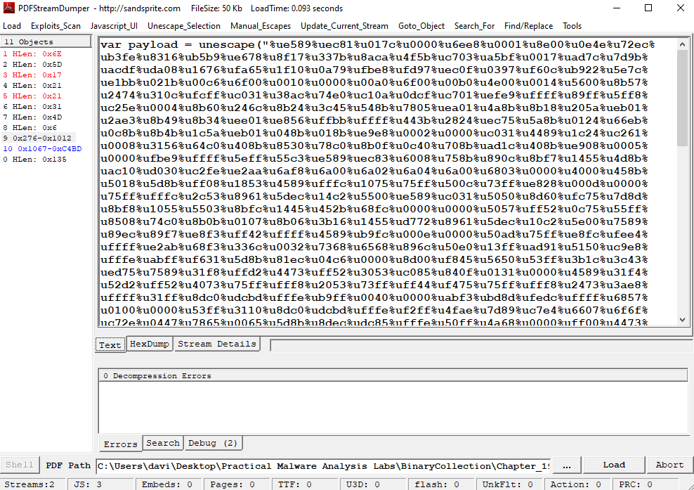

---

### Question 3
```
Which functions does the shellcode manually import?
```

To decode correctly, you need to consider converting %u values into bytes and reversing the endianness. CyberChef, using Swap Endianness with a word size of 2, can perform this conversion. After that, the spaces can be removed so that the result can be interpreted as raw hexadecimal by scdbg. 

The shellcode can be saved after decoding for later analysis. Running it in scdbg shows a check for an open file handle, possibly as an analysis evasion mechanism.

