## Lab20-1 

The purpose of this first lab is to demonstrate the usage of the this pointer. Analyze the malware in Lab20-01.exe.

### Question 1
```
Does the function at 0x401040 take any parameters?
```

Yes, but with only one implicit parameter: this pointer is passed in the ECX register. The function uses the `__thiscall` convention (`HRESULT __thiscall sub_401040(LPCSTR *this)`).

A URL is provided in the call to this function.

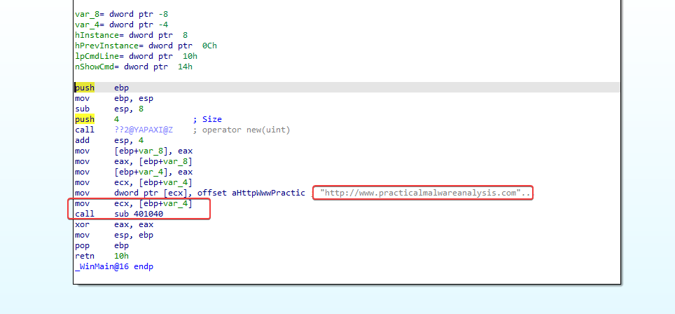

---

### Question 2
```
Which URL is used in the call to URLDownloadToFile?
```

http[:]//www[.]practicalmalwareanalysis[.]com/cpp[.]html

`WinMain` dynamically allocates 4 bytes via `operator new` and writes the pointer `aHttpWwwPractic` (0x00405030) into the allocated memory block. Inside `sub_401040`, `mov eax, [ebp+var_4]` loads this pointer, and `mov ecx, [eax]` dereferences it to retrieve the string address, which is passed directly to `URLDownloadToFileA` as the `szURL` argument.

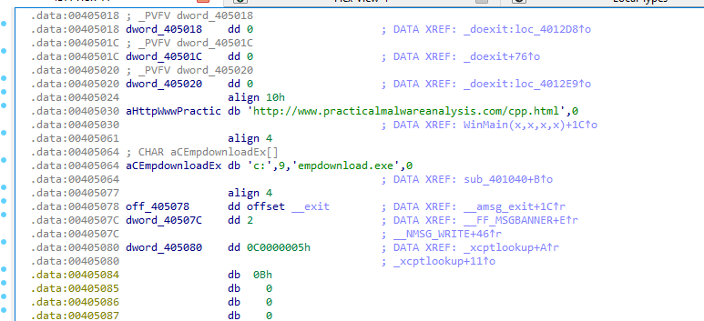

---

### Question 3
```
What does this program do?
```

Based on observations, this program downloads a file from http://www.practicalmalwareanalysis.com/cpp.html and saves it to the local machine as `c:\tempdownload.exe`.

---

## Lab20-2

The purpose of this second lab is to demonstrate virtual functions. Analyze the malware in Lab20-02.exe.

> NOTE: This program is not dangerous to your computer, but it will try to upload possibly sensitive files from your machine.

### Question 1
```
What can you learn from the interesting strings in this program?
```

Based on the analysis of some of the malware's strings, it appears the malware searches the machine for .doc and .pdf documents and uploads them via FTP to the C2 server at ftp[.]practicalmalwareanalysis[.]com.

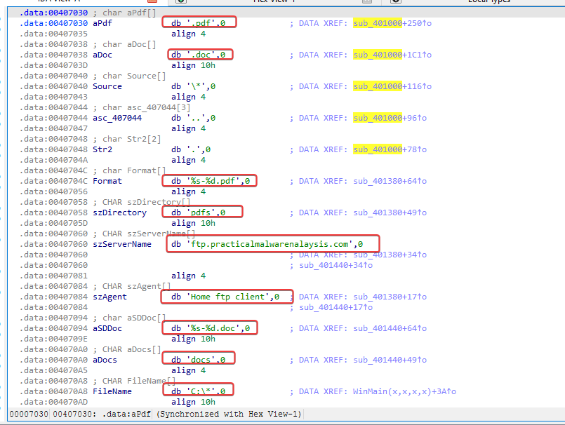

---

### Question 2
```
What do the imports tell you about this program?
```

Among the kernel32.dll imports, we can see APIs associated with searching for files on the system that match a specific parameter.

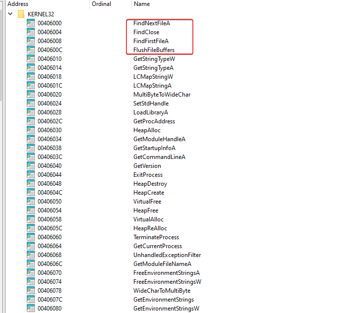

The wininet.dll imports provide strong evidence that this malware indeed uses FTP for data/document exfiltration.

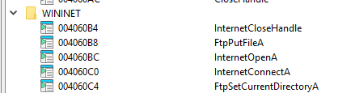

---

### Question 3
```
What is the purpose of the object created at 0x4011D9? Does it have any
virtual functions?
```

It instantiates a heap-allocated file handler object corresponding to the identified target file extension (.doc or .pdf). The object's structure includes a pointer to a virtual function table (vtable) used to invoke extension-specific behaviors.

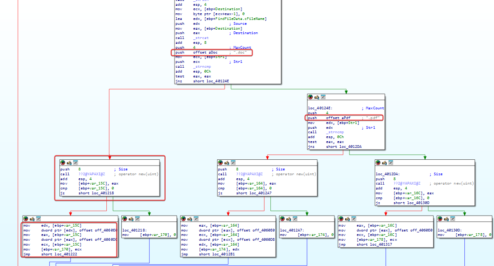

---

### Question 4
```
Which functions could possibly be called by the call [edx] instruction at
0x401349?
```

- sub_401380: Executed if the target file is a .pdf file (handles the upload to the remote PDF directory).
- sub_401440: Executed if the target file is a .doc file (handles the upload to the remote document directory).

---

### Question 5
```
How could you easily set up the server that this malware expects in order
to fully analyze the malware without connecting it to the Internet?
```

Since we know it expects an FTP server to be present at ftp.practicalmalwareanalysis.com for exfiltration, we can set up a DNS redirect to point ftp[.]practicalmalwareanalysis[.] to our machine's IP address: 127.0.0.1. 

---

### Question 6
```
What is the purpose of this program?
```

The malware is a document exfiltrator (data thief). It searches local drives for files ending in .pdf and .doc, instantiates handler objects for each match, and automatically sends the discovered documents via FTP to ftp.practicalmalwareanalysis.com.

---

### Question 7
```
What is the purpose of implementing a virtual function call in this
program?
```

By implementing virtual functions, the program is able to perform different actions depending on the file extension found on the host. In this case, the different functions specified the directory where the exfiltrated files would be stored.

---

## Lab 20-3

This third lab is a longer and more realistic piece of malware. This lab comes with a configuration file named config.dat that must be in the same directory as the lab in order to execute properly. Analyze the malware in Lab20-03.exe.

### Question 1
```
What can you learn from the interesting strings in this program?
```

HTTP endpoints /index.html, /info.html, /response.html, /get.html, /put.html, and /srv.html reveal the URL paths used for C2 beaconing and command management.

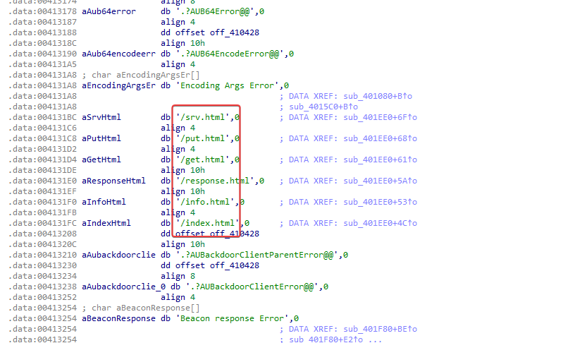

User-Agent header

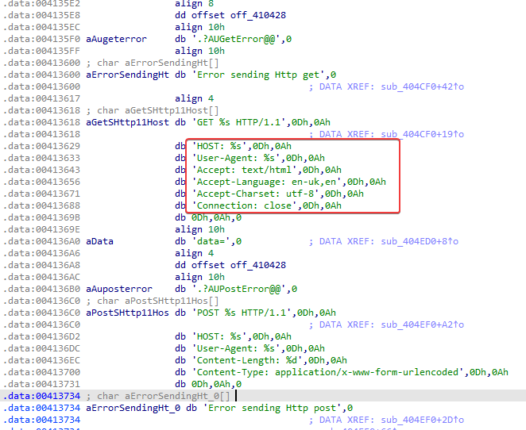

Two 52-character alphabets (PLMOKNIJBUHVYGTFCRDXESZWAQ... and ABCDEFGHIJKLMNOPQRSTUVWXYZ...) indicate a custom monoalphabetic substitution cipher used to obfuscate network communications.

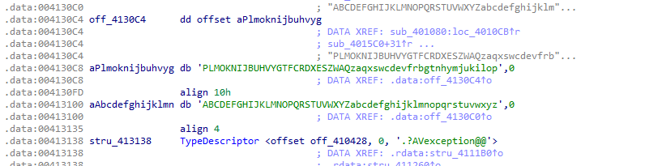

---

### Question 2
```
What do the imports tell you about this program?
``` 

`WS2_32.dll:`
- gethostbyname
- connect
- send
- recv
- WSAGetLastError

This indicates that the malware implements custom HTTP communication manually over raw TCP sockets, rather than using high-level Windows HTTP APIs such as WinINet or WinHTTP.

`kernel32.dll:`
- CreateProcessA
- TerminateProcess
- CreateFileA
- ReadFile
- Sleep

We can see that it has the ability to establish network connections, execute processes, and sleep—all common functions for a remote access tool/Trojan that leverages the sleep API call to allow for periodic C2 check-ins.

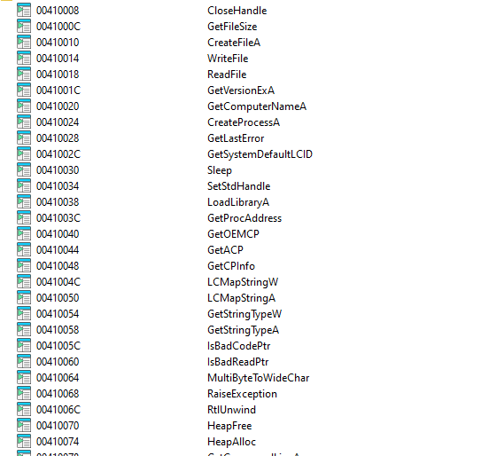

---

### Question 3
```
At 0x4036F0, there is a function call that takes the string Config error,
followed a few instructions later by a call to CxxThrowException. Does the
function take any parameters other than the string? Does the function
return anything? What can you tell about this function from the context
in which it’s used?
```

It uses two parameters: the string pointer ("Config error") pushed onto the stack, and an implicit pointer passed via the ECX register. There is no return value, as C++ constructors do not return values.

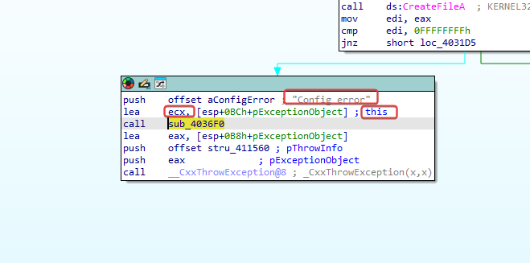

---

### Question 4
```
What do the six entries in the switch table at 0x4025C8 do?
```

The six entries in the switch table at 0x4025C8 correspond to six different actions, based on the command received from the C2:

- 'a' 0x61: deletes the calling object.
- 'b' 0x62: puts the beacon to sleep for a specified period.
- 'c' 0x63: executes a command received from the C2.
- 'd' 0x64: downloads a file from the C2.
- 'e' 0x65: uploads a file to the C2.
- 'f' 0x66: collects system information and sends it to the C2. ---

### Question 5
```
What is the purpose of this program?
```

An advanced C++ HTTP-based command-and-control (C2) backdoor. It registers the infected host with a remote server via encrypted HTTP POST requests containing system information (hostname, operating system details), obfuscates network traffic using a custom 52-character substitution cipher, and continuously polls the C2 server for beacon instructions to:

- Enter a sleep mode for a specified number of seconds.
- Start an arbitrary process.
- Download a file from the C2.
- Upload a file to the C2.
- Profile the system and send the information back to the C2.

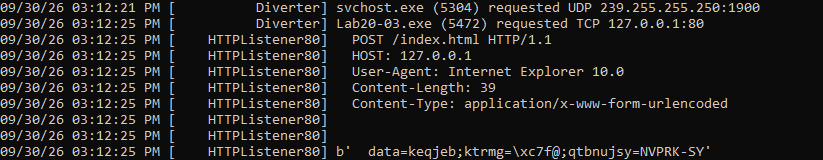

---


