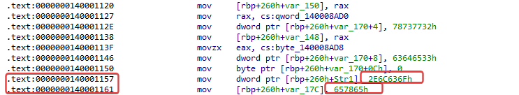
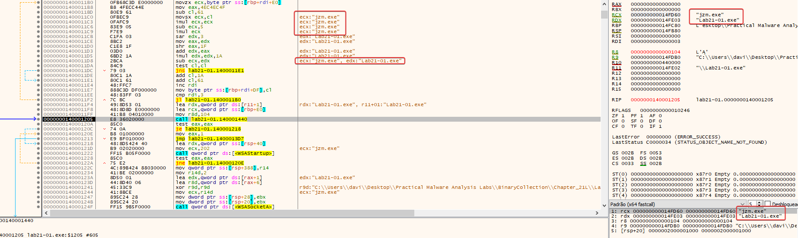
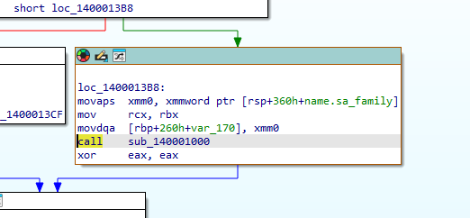
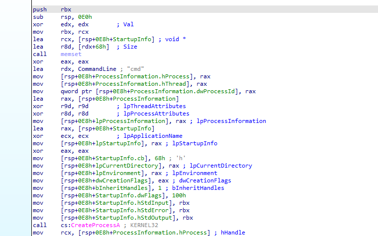
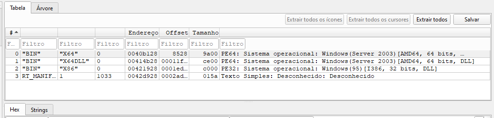
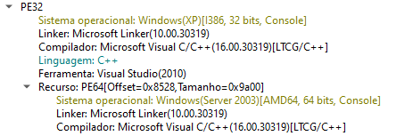
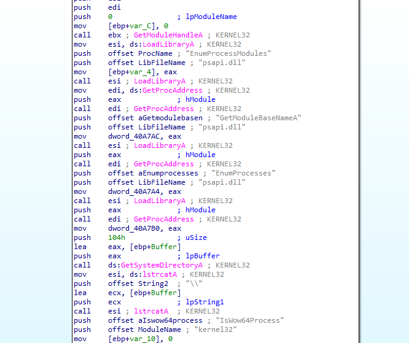
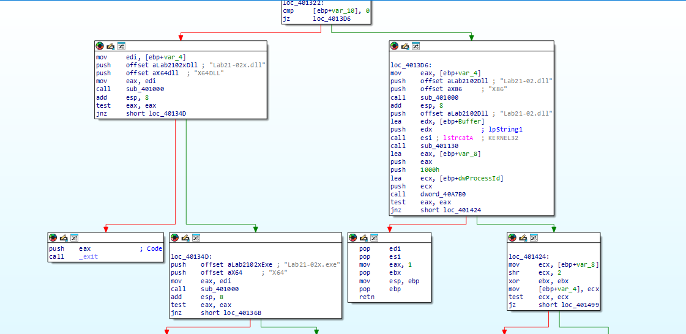

You’ll need a 64-bit computer and a 64-bit virtual machine in order to run 
the malware for these labs, as well as the advanced version of IDA Pro in 
order to analyze the malware. 

## Lab21-1

Analyze the code in Lab21-01.exe. This lab is similar to Lab 9-2, but tweaked and compiled for a 64-bit system.

### Question 1
```
What happens when you run this program without any parameters?
```
Visually, when running this malware in the terminal, no activity or connections are apparent...

---

### Question 2
```
Depending on your version of IDA Pro, main may not be recognized
automatically. How can you identify the call to the main function?
```

I didn't encounter any specific problems or errors here, though there could potentially be incompatibilities with the system or architecture where it is being executed.

---

### Question 3
```
What is being stored on the stack in the instructions from
0x0000000140001150 to 0x0000000140001161?
```

Navigating to address 0x0000000140001150, we see large hexadecimal values ​​being pushed onto the stack.



Converting this to an ASCII string yields `.lcoexe`. At first glance, the meaning isn't obvious, but recall that x86 and x64 architectures are little-endian (byte-reversed). Since IDA interpreted the data as a hexadecimal value rather than a string, the conversion results in reversed values. Reversing the byte order reveals the string stored on the stack:

```
ocl.exe
```

The program likely needs to be named `ocl.exe` to run correctly.

---

### Question 4
```
How can you get this program to run its payload without changing the
filename of the executable?
``` 

Regarding the program's execution logic: as we know, it checks the executable's filename. If it is 'ocl.exe', it executes normally; otherwise, it cancels execution. The obvious way to bypass this is simply by renaming the file to the expected name, but we can also manipulate the check itself. Since the name check uses the `strcmp` function, we can manipulate the ZF (Zero Flag) to execute the malware normally without renaming it.



---

### Question 5
```
Which two strings are being compared by the call to strncmp at
0x0000000140001205?
```

Based on the debugger register state from the previous question, the two strings compared at 0x140001205 are "jzm.exe" (passed in the RCX register) and "Lab21-01.exe" (passed in the RDX register).

---

### Question 6
```
Does the function at 0x00000001400013C8 take any parameters?
```

The function at 0x1400013C8 takes a single parameter: a pointer to the socket created by `WSASocketA`.

- On Windows x64, the first few parameters are passed via RCX, RDX, R8, and R9.
- Before the call, RBX is moved into RCX; RBX holds the value returned by `WSASocketA`.
- At the start of the function, RCX is moved back to RBX, and this value is used to redirect stdin, stdout, and stderr.
- Therefore, the function uses the socket as a communication channel with the C2 and redirects all input/output to it.



---

### Question 7
```
How many arguments are passed to the call to CreateProcess at 
0x0000000140001093? How do you know?
```

The CreateProcessA call accepts exactly 10 arguments, in accordance with the official API signature.

- The first 4 arguments are passed via RCX, RDX, R8, and R9.
- The remaining 6 are passed on the stack.
- The parameters range from lpApplicationName to lpProcessInformation.

Thus, based on the API signature and the x64 calling convention, it is possible to identify the 10 arguments of the CreateProcessA call.

```c++
BOOL CreateProcessA(
  [in, optional]      LPCSTR                lpApplicationName,
  [in, out, optional] LPSTR                 lpCommandLine,
  [in, optional]      LPSECURITY_ATTRIBUTES lpProcessAttributes,
  [in, optional]      LPSECURITY_ATTRIBUTES lpThreadAttributes,
  [in]                BOOL                  bInheritHandles,
  [in]                DWORD                 dwCreationFlags,
  [in, optional]      LPVOID                lpEnvironment,
  [in, optional]      LPCSTR                lpCurrentDirectory,
  [in]                LPSTARTUPINFOA        lpStartupInfo,
  [out]               LPPROCESS_INFORMATION lpProcessInformation
);
```



---

## Lab21-2

Analyze the malware found in Lab21-02.exe on both x86 and x64 virtual 
machines. This malware is similar to Lab12-01.exe, with an added x64 
component.

### Question 1
```
What is interesting about the malware’s resource sections?
```

The added section is a resource section, and if we examine its contents, we can see three interesting binaries named x64, x64DLL, and x86.



---

### Question 2
```
Is this malware compiled for x64 or x86?
```

The primary executable is compiled for the x86 (32-bit) architecture.



---

### Question 3
```
How does the malware determine the type of environment in which it is
running?
```

The malware dynamically resolves the `IsWow64Process` API function exported by `kernel32.dll`. It retrieves the base address of `kernel32` via `GetModuleHandleA`, locates the target function using `GetProcAddress`, and executes it to determine if the 32-bit process is running within the Windows on Windows 64-bit (WOW64) subsystem on a 64-bit operating system.



---

### Question 4
```
What does this malware do differently in an x64 environment versus an
x86 environment?
```

After the `IsWow64Process` check, the malware follows different paths depending on the environment:

- x64 environment: extracts two files from the resources—`Lab21-02x.exe` and `Lab21-02x.dll`—writes them to disk, and executes the `.exe`.
- x86 environment: extracts `Lab21-02.dll`, attempts to obtain debug privileges, and locates the `explorer.exe` process. - Next, in the x86 execution path, the malware opens the process, allocates memory, writes the DLL into that memory, and creates a remote thread to execute the injected code.

In summary: on x64 systems, the malware executes an extracted binary; on x86 systems, it uses DLL injection into explorer.exe.



---

### Question 5
```
Which files does the malware drop when running on an x86 machine?
Where would you find the file or files?
```

On an x86 computer, the malware drops Lab21-02.dll. The file is written to the standard 32-bit system directory—typically C:\Windows\System32—because the malware uses the GetSystemDirectoryA API call to determine the drop location.

---
