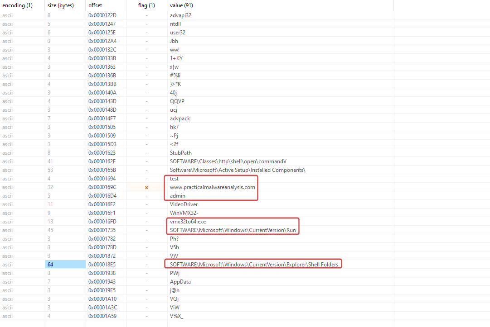
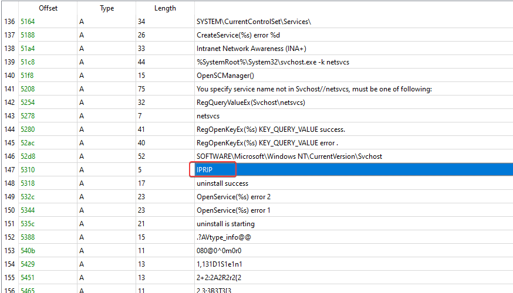
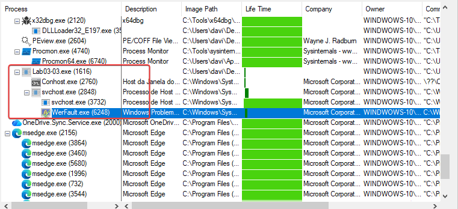

In this post, I continue my studies of the book "Practical Malware Analysis" and begin working on Lab 3. The goal is to apply practical static and dynamic analysis techniques to understand the behavior of real samples, reinforcing fundamental concepts used in malware analysis environments. This content is part of my study routine and documentation of the learning steps.

## 1.1 LAB 03-01
```
Lab03-01.exe
```

### 1.1.1 Question 1
```
What are the imports and strings of this malware?
```

Imports: 'ExitProcess' from library kernel32.dll.

Strings:



---

### 1.1.2 Question 3
```
What are the host-based malware indicators?
```

Analyzing the binary strings, a domain pops up where the malware supposedly communicates with the C2 server.

'www[.]practicalmalwareanalysis[.]com'

---

## 2.1 LAB 3-02
```
Lab03-02.dll
```

### 2.1.1 Question 1
```
How do I install this malware?
```

Analyzing the malware's strings, I found what could possibly be the name that was used to create the service by the malware, 'IPRIP'. We can install the service manually with the command> rundll32 Lab03-02.dll,Install



---

### 2.1.2 Question 2
```
How would you go about running this malware after it's installed?
```

net start IPRIP.

---

## 3.1 LAB 3-03
```
Lab03-03.exe
```

### 3.1.1 Question 1
```
What do you notice when monitoring this malware with Process Explorer?
```

The malware spawns svchost briefly before both processes disappear.




---

### 3.1.2 Question 3
```
What are the host-based malware indicators?
```

We can see both in memory and on the disk that the malware creates a file called practicalmalwareanalysis.log.

---
