In this post, I continue my studies of the book "Practical Malware Analysis" and begin working on Lab 6. The goal is to apply practical static and dynamic analysis techniques to understand the behavior of real samples, reinforcing fundamental concepts used in malware analysis environments. This content is part of my study routine and documentation of the learning steps.

---

## 1.1 LAB 07-01
```
Lab06-01.exe
```

### 1.1.1 Question 1
```
What is the main code construct found in the only subroutine called main?
```

Initially in our main function, we have a function call 'call sub_401000', let's go into the function to see what it does.

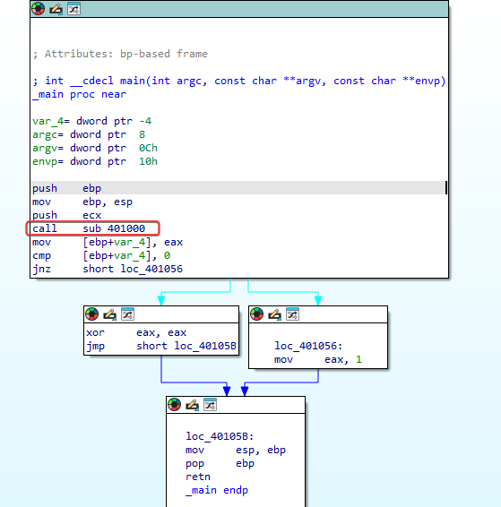

Entering 'sub_401000' we can see that there is the use of the function 'InternetGetConnectedState', a Windows API function that checks the machine's connection status, where the value returned by the function is stored in EAX, the value is stored in var_4, and there is a comparison instruction, where if the value is 1, it indicates that the internet is connected, and if not, there is no internet and it jumps to loc_40102B.

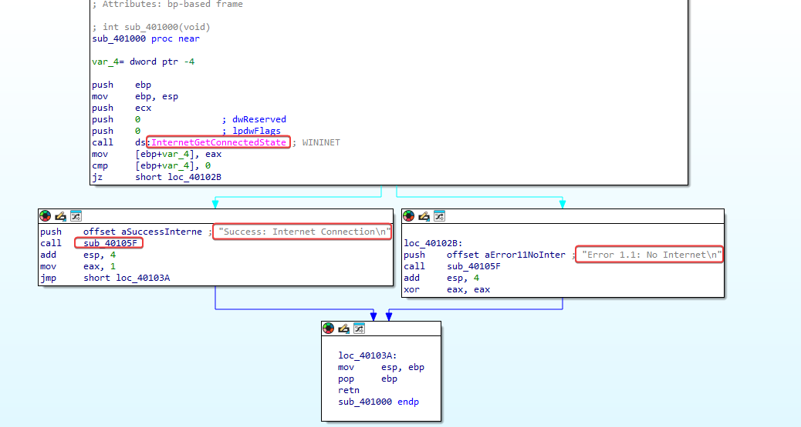

---

### 1.1.2 Question 2
```
What's the subroutine located at 0x40105F?
```

The references to the functions 'stbuf' and 'ftbuf' lead us to believe that it is referring to 'string buffer' and 'format buffer'. We also have 'sub_401282', where there is a big while loop doing string construction/comparison.

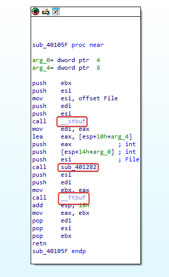

---

### 1.1.3 Question 3
```
What's the goal of this program?
```

Apparently, it does an internet connection check on the machine and shows a message if it’s connected, besides returning '1'.

---

## 2.1 LAB 07-02
```
Lab06-02.exe
```

### 2.1.1 Question 1
```
What operation does the first subroutine called by the main function perform?
```

Here in the main we can see the subroutine 'sub_401000' being referenced.

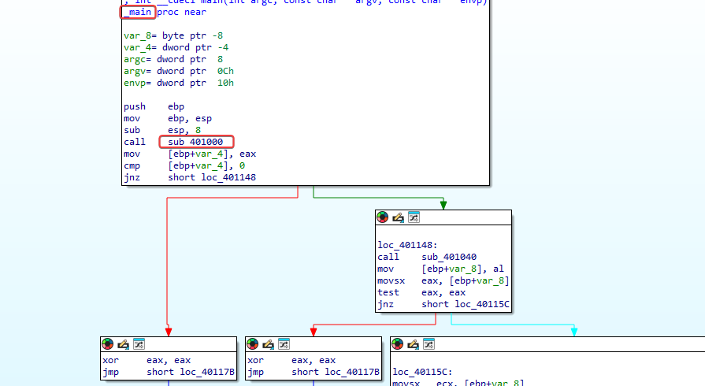

Inside the subroutine, we can see that it does an internet check using the Windows API 'InternetGetConnectedState'.

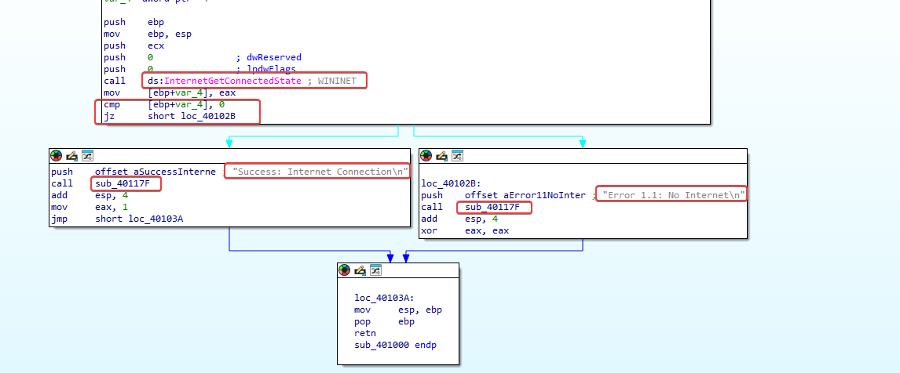

If the Windows API function returns 1, indicating that the machine has internet, the program continues its execution; if not, 'loc_40102B' indicates that it doesn't have internet.

---

### 2.1.2 Question 2
```
What's the subroutine located at 0x40117F?
```

If we look at this subroutine, we notice that it's almost identical to the one we saw in Lab06-01.exe, and once again, comparing a string pushed to the stack just before calling this subroutine in main leads us to believe that this is 'printf' again. In this case, there's also the use of '%c' to help reinforce this inference.

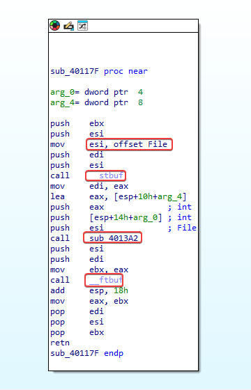

---

### 2.1.3 Question 3
```
What does the second subroutine called by the main function do?
```

Makes a request to the URL:'http[:]//www[].practicalmalwareanalysis[.]com', and if it is successful, reads the first 512 bytes and stores them in a buffer, using the 'InternetReadFile' API.

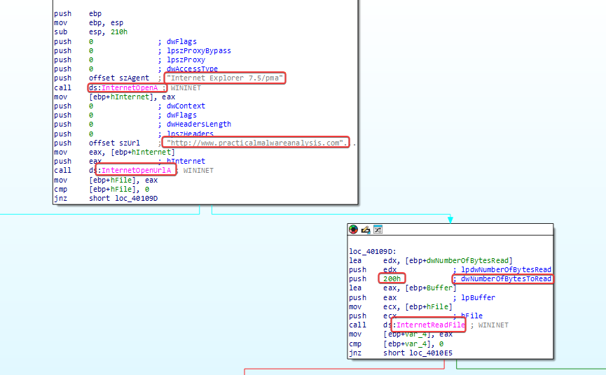.

---

### 2.1.4 Question 4
```
What kind of code structure is used in this subroutine?
```

After the 'InternetReadFile' function is executed successfully, it reads 4 bytes from the buffer, which indicates the start of an HTML comment.

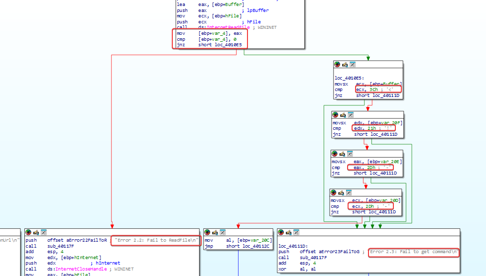.

--- 

### 2.1.5 Question 5
```
Are there network-based indicators for this program?
```

http[:]//www[].practicalmalwareanalysis[.]com
Internet Explorer 7.5/pma

---

### 2.1.6 Question 6
```
What's the purpose of this malware?
```

The function of this malware is primarily to check the internet connection of the machine that is running it, and if it's okay, it makes a URL request, reads the first 512 bytes, and stores them in a buffer, looking for specific HTML characters.

---

## 3.1 LAB 07-03
```
Lab06-03.exe
```

### 3.1.1 Question 1
```
Compare the calls in `main` with the `main` method from Lab 6-2. What's the new function being called from `main`?
```

Initially, in the same function sub_401000, the same connection test is performed, and if it's ok, the malware flow continues, where we saw something different in sub_401130.

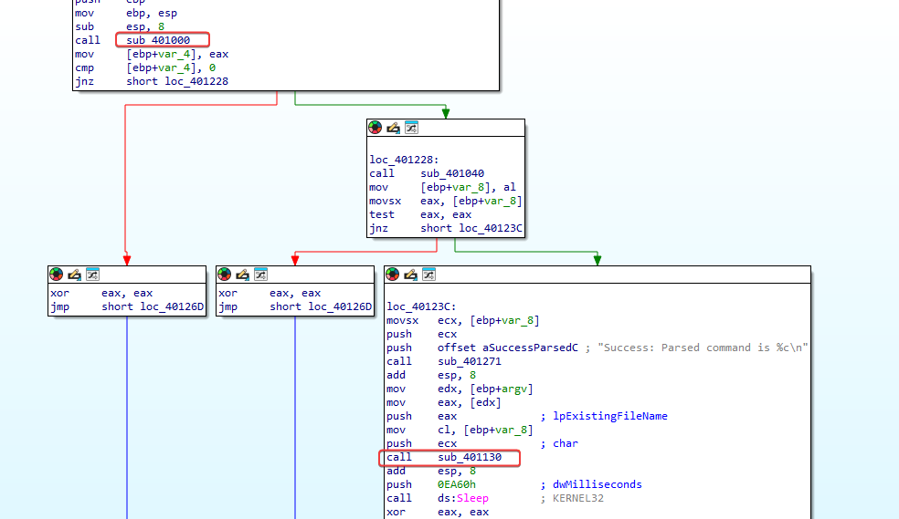

---

### 3.1.2 Question 2
```
What parameters does this new function take?
```

char and lpcstr.

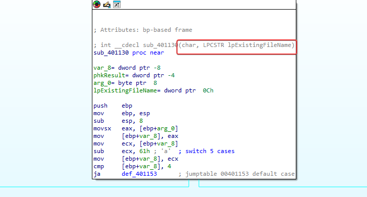

---

### 3.1.3 Question 3
```
What's the main code structure that this function contains?
```

The malware creates a registry key where it places an executable 'cc.exe' in a Windows registry key where executables are stored to be started along with the operating system, which we could say is supposedly where the malware leaves its persistence.

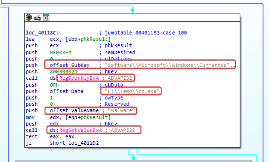

---


### 3.1.4 Question 4
```
What can this function do?
```

Maintain the malware's persistence on the system.

---

### 3.1.5 Question 5
```
Are there host-based indicators for this malware?
```

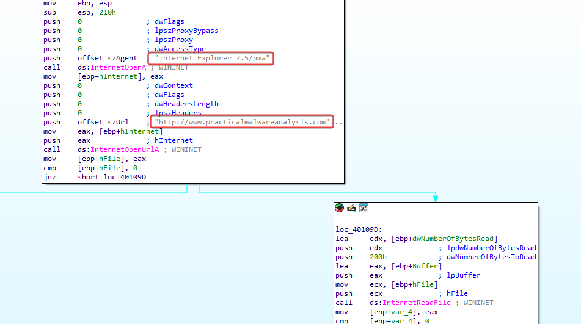