In this post, I continue my studies of the book "Practical Malware Analysis" and begin working on Lab 7. The goal is to apply practical static and dynamic analysis techniques to understand the behavior of real samples, reinforcing fundamental concepts used in malware analysis environments. This content is part of my study routine and documentation of the learning steps.

---

## 2.1 LAB 07-01.exe
```
Lab07_01.exe
```

### 2.1.1 Question 1
```
How does this program ensure its continuity (achieve the expected performance) when the computer is restarted?
```

First, we will take a look at the main function, in which it is possible to see a call to a service name 'MalService', a call to start the Service Control Dispatcher with the control function sub_401040, and a call associated with a subroutine.

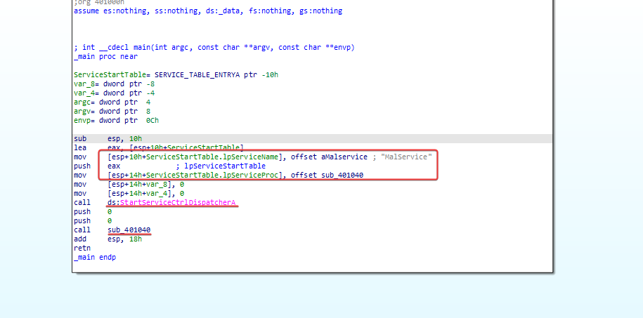

Within this subroutine, we can see the use of service creation functions, probably for malware persistence.

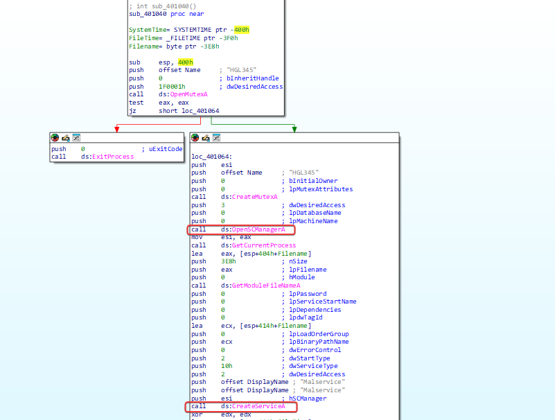

---

### 2.1.2 Question 2
```
Why does the program use a mutex?
```

Mutexes are synchronization objects used to prevent simultaneous execution. The malware uses a mutex to ensure that only one instance is running; it looks for a mutex named 'HGL345'. If found, the program will terminate; if not, it creates a mutex with that name.

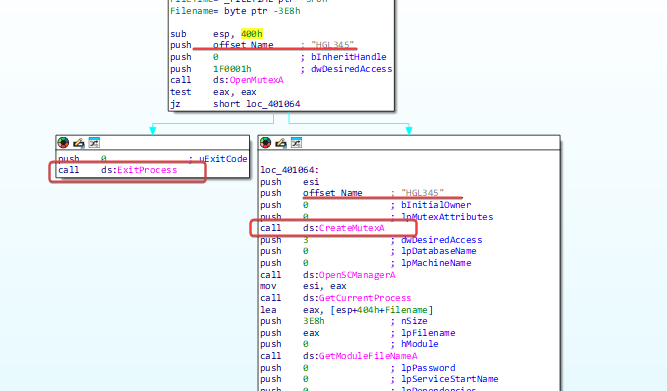

---

### 2.1.3 Question 3
```
What would be a good host-based signature to use for detecting this program?
```

Checking any service with the coded name 'MalService' or mutex 'HGL345'.

### 2.1.4 Question 4
```
What is a good network-based signature to detect this malware?
```

User Agent 'Internet Explorer 8.0' and communication with the URL 'http://www.malwareanalysisbook.com'.

---

## 3.1 LAB 07-02.exe

### 3.1.1 Question 1
```
How does this program ensure persistence?
```

When analyzing the program, it is not possible to identify any method for implementing persistence.

### 3.1.2 Question 2
```
What is the purpose of this program?
```

By analyzing the program running OleInitialize, it is possible to determine that a COM Object is being executed.

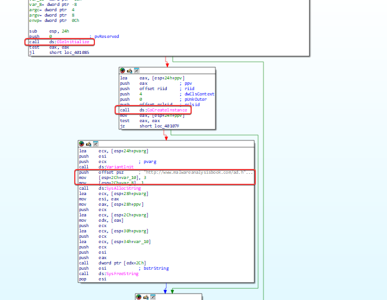

It is used to open a URL in the browser, probably in Edge.

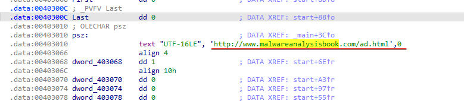

### 3.1.3 Question 3
```
When will the program finish running?
```

The program will terminate after being executed and the web page of the provided URL is opened.

---

## 4.1 LAB 07-03.exe e LAB 07-03.dll

### 4.1.1 Question 1
```
How does this program achieve persistence to ensure it continues running when the computer is restarted?
```

When checking both, it is not possible to identify any obvious evidence of persistence, but there are some elements that raise suspicion. The program shows a reference to a DLL provided along with it (LAB07-03.dll), as well as a Windows DLL = kernel32.dll.

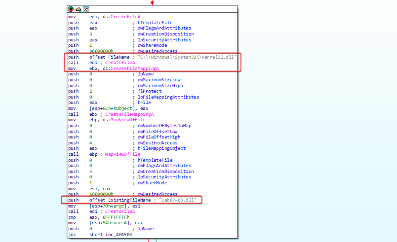

It is also possible to see a reference to a similar DLL name, kernel123.dll, and a reference to LAB07-03.dll being copied into a file with that name in C:\Windows\System32 before we see a reference to subdirectories within C:\ .

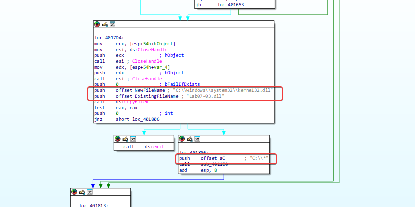

Checking sub_4011E0, inside it you can see an instruction that indicates that files are being checked in C:\* which was passed to the program.

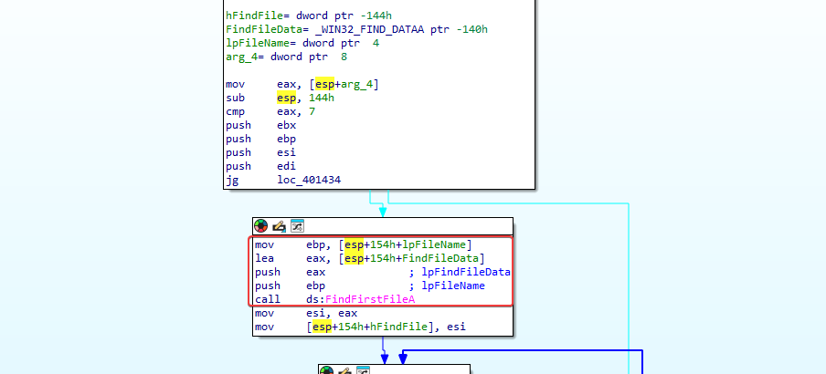

Where we arrive, many comparisons and jump instructions are happening. Looking more closely at this function, we can see that a comparison occurs that checks if a file is .exe and, if not, a jump occurs.

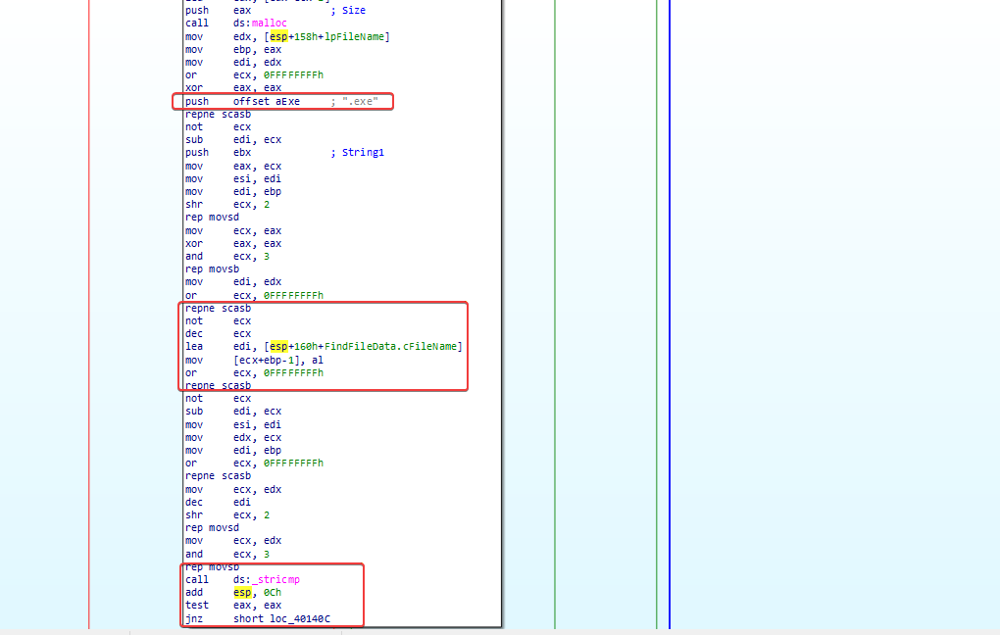

Based on this, we can infer that something on the file system located at C:\ is being checked recursively for .exe files, and if one is found, something happens. The function sub_4010A0 executes if the jump is not taken, allowing us to find out what happens when an executable file is found.

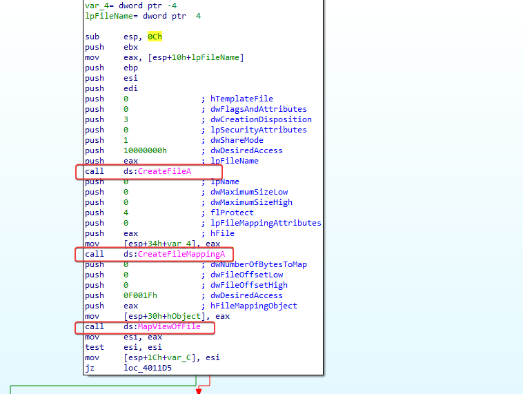

So, if an executable file is found, it is mapped into memory and can then be modified by this program. Looking further into the program, we can see that it compares kernel32.dll to a location within the executable and, if it is not found, it skips and repeats the process. When it is found, it begins to copy a value referenced by dword_403010 over it.

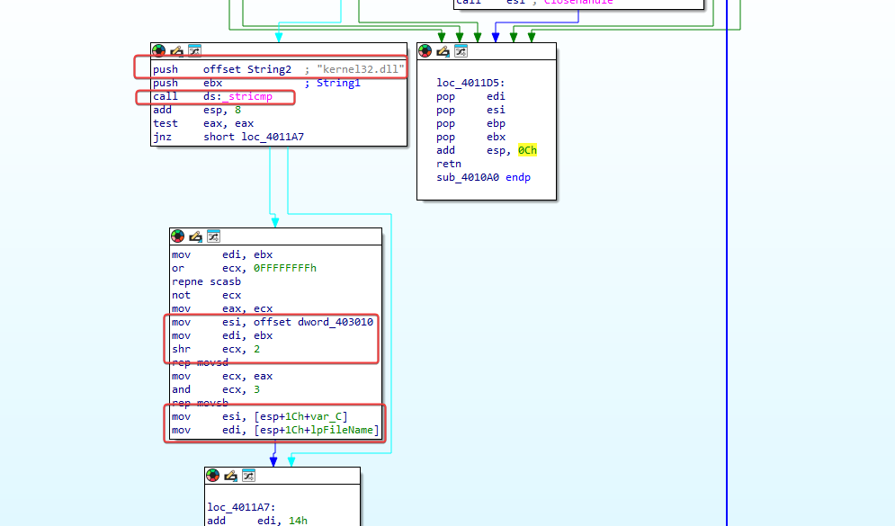

By researching in IDA, it is possible to see that it is a DWORD value specified as '6E72656Bh'.
 
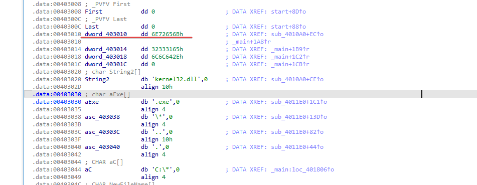

Converting this to an ASCII string makes it possible to get something more readable.

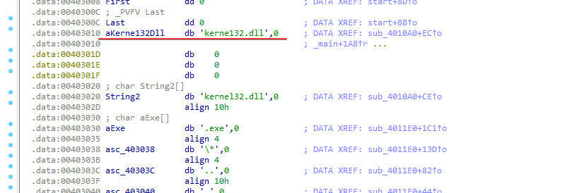

All in all, we can define that the program searches for executables recursively within C:\, and when they are found, it opens them and directly in memory modifies the file to replace any instances of kernel32.dll with kerne123.dll for persistence. Based on this, we can infer that the program is a type of file infector and uses the copied kerne123.dll (LAB07-03.dll) as its main payload. By analyzing LAB07-03.dll, it is possible to identify that it has some type of C2 function.

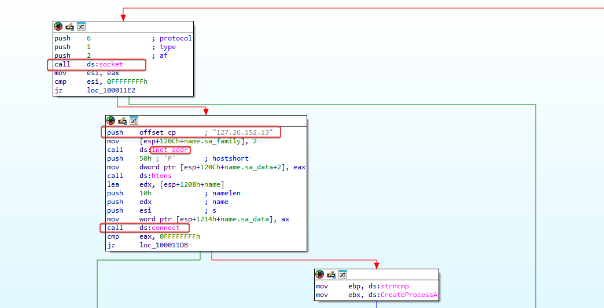

---

### 4.1.2 Question 2
```
What are two good host-based signatures for this malware?
```

Presence of kerne123.dll on the disk and presence of the Mutex 'SADFHUHF'.

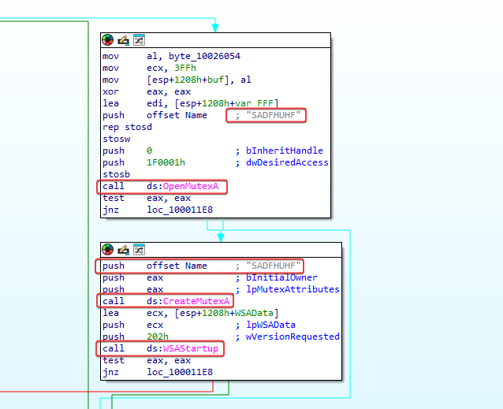

---

### 4.1.3 Question 3
```
What is the purpose of this program?
```

Based on the analysis of Question 1, we can conclude that this program is a file infector that infects executables on the system to load a remote access trojan that connects to the IP 127[.]26[.]152[.]13.

---

### 4.1.4 Question 4
```
How can I remove this malware after it has been installed?
```

Because this malware infects all the files on the disk, it is very difficult to remove. You can remove the malicious kerne123.dll from the disk; however, it is likely that this file is used by all processes and cannot be removed. Furthermore, if it is removed during the analysis of the deadbox, it is likely that the system will crash on startup due to the absence of any variant of kernel32.dll. To remediate, you could modify kerne132.dll to become the legitimate kernel32.dll, or even change the malware's actions and recompile so that, instead, it modifies all executables to point to the legitimate kernel32.dll instead of kerne132.dll. As another option, it might be easier to rebuild the system or restore from a backup.

---
