In this post, I continue my studies of the book "Practical Malware Analysis" and begin working on Lab 9. The goal is to apply practical static and dynamic analysis techniques to understand the behavior of real samples, reinforcing fundamental concepts used in malware analysis environments. This content is part of my study routine and documentation of the learning steps.

---

## LAB 09-01.exe
```
Lab09-01.exe
```

### Question 1
```
How can you make this malware install itself?
```

Analyzing the malware in OllyDbg, it is possible to see that it pauses immediately as soon as it reaches the executable's entry point.

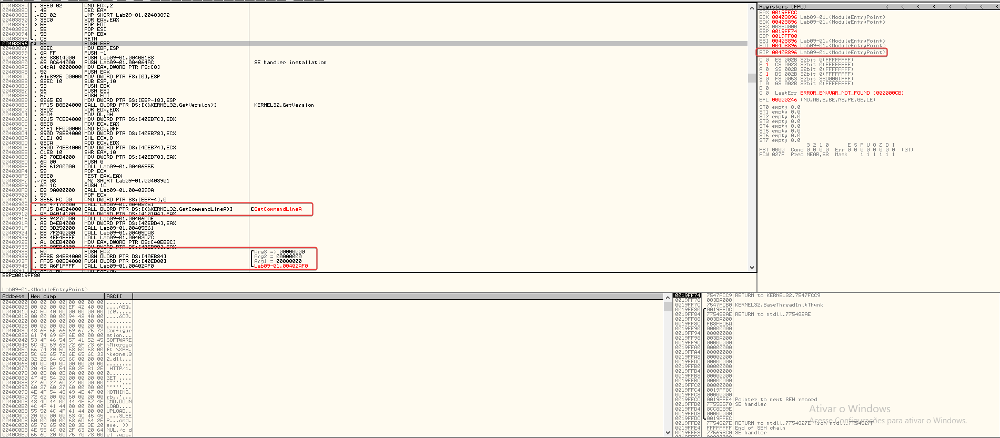

By examining the function at address 0x403945, it is possible to see that 3 arguments are available to be passed to the program and that it seems to be the start of the main function.

Running the program, when we reach the instruction besides GetCommandLine, we can see that EAX was updated to reflect the program's command line, which in this case was running the application without any arguments.

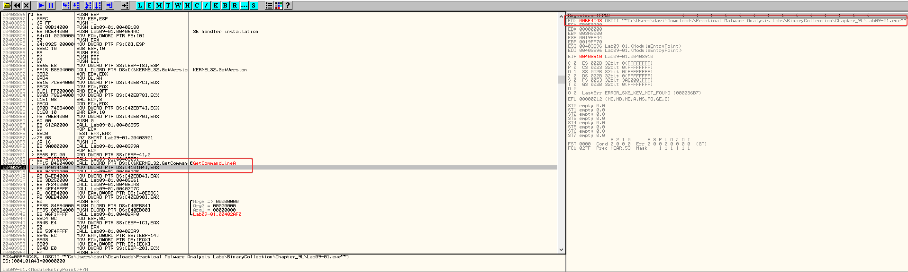

Entering the main function, upon reaching 0x402AFD we can see that a comparison occurs to check if the number of arguments passed to the program is equal to one.

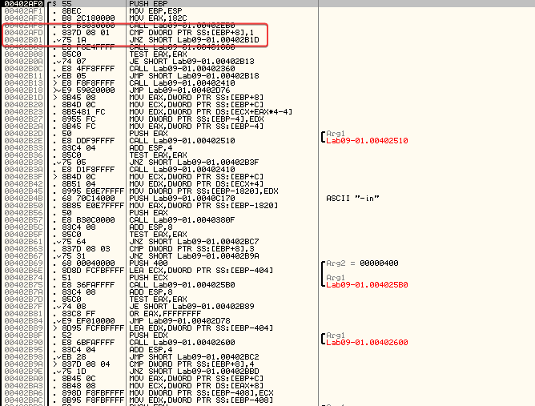

Since no argument was approved, the comparison doesn't work. Thus, no jump is made and the program continues to call 0x401000.

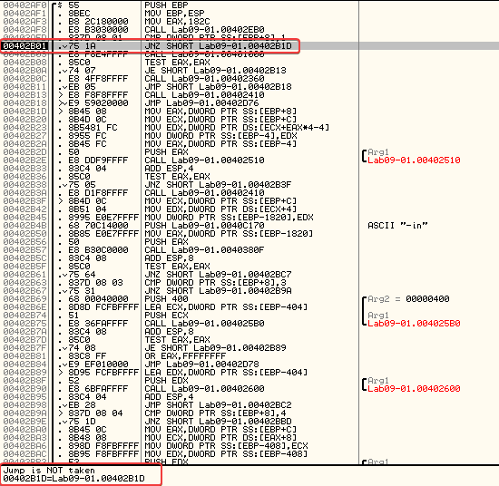

Navigating inside 0x401000, encontrei uma verificao para o que parecia ser uma chave de registro com erro de digitacao. Apos analisar mais, descobri que o malware tentava se excluir sozinho se executasse sem parametros.

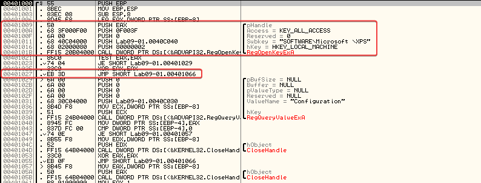

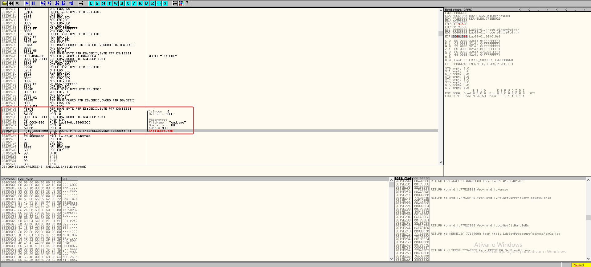

---

### Question 2
```
What are the command line options for this program? What is the password requirement?
```

- -in
- -re
- -c
- -cc

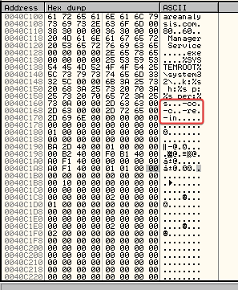

---

### Question 3
```
How can you use OllyDbg to permanently fix this malware so that it doesn't need the special command-line password?
```

It can be patched at 0x402510 to always return EAX = 1. To do this, we use the associated HEX values to set EAX to 1.

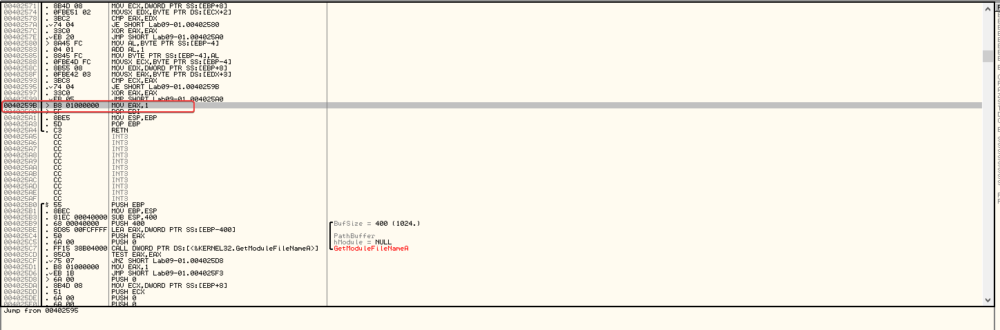

---

### Questions 4
```
What are the host-based indicators of this malware?
```

- HKLM\SOFTWARE\Microsoft\XPS 
- Manager Service
- %SYSTEMROOT%\Windows\System32

---

### Question 5
```
What are the different actions that this malware can be instructed to take over the network?
```

In sub_402020, it contains various instructions that help determine which different actions this malware can be instructed to take.

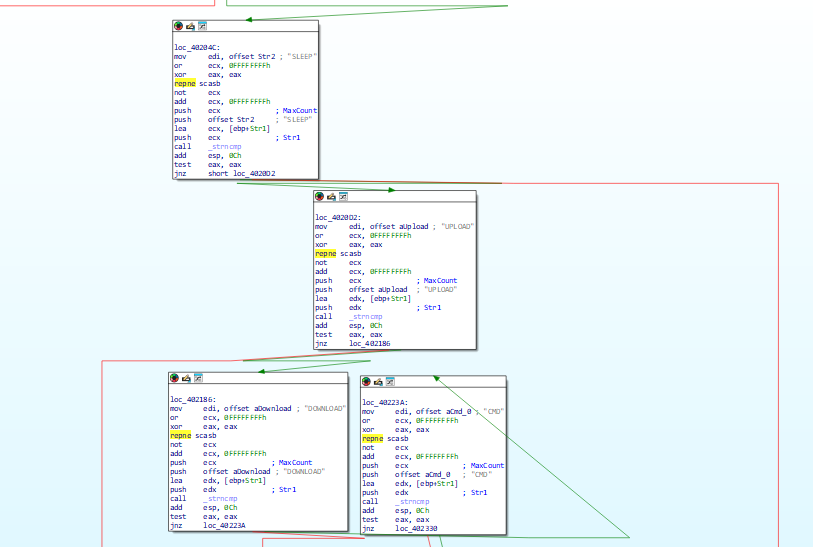

Strings: 

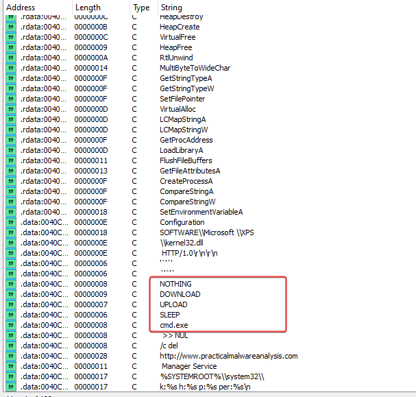

---

### Question 6
```
Are there useful network-based signatures for this malware?
```

http[:]//www[.]practicalmalwareanalysis[.]com

---

## LAB 09-02.exe

### Question 1
```
Which strings do you see statically in the binary?
```

Nothing much, just more imports and maybe function names.

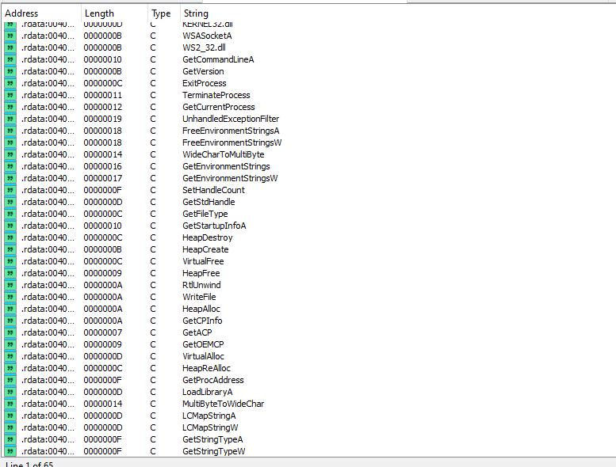

---

### Question 2
```
What happens when you run this binary?
```

When running the binary, it results in almost immediate termination without showing any other visible action.

---

### Question 3
```
How can you make this sample run its malicious payload?
```

When running the program in OllyDbg, we can see that after the call at 0x401626, EDX is filled with the value "ocl.exe", and this remains throughout the program until a comparison check fails and the program terminates.

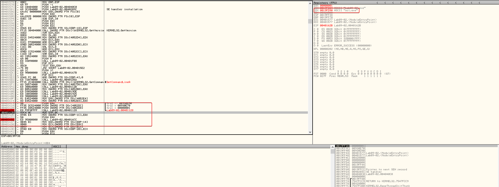

We can assume that the program checks if it is named ocl.exe, and if it is not, then it terminates. If we rename it and continue debugging, we notice that the termination no longer occurs.

---

### Question 4
```
What is happening at 0x00401133?
```

Examining 0x00401133, we can see that several hexadecimal values are being moved to a relevant area of the stack segment.

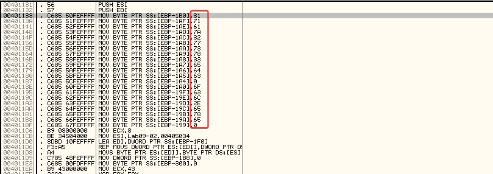

This is a common string obfuscation technique to make analysis more difficult.

Taking the hexadecimal values and converting them to ASCII>

- 31 71 61 7a 32 77 73 78 33 65 64 63 = 1qaz2wsx3edc
- 6F 63 6C 2E 65 78 65 = ocl.exe

---

### Question 5
```
What arguments are being passed to the subroutine 0x00401089?
```

After adding breakpoints and stepping through the application, I discovered the presence of "1qaz2wsx3edc" being passed to the subroutine, along with a pointer to (in ESI).0x004010890x12FD58

---

## LAB 09-03.exe

### Question 1
```
Which DLLs are imported by Lab09–03.exe?
```

- KERNEL32.DLL
- NETAPI32.DLL
- DLL1.DLL
- DLL2.DLL

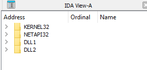

---

### Question 2
```
What is the base address requested by DLL1.dll, DLL2.dll, and DLL3.dll?
```

Everyone has an image base set to 0x10000000.

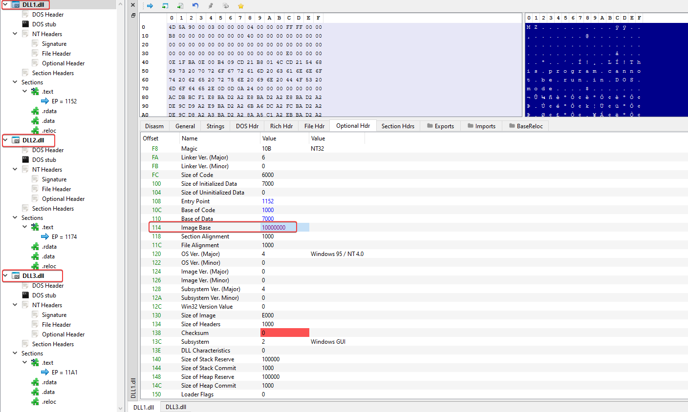

---
