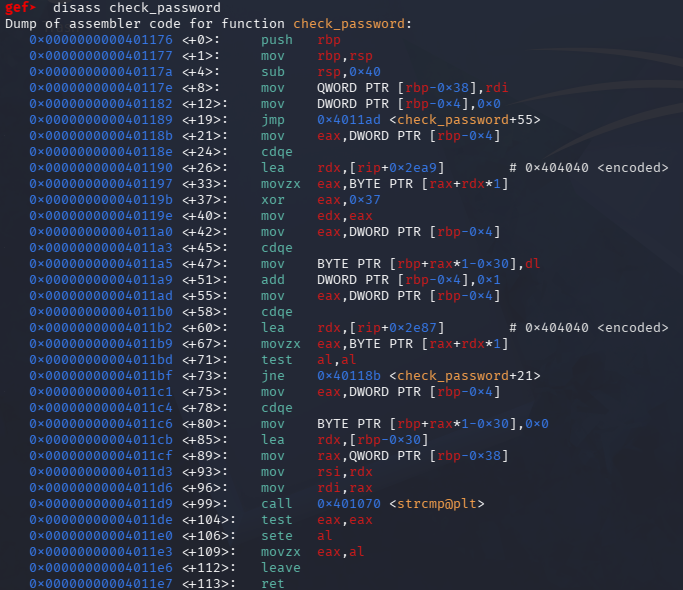
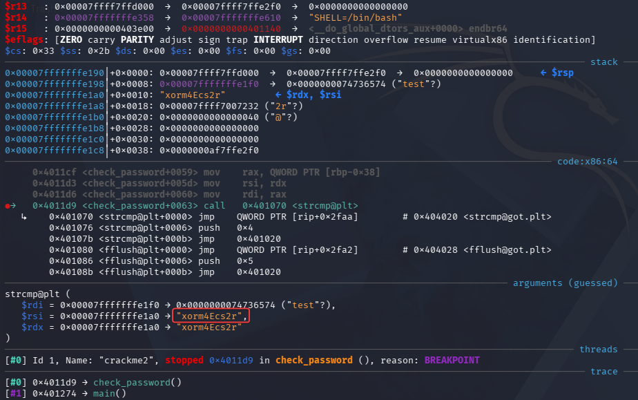
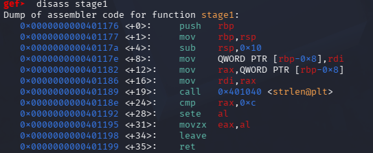
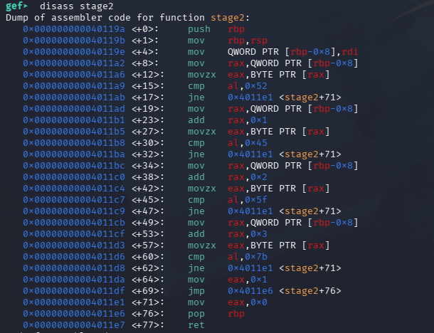
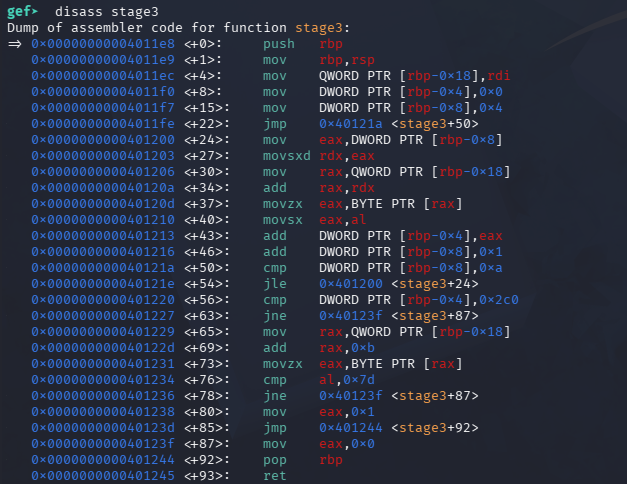

## Introduction

In this post, I continue my studies of the course 'Reverse Engineering for Beginners' from Red Team Leaders, putting into practice some of the concepts presented throughout the lessons.

In this lesson, I worked with the practical cracking labs for Linux, analyzing different CrackMe-type challenges. The exercises cover everything from simple password checks to multi-step validations, involving techniques like string analysis, debugging, and identifying the logic used by the program to validate the input provided.

The goal was to solve the challenges by analyzing the behavior of the binaries, aiming to understand their internal logic and identify the information needed to overcome each step of the validation.

# crackme1
## Goal

Find the hardcoded password and enter it to see the success message.

## Recon

```bash
> file crackme1

crackme1: ELF 64-bit LSB executable, x86-64, version 1 (SYSV), dynamically linked, interpreter /lib64/ld-linux-x86-64.so.2, BuildID[sha1]=f1294f71e847254866d0b014f85e3124ea8d65a8, for GNU/Linux 3.2.0, not stripped
```

Here we know that it is a 64-bit ELF binary.

Let's look at all possible strings in the binary with the strings command (I'll only leave the interesting ones):
```bash
r3vers1ng_101
=== CrackMe Level 1 ===
Enter the password: 
[+] Access Granted! You cracked it!
[+] Flag: FLAG{strings_are_your_friend}
[-] Access Denied. Try again.
check_password
```
Here we possibly already have the password and the flag obtained that we need to complete the challenge, but let's go further.

---
## Static analysis

We can also check out some interesting sections (.rodata) of the binary to see a bit of its data and functionalities.

```bash
 402000 01000200 00000000 72337665 7273316e  ........r3vers1n
 402010 675f3130 31003d3d 3d204372 61636b4d  g_101.=== CrackM
 402020 65204c65 76656c20 31203d3d 3d00456e  e Level 1 ===.En
 402030 74657220 74686520 70617373 776f7264  ter the password
 402040 3a20000a 00000000 5b2b5d20 41636365  : ......[+] Acce
 402050 73732047 72616e74 65642120 596f7520  ss Granted! You 
 402060 63726163 6b656420 69742100 00000000  cracked it!.....
 402070 5b2b5d20 466c6167 3a20464c 41477b73  [+] Flag: FLAG{s
 402080 7472696e 67735f61 72655f79 6f75725f  trings_are_your_
 402090 66726965 6e647d00 5b2d5d20 41636365  friend}.[-] Acce
 4020a0 73732044 656e6965 642e2054 72792061  ss Denied. Try a
 4020b0 6761696e 2e00                        gain.. 
```

Analyzing the binary's functions, we clearly find where the verification of the password provided by the user (check_password) is done, let's see what it possibly does:

```bash
> objdump -M intel -d crackme1 | grep -A 20 "<check_password>:"
  401176:       55                      push   rbp
  401177:       48 89 e5                mov    rbp,rsp
  40117a:       48 83 ec 20             sub    rsp,0x20
  40117e:       48 89 7d e8             mov    QWORD PTR [rbp-0x18],rdi
  401182:       48 8d 05 7f 0e 00 00    lea    rax,[rip+0xe7f]        # 402008 <_IO_stdin_used+0x8>
  401189:       48 89 45 f8             mov    QWORD PTR [rbp-0x8],rax
  40118d:       48 8b 55 f8             mov    rdx,QWORD PTR [rbp-0x8]
  401191:       48 8b 45 e8             mov    rax,QWORD PTR [rbp-0x18]
  401195:       48 89 d6                mov    rsi,rdx
  401198:       48 89 c7                mov    rdi,rax
  40119b:       e8 d0 fe ff ff          call   401070 <strcmp@plt>
  4011a0:       85 c0                   test   eax,eax
  4011a2:       0f 94 c0                sete   al
  4011a5:       0f b6 c0                movzx  eax,al
  4011a8:       c9                      leave
  4011a9:       c3                      ret
```
Inside the function, he uses 'strcmp' to compare the password provided with the user (rdi) to the correct password (rsi) expected by the program.

---
## Dynamic analysis

Right off the bat, let's go straight to where we know we'll find the correct password in 'strcmp' inside the 'check_password' function:
```bash
 →   0x40119b <check_password+0025> call   0x401070 <strcmp@plt>
  strcmp@plt (
   $rdi = 0x00007fffffffdc80 → 0x0000000069766164 ("test"?),
   $rsi = 0x0000000000402008 → "r3vers1ng_101",
   $rdx = 0x0000000000402008 → "r3vers1ng_101"
  )

```

Running the binary by providing the correct password:

```bash
./crackme1
=== CrackMe Level 1 ===
Enter the password: r3vers1ng_101
[+] Access Granted! You cracked it!
[+] Flag: FLAG{strings_are_your_friend}
```
# crackme2

Find the password encoded with XOR in the binary. The password isn't stored in plain text -- you need to find the encoding scheme and reverse it.

The binary works the same way as crackme1, but using XOR encryption, so we have the check_password function that I will explain line by line:



1. Create the local variables
```asm
push rbp
mov rbp, rsp
sub rsp, 0x40
```
Reserves 0x40 = 64 bytes on the stack for the function.

The main locations used are:
```
[rbp-0x38] -> input (password provided by the user)
[rbp-0x30] -> buffer (decoded password)
[rbp-0x04] -> counter 'i'
```

---

2.  Save the input and initialize the counter
```asm
mov QWORD PTR [rbp-0x38], rdi
mov DWORD PTR [rbp-0x04], 0x0
```
How `RDI` contains the first argument that was passed when calling this `check_password` function:
```asm
[rbp-0x38] = input
```
And:
```asm
[rbp-0x04] = 0
```
So:
```c
i = 0;
```

---

3. Grab a character from `encoded`
```asm
mov eax, DWORD PTR [rbp-0x4]
cdqe
lea rdx, [rip-0x2ea9]       # encoded
movzx eax, BYTE PTR [rax+rdx]
```
Here he uses the counter to access:
```c
encoded[i];
```
So, conceptually:
```c
i = 0;
encoded[0];
```
Later:
```c
i = 1;
encoded[1];
```
and so on...

---

4. Decodes with XOR
```asm
xor eax, 0x37
```
Do:
```c
encoded[i] ^ 0x37;
```
This is the decoding process.

---

5. Put the result in the buffer
```asm
mov edx, eax
mov eax, DWORD PTR [rbp-0x4]
cdqe
mov BYTE PTR [rbp+rax*1-0x30], dl
```
The result of the XOR is placed in:
```c
buffer[i];
```
Remember:
```
buffer starts at [rbp-0x30]
```
Do:
```c
buffer[0] = encoded[0] ^ 0x37;
buffer[1] = encoded[1] ^ 0x37;
buffer[2] = encoded[2] ^ 0x37;
```

---

6. Increase the counter
```asm
add DWORD PTR [rbp-0x4], 0x1
```
And simply:
```c
i++;
```

---

7. Check if it has reached the end of `encoded`:
```asm 
mov eax, DWORD PTR [rbp-0x4]
cdqe
lea rdx, [rip+0x2e87]
movzx eax, BYTE PTR [rax+rdx]
test al, al
jne 0x40118b
```
Checks:
```c
encoded[i] != '\0'
```
If it hasn't reached the end yet, go back to the start of the loop:
```
-> take encoded[i]
-> XOR 0x37
-> put it in buffer[i]
-> i++
-> check again
```

---

8. Finish the buffer
```asm 
mov BYTE PTR [rbp+rax*1-0x30], 0x0
```
Put `0` at the end:
```c
buffer[i] = '\0';
```
Now `buffer` is a valid string.

---

9. Compare with the input
```asm
mov rsi, rdx
mov rdi, rax
call strcmp@plt
```
Get ready:
```
RDI -> input
RSI -> buffer
```
and call:
```c
strcmp(input, buffer);
```

---

10. Returns 1 or 0
```asm
test eax, eax
sete al
movzx eax, al
```
If `strcmp()` returns `0`:
```
input == buffer
```
then it returns:
```
1 otherwise -> 0
```

As we know, in the call to `strcmp()` the encrypted buffer will be passed to compare with the string provided by the user, and this way we can see the expected string in plain text.



So, entering the correct password:
```bash
./crackme2 
=== CrackMe Level 2 ===
Enter the password: xorm4Ecs2r
[+] Access Granted! XOR decryption mastered!
[+] Flag: FLAG{x0r_is_r3v3rsible}
```

---

# crackme3

Go through all three stages of validation. The password has a specific format, length, and character restrictions. You need to reverse engineer each stage separately.

In this binary, the password check goes through 3 stages: `stage1`, `stage2`, and `stage3`.

## stage1
Let's take a look at the `stage1` code:



1. Creates the stack frame:
```asm
push rbp
mov rbp, rsp
sub rsp, 0x10
```
Reserves `0x10` = 16 bytes on the stack.

Here we have:
```
[rbp-0x8] -> input
```

---

2. Save the input
```asm
mov QWORD PTR [rbp-0x8], rdi
```
`RDI` contains the first argument of the function.

So:
```
[rbp-0x8] = input
```

---

3. Prepare the input for `strlen`
```asm
mov rax, QWORD PTR [rbp-0x8]
mov rdi, rax
call strlen@plt
```
It grabs the `input` and puts it into `RDI`.

Then it calls:
```c
strlen(input);
```
The result of `strlen()` ends up in `RAX`.

---

4. Compare the size with `0xc` = 12.
```asm
cmp rax, 0xc
```

---

5. Converts the result to true/false
```asm
sete al
movzx eax, al
```
`sete` means ***Set if Equal***.

If:
```
RAX == 12
```
then:
```
AL = 1
```
Otherwise:
```
AL = 0
```
After that, `movzx` turns it into an integer value:
```
EAX = 1
or
EAX = 0
```

---

6. Return
```asm
leave
ret
```
The call to the `stage1` function returns in `RAX`:
```
1 -> input has exactly 12 characters
0 -> input has a size different from 12
```


## stage2
Let's look at the `stage2` code:



1. Saves the input
```asm
push rbp
mov rbp, rsp
mov QWORD PTR [rbp-0x8], rdi
```
`RDI` contains the function argument, so:
```
[rbp-0x8] -> input
```
There’s no explicit counter, it directly accesses positions `0`, `1`, `2`, and `3`.

---

2. Check the first character
```asm
mov rax, QWORD PTR [rbp-0x8]
movzx eax, BYTE PTR [rax]
cmp al, 0x52
jne 0x4011e1
```
`[rax]` means
```c
input[0];
```
And it compares with:
```
0x52 = 'R'
```
So:
```
input[0] == 'R'
```
If it's different, `jne` jumps to the end and returns `0`.

---

3. Check the next character
```asm
mov rax, QWORD PTR [rbp-0x8]
add rax, 0x1
movzx eax, BYTE PTR [rax]
cmp al, 0x45
jne 0x4011e1
```
Here:
```
rax = input + 1
```
So:
```c
input[1];
```
and compared with:
```
0x45 = 'E'
```
Then:
```
input[1] == 'E'
```

---

4. Check the third character
```asm
mov rax, QWORD PTR [rbp-0x8]
add rax, 0x2
movzx eax, BYTE PTR [rax]
cmp al, 0x5f
jne 0x4011e1
```
Now access:
```c
input[2];
```
And compare with:
```
0x5f = '_'
```
So:
```
input[2] == '_'
```

---

5. Check the fourth character
```asm
mov rax, QWORD PTR [rbp-0x8]
add rax, 0x3
movzx eax, BYTE PTR [rax]
cmp al, 0x7b
jne 0x4011e1
```
Accesses:
```c
input[3];
```
and compares with:
```
0x7b = '{'
```
So:
```
input[3] == '{'
```

---

6. If everything is correct:
```asm
mov eax, 0x1
jmp 0x4011e6
```
It returns:
```
1
```
If ***any*** of the comparisons fail:
```asm
mov eax, 0x0
```
It returns:
```
0
```

 > Now, we know that `stage2` checks if the first 4 characters of the provided 12-character string start with 'RE_{'.

---
## stage3
Let's look at the `stage3` code:



1. Initialize the variables
```asm
mov QWORD PTR [rbp-0x18], rdi
mov QWORD PTR [rbp-0x4], 0x0
mov QWORD PTR [rbp-0x8], 0x4
```
We have:
```
[rbp-0x18] -> input
[rbp-0x04] -> sum = 0
[rbp-0x08] -> counter = 4
```
That is:
```c
int sum = 0;
int i = 4;
```
The counter starts at `4` because `stage2` already checked positions `0` to `3`.

---

2. Grab `input[i]`
```asm
mov eax, DWORD PTR [rbp-0x8]
movsxd rdx, eax
mov rax, QWORD PTR [rbp-0x18]
add rax, rdx
movzx eax, BYTE PTR [rax]
movsx eax, al
```
Here it calculates:
```
input[i]
```
Since `i` starts at 4:
```
input[4]
input[5]
input[6]
...
```
`movzx` grabs the character as ***1 byte***, and `movsx` turns that byte into a signed integer.

In practice, for normal ASCII characters, we can just think of it as:
```c
int value = input[i];
```

---

3. Adds the character
```asm
add DWORD PTR [rbp-0x4], eax
```
Adds the ASCII value to the variable `sum`:
```c
sum += input[i];
```
Ex:
```
'A' = 65
'B' = 66
'C' = 48
```

---

4. Incrementing the counter
```asm
add DWORD PTR [rbp-0x8], 0x1
```
And:
```c
i++;
```
So the loop will process:
```
i = 4
i = 5
i = 6
i = 7
i = 8
i = 9
i = 10
```

---

5. Loop condition
```asm
cmp DWORD PTR [rbp-0x8], 0xa
jle 0x401200
```
`0xa` in hexadecimal is `10`.

As long as:
```
i <= 10
```
it keeps going.

So, there are 7 characters:
```
input[4] to input[10]
```
We can imagine the loop like this:
```c
for (i = 4; i <= 10; i++)
    sum += input[i];
```

---

6. Check the sum
```asm
cmp DWORD PTR [rbp-0x4], 0x2c0
jne 0x40123f
```
`0x2c0` in decimal:
```
0x2c0 = 704
```
So:
```c
if (sum != 704)
    return 0;
```
In other words:

> The sum of the ASCII values from `input[4]` to `input[10]` needs to be 704.

---

7. Check the last character
If the sum is correct:
```asm
mov rax, QWORD PTR [rbp-0x18]
add rax, 0xb
movzx eax, BYTE PTR [rax]
cmp al, 0x7d
jne 0x40123f
```
`0xb` = 11

Then it checks:
```
input[11]
```
counts:
```
0x7d = '}'
```
So:
```
input[11] == '}'
```

---

8. Return
If everything is correct:
```asm
mov eax, 0x1
```
Returns:
```
1
```
If the sum is wrong ***or*** `input[11]` is not `}`.
```
mov eax, 0x0
```
Returning:
```
0
```

***In short***
 ```
 [0] [1] [2] [3] [4] [5] [6] [7] [8] [9] [10] [11]
  R   E   _   {   ?   ?   ?   ?   ?   ?    ?    }
 └────────────┘  └──────────────────────────┘ └───┘
     stage2              soma = 704           stage3

 ```


So, putting this together with the previous steps, we already know that the format is:

```
RE_{???????}
```
where the ***7*** need to have an ASCII sum = 704, and the last character is `}`.

In this case I used: `d d d d d d h`. Explanation:
```
d = 100
h = 104

6 * 100 + 104 = 704
```

Running `crackme3` by providing the correct string:

```bash
./crackme3 
=== CrackMe Level 3 ===
Enter the password: RE_{ddddddh}
[*] Stage 1: Length check... PASSED
[*] Stage 2: Format check... PASSED
[*] Stage 3: Value check... PASSED
[+] All stages passed! Excellent work!
[+] Flag: FLAG{multi_stage_cracker}
```

