# Introduction

This document describes the analysis and resolution of the CyberWarface Labs WEB-RTA certification labs.

The assessment consists of two web applications, each featuring a series of challenges designed to evaluate practical web security skills. Throughout the assessment, various vulnerabilities and attack techniques are explored, including SQL Injection, IDOR, JWT manipulation, XXE, SSRF, SSTI, authentication bypass, and OAuth scope manipulation.

The following sections document the methodology used to identify and exploit these vulnerabilities, as well as the analysis performed during each stage of the assessment.

---

# [Research] Which vulnerability (short form only) allows users to execute malicious queries in the databases? E.g: XXE

SQL Injection, or SQLi, is a security vulnerability that allows an attacker to interfere with the queries an application makes to the database. Main types:

- Classic SQLi: The attacker retrieves data directly on the application screen.
- Blind SQLi: The system does not display errors or data directly; the attacker uncovers information by asking true/false questions.
- UNION Attacks: Uses the SQL UNION operator to combine the results of two queries into a single response.

---

# [Research] Which vulnerability (short form only) lets attackers access data of other users by manipulating object identifiers in requests?

IDOR is a web security vulnerability where an application uses user-supplied input to directly access an internal resource without verifying whether the user has permission to do so. It occurs when a server assumes that an authenticated user can view any record simply because they are authenticated. A simple example:

- Changing a parameter value (such as changing `id=101` to `id=102`) can expose another person's private data or transactions.

---

# [Research] Which vulnerability (short form only) tricks a web application into making requests to internal or external resources on behalf of the attacker? E.g: XXE

SSRF (Server-Side Request Forgery) is a powerful and dangerous vulnerability in web applications where an attacker tricks a vulnerable server into sending malicious or unauthorized requests to internal or external resources. Basic SSRF example (accessing internal resources):

- http://vulnerable.com/fetch?url=http://127.0.0.1:8080/admin

---

# [Research] Which vulnerability (short form only) lets an attacker inject malicious payloads into server-side templates to execute code?

Server-Side Template Injection (SSTI) is a web security vulnerability that occurs when an application insecurely embeds user input directly into a server-side template, rather than passing it as separate data.

---

# What is the role allocated to the unauthenticated users in WebApp 01?

Upon accessing WebApp 01 at http://147.135.87.82:31104 and navigating to `/login`, an access token (`Cookie: access_token_cookie= ......`) is assigned to the unlogged-in user; we can analyze this token on jwt.io.

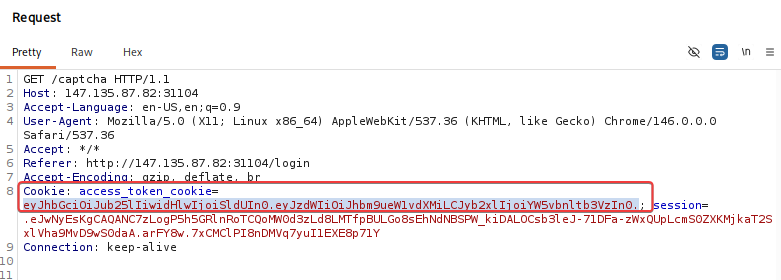

Subsequently, users not logged into the system are assigned the `anonymous` role.

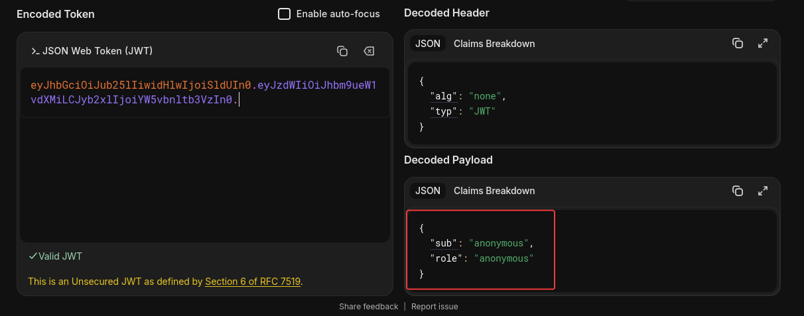

---

# What is the endpoint where the events are available in WebApp 01? E.g: /abc

To search for directories on the WebApp 01 URL, I used the `feroxbuster` tool and obtained the following findings:

```bash
feroxbuster --url http://147.135.87.82:31104 -w /usr/share/wordlists/dirb/common.txt 

200      GET      418l      806w    10291c http://147.135.87.82:31104/login
200      GET      453l      858w    10382c http://147.135.87.82:31104/
200      GET        1l        3w       21c http://147.135.87.82:31104/captcha
200      GET        1l        423w	  64c http://147.135.87.82:31104/dashboard
```

---

# What is the name of the event visible to authenticated users in WebApp 01?

As we know, we are currently visiting this application as the `anonymous` user—a state where certain events and features are not visible to unauthenticated users. To change this, we can **manipulate our JWT token.**

Using the JWT encoder at jwt.io, we can modify the token by changing the `anonymous` field to `user`, thereby generating a new token.

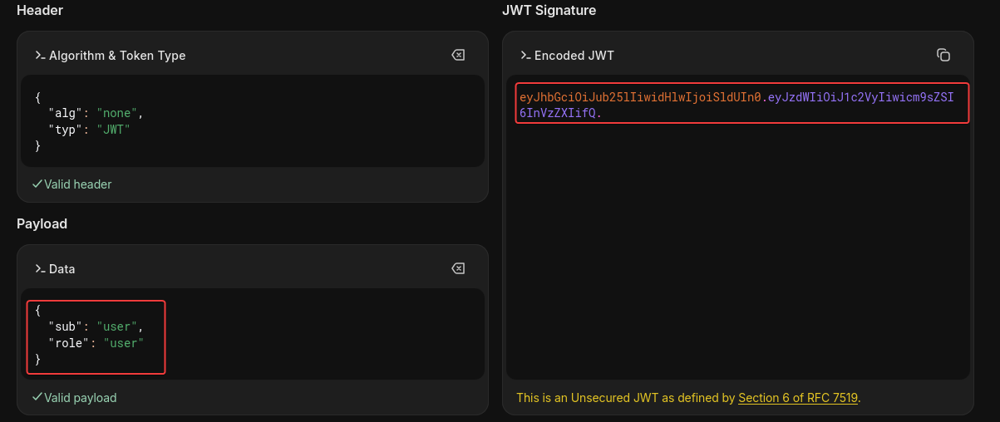

Next, by making a request to `/dashboard`, capturing it in Burp, and sending it to Repeater, we can modify the access token to gain user-level access to the page.

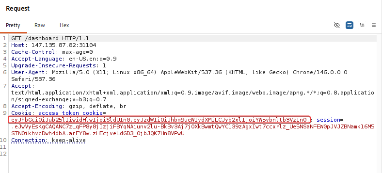

After replacing the token with the one we generated—with the fields modified to `user`—we are able to view the created events.

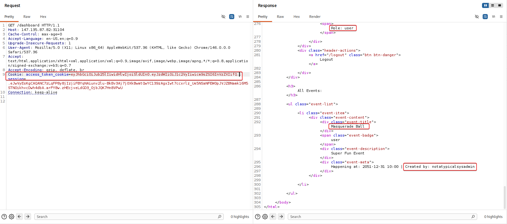

---

# What is the username of the admin user in WebApp 01?

notatypicalsysadmin

# What is the absolute path of the file which contains the string flag (present in the local filesystem) in WebApp 01?

Now that we have the administrative username `notatypicalsysadmin`, we can attempt to log in. Initially, I tested a basic SQL injection in the username field; however, the application still required the password field to be filled in.

The application validates the CAPTCHA before verifying the credentials. When the CAPTCHA is completed correctly, the response confirms whether the provided username exists.

Consequently, I tested an SQL injection using the following workflow: first, I provided a valid CAPTCHA; then, for the credentials, I used the administrative username we had previously identified along with an SQL injection payload in the `username` field, aiming to bypass authentication without providing the correct password.

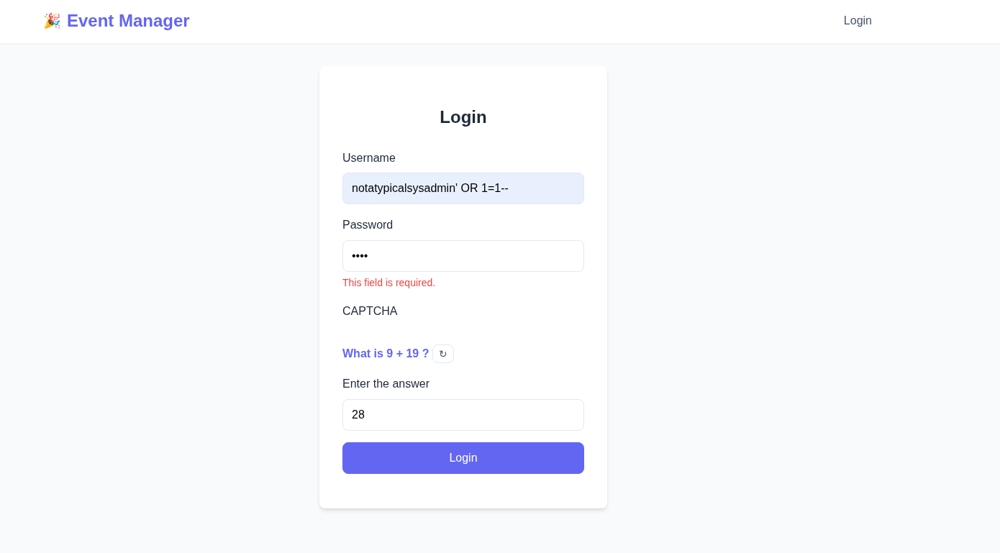

Next, we have access.

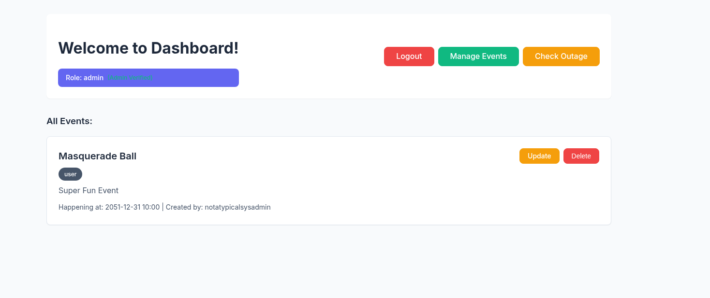

After gaining access, we can view and update the created event. By analyzing the event creation process, we can see that the application uses XML to process the submitted data.

At this stage, we can exploit an XML feature to make the application read files from the local file system. This vulnerability is known as XML External Entity (XXE).

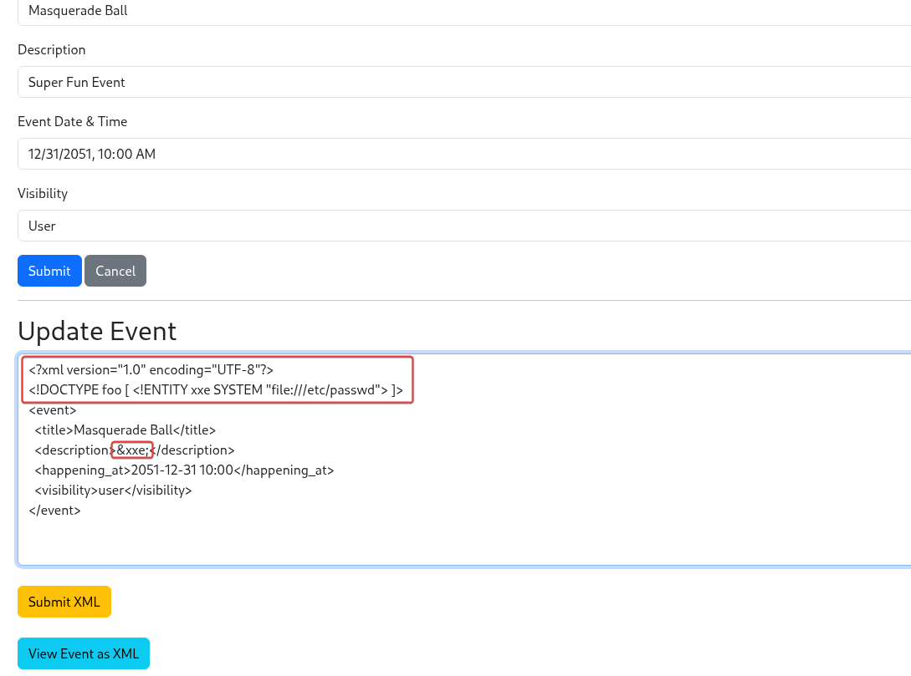

---

# Which is the value of the flag in WebApp 01?

flag:x:1001:1001:Not there yet Seek out client and go for login:/tmp:/bin/false

---

# What is the internal URl for fetching secrets in WebApp 01?

Upon analyzing the system's functionalities, we identified what appears to be an API verification feature that allows the administrator to check the status of a service.

In practical terms, this functionality enables the server to perform internal requests.

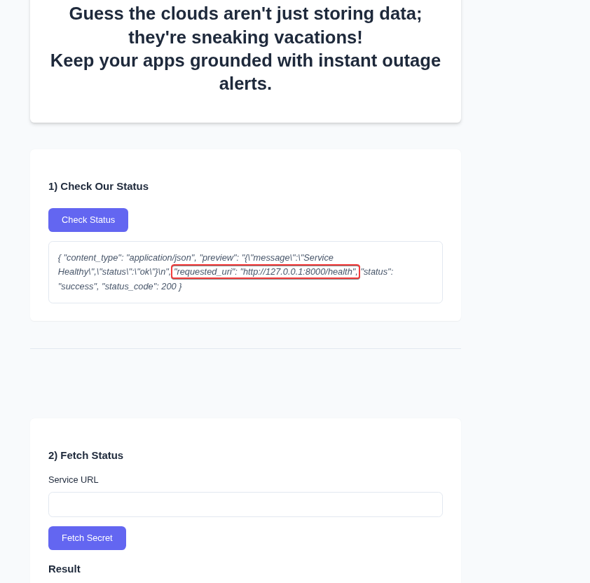

The interface features a "Service URL" input field and a "Fetch Secret" button—characteristics suggesting the potential presence of an endpoint vulnerable to SSRF (Server-Side Request Forgery).

When a request is made to http://127.0.0.1:8000, the server returns a 418 (I'm a teapot) status code. This indicates that the service is active but rejects simple requests directed straight at the endpoint.

URL-encoding the target URL and resending:

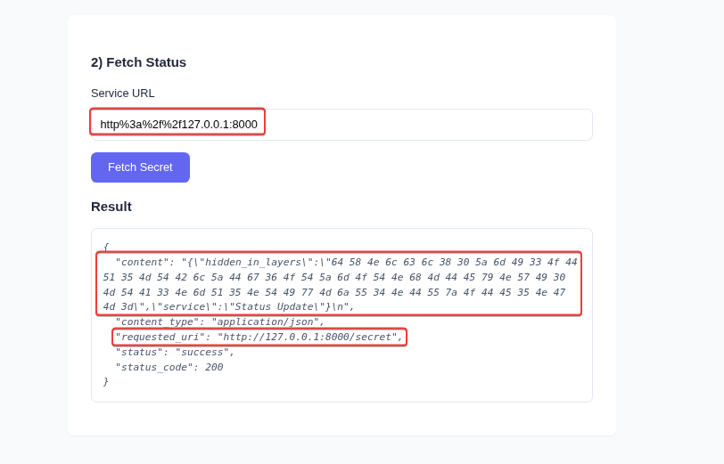

---

# What is the encoded data (with the label "hidden in layers") returned by the successful exploitation of a vulnerability which allows attackers to reach internal URLs in WebApp 01?

64 58 4e 6c 63 6c 38 30 5a 6d 49 33 4f 44 51 35 4d 54 42 6c 5a 44 67 36 4f 54 5a 6d 4f 54 4e 68 4d 44 45 79 4e 57 49 30 4d 54 41 33 4e 6d 51 35 4e 54 49 77 4d 6a 55 34 4e 44 55 7a 4f 44 45 35 4e 47 4d 3d

---

# What is plaintext version of hidden in layers in WebApp 01?

The code we have is in ASCII format; we can decode it using Burp's built-in decoder. After that, we have a Base64 string.

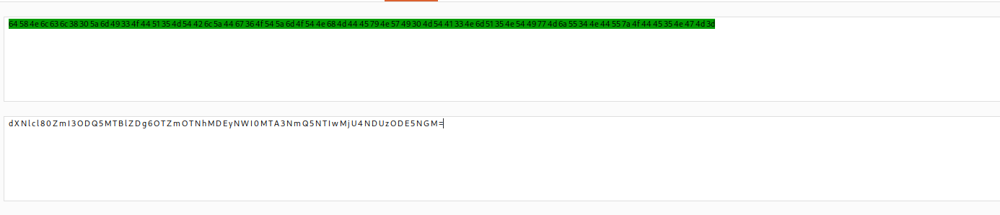

Decoding the Base64, we get:

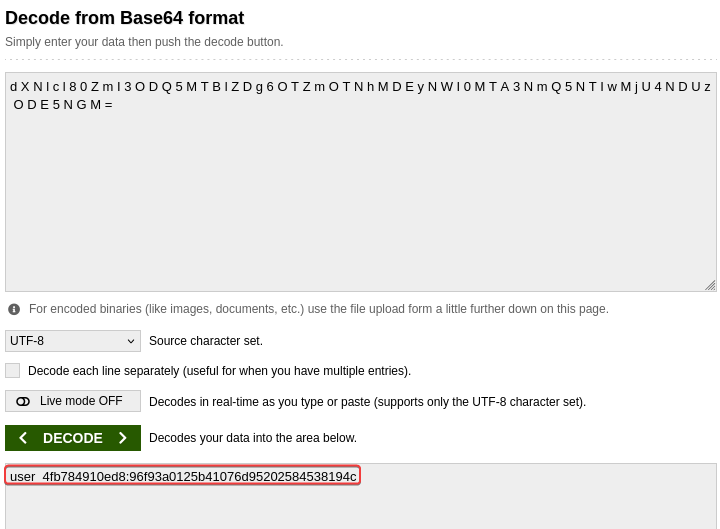

What a "username:password" represents.

---

# What is the endpoint where WebApp 02 has login page configured? E.g: /abc/def

/client/login

# What is the Client ID allocated to the exfiltrated credentials (obtained from hidden in layers) in WebApp 02?

Using the credentials obtained by decoding in the previous questions, we were able to retrieve the following ID with scope permissions:

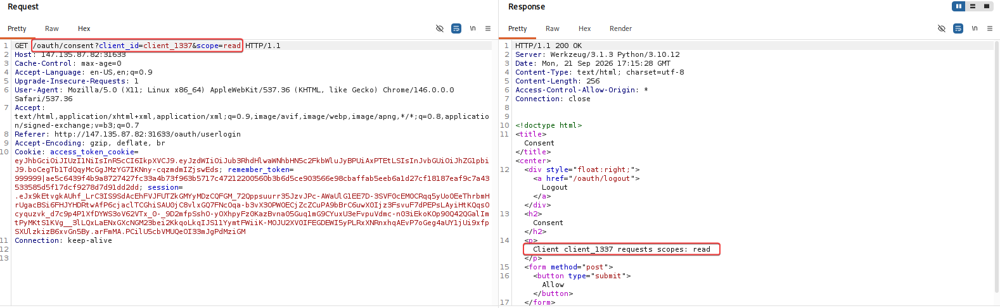

# What is Bob's Credit Card number?

By analyzing the URL from the previous question, we can observe that the permission defined for the request scope is passed directly as a parameter in the URL. Thus, we can modify this parameter from `read` to `admin` in an attempt to gain access to administrative resources.

http://147.135.87.82:31633/oauth/consent?client_id=client_1337&scope=read
        |
        to
        |
http://147.135.87.82:31633/oauth/consent?client_id=client_1337&scope=admin

After obtaining administrative scope, another challenge arises: accessing system resources as an administrator requires a second authentication step (2FA).

The system uses a three-digit OTP, resulting in only 1,000 possible combinations. In this scenario, we can use a brute-force attack to test the possible combinations.

Using Burp Suite to automate the requests and vary the code sent in the corresponding parameter:

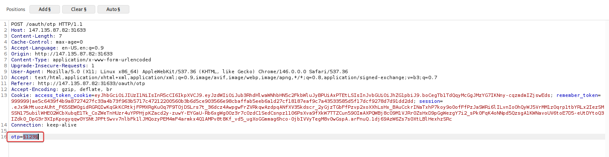

Burp Suite will perform up to 1,000 attempts, testing every possible combination until it finds the code accepted by the system, allowing the authentication process to complete.

After providing the correct code, we can access and view:

---


